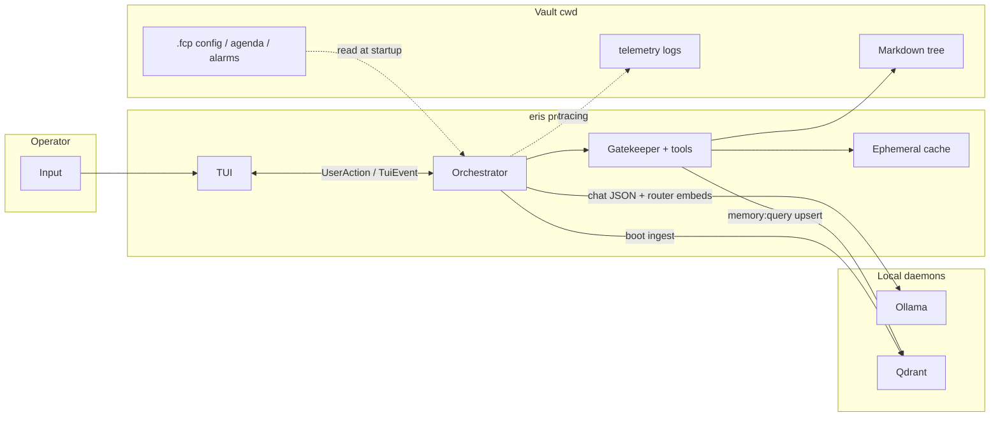

# Eris

**Episodic Reasoning & Inference System** — a local, vault-centric TUI assistant: Ollama for chat/embeddings, optional Qdrant for semantic memory, Markdown vault on disk, tools behind a JSON-schema gatekeeper.

## Scope

- **In scope:** Interactive `chat` from a vault directory, tool use (vault, memory, web, agenda, clocks, etc.), structured logging under `.fcp/telemetry/logs/`.
- **Out of scope today:** `eris run` and `eris tool` are present in the CLI but **not implemented** for production use; use `chat`.

Architecture detail: [docs/updated_architecture/README.md](docs/updated_architecture/README.md).

## Prerequisites

### Rust

- **Stable** toolchain, **Edition 2024** (see `Cargo.toml`).
- Used to compile and run tests from this repo.

### Ollama (LLM + embeddings)

Eris talks to Ollama over HTTP; defaults match `AppConfig` (`ollama_host`, typically `**http://localhost:11434`**).

1. **Install** [Ollama](https://ollama.com) for your OS and ensure the daemon is running (`ollama serve`, or the background service the installer sets up).
2. **Pull a chat model** — must match `**model_name`** in `.fcp/config.toml` (default in code: `**gemma4:26b`**):
  ```bash
   ollama pull gemma4:26b
  ```
   Use any tag you prefer; set `model_name` accordingly.
3. **Pull an embedding model** — must match `**embed_model_name`** (default: `**nomic-embed-text`**) for ToolRouter similarity and Qdrant upserts:
  ```bash
   ollama pull nomic-embed-text
  ```
4. **Context length:** If you raise `num_ctx` in config, ensure Ollama can serve that context for your model (see Ollama docs for `OLLAMA_CONTEXT_LENGTH` / model limits).

If Ollama is down, chat cannot run.

### Qdrant (vector DB)

Used for semantic memory (`memory:query`), boot ingest, and web-artifact cleanup. The client uses the URL in `**qdrant_url`** (default `**http://localhost:6334`**). gRPC must be reachable after TCP connect.

**Option A — Docker (typical)**

```bash
docker run -p 6333:6333 -p 6334:6334 qdrant/qdrant
```

- **6333** — REST/dashboard (optional).
- **6334** — gRPC (what Eris uses by default).

**Option B — native/binary** — install Qdrant from upstream and listen on the same ports, or change `qdrant_url` in `.fcp/config.toml`.

If Qdrant is unreachable and `**require_semantic_brain`** is `true` (default), **chat startup fails** after retries. Set `require_semantic_brain = false` only if you want chat without vector tools.

### Checklist


| Piece       | `.fcp/config.toml` keys | Notes                                               |
| ----------- | ----------------------- | --------------------------------------------------- |
| Ollama HTTP | `ollama_host`           | Default `http://localhost:11434`                    |
| Chat model  | `model_name`            | Match what you `ollama pull` (default `gemma4:26b`) |
| Embed model | `embed_model_name`      | Default `nomic-embed-text` (768-d vectors → Qdrant) |
| Qdrant URL  | `qdrant_url`            | Default `http://localhost:6334` (gRPC)              |


Figment also merges `**FCP_`* environment variables** over TOML (e.g. `FCP_WORKSPACE`, `FCP_LOG_LEVEL`, `FCP_USER_NAME`). For other fields, match `AppConfig` in `[src/config.rs](src/config.rs)` to the env key shape your Figment build expects.

## Installation

From the repository root:

```bash
cargo build --release
```

The binary is `target/release/eris` (package name `eris`).

```bash
cargo test
```

## Workspace initialization

1. **Choose or create a directory** that will be the vault (notes, `.fcp/`, etc.).
2. `**cd` into that directory** — configuration and paths are resolved from the **current working directory**, not from `FCP_VAULT` alone for normal chat.
3. **First run:** if `.fcp/seal` is missing, the app runs an **ignition** wizard (model, identity scaffold). It creates `.fcp/`, `00_Core/`, standard folders, and config.
4. **Config:** edit `.fcp/config.toml` as needed (model name, `num_ctx`, Qdrant URL, `workspace` id for collection `fcp_vault_{workspace}`, etc.). Environment overrides use the `**FCP_`** prefix (e.g. `FCP_WORKSPACE`).

Multi-machine note: copy or recreate `.fcp/config.toml` per environment; keep the same `workspace` string if you want the same Qdrant collection name.

## Usage

```bash
cd /path/to/your/vault
/path/to/eris chat
```

Common flags (see `eris chat --help`):

- `**-w` / `--workspace**` — logical partition (Qdrant collection suffix, ephemeral snapshot id). Env: `FCP_WORKSPACE` (default `default`).
- `**-v` / `--vault**` — legacy/config override for `vault_root` in `AppConfig`; normal chat still expects you to **launch from** the vault directory.

Verbose tracing: `**-V`**, `**-VV`**.

## Programm Flow

**Mental model — data and interaction flow** (one chat turn, simplified):




You type in the **TUI**; messages flow through **channels** to the **orchestrator**, which calls **Ollama** for structured JSON replies and embedding-based routing. **Tools** run only through the **gatekeeper** (validated args, state-checked): they read/write **Markdown** under the vault, use **ephemeral** staging, and hit **Qdrant** for semantic memory. **Logs** go to `.fcp/telemetry/` — not mixed into the chat deck.

- **Terminal:** Full-screen **ratatui** UI: chat deck, status, telemetry; `Ctrl+C` exits and tears down daemons this process started.
- **Logs:** Rotating files under `**<vault>/.fcp/telemetry/logs/`** (tracing); not printed to the TUI buffer for normal operation.
- **Semantics:** If Qdrant is reachable, boot may **ingest** markdown into the collection `fcp_vault_{workspace}`. If not and `require_semantic_brain` is true, startup fails; if false, chat runs without vector tools.
- **Developers:** New tools and gatekeeper rules: [docs/ADDING_A_TOOL.md](docs/ADDING_A_TOOL.md).

## Natural language → tool routing (phrase compendium)

Tool choice is **not** parsed from rigid commands. The orchestrator’s **ToolRouter** (`[src/orchestrator/tool_router.rs](src/orchestrator/tool_router.rs)`) embeds your text with the same model as vector memory (`embed_model_name` in config, default `nomic-embed-text`) and compares it to **precomputed** vectors—one per tool built from the tool name, JSON-schema description, and `**routing_hints`** in the embedded TOML blocks in `[src/tools/specs.rs](src/tools/specs.rs)`. Tools whose **cosine similarity** meets `tool_match_threshold` in `.fcp/config.toml` (default **0.50**) are surfaced to the LLM. If a tool has no descriptor hints, `enrich_for_routing` in `tool_router.rs` adds fallback “common triggers” for that tool name.

The **gatekeeper** only enforces **state** and **JSON Schema** on tool calls (`[src/tools/gatekeeper.rs](src/tools/gatekeeper.rs)`); it does not map phrases to tools.

**Extra rules (outside pure similarity):**

- **Short utterances** (≤3 words or ≤15 characters) are treated as chat-only unless you include a URL, a leading `/`, a domain-like token (e.g. `news.ycombinator.com`), or explicit web wording such as `search the web` / `look up online`.
- **Lexical web guard:** URLs, `www.`, host-shaped tokens, or multi-word phrases like `visit the page`, `open this page`, `read the website`, `search the web` ensure `**web:fetch`** is included when similarity alone would skip it (bare `open`/`visit` alone are ignored so figurative English does not fetch the web).

Representative `**routing_hints**` (say things *like* this—the model still decides, and similarity is fuzzy):


| Tool                       | Typical phrasing                                                                                         |
| -------------------------- | -------------------------------------------------------------------------------------------------------- |
| **vault:list**             | list files, show directory, browse folder, what files exist                                              |
| **vault:read**             | read file, open note, show file, inspect markdown                                                        |
| **vault:write**            | save note, write file, append note, create markdown                                                      |
| **memory:query**           | search memory, do you remember, what is my name, who am I, user preferences, my identity, recall context |
| **memory:stage**           | remember this, stage memory, temporary memory, hold in staging                                           |
| **memory:staged_list**     | show staged memory, list staged ids, what is staged                                                      |
| **memory:commit**          | commit staged memory, persist one memory, save to vault, keep forever                                    |
| **memory:commit_all**      | commit all memories, flush staged memory, bulk commit staged                                             |
| **agenda:push**            | add task, remind me, todo, queue task                                                                    |
| **agenda:list**            | show tasks, list agenda, pending tasks                                                                   |
| **agenda:remove**          | remove task, cancel agenda, delete from list, drop task, never mind                                      |
| **agenda:remind_at**       | remind me at/in/about, remember to, nudge/ping me at, snooze, on my agenda or todo list, task reminder   |
| **agenda:complete**        | task done, complete task, mark done, finished the …                                                      |
| **(deprecared) web:fetch** | open website, read web page, fetch URL, news from — plus URLs and the lexical phrases above              |
| **ephemeral:buffer_query** | search inside staged large buffer (vault or web), keyword/snippet over chunks, buffer_id               |
| **ephemeral:buffer_page**  | paginate staged blob, next chunk window, sequential read after vault:read / web:fetch                  |
| **system:health**          | health check, system status, CPU/memory usage, Ollama status, diagnostics                                |
| **clock:now**              | what time is it, current time, timezone, date and time                                                   |
| **clock:timer**            | in 30 minutes, countdown, generic timer, label-only reminder (not agenda)                                |
| **clock:alarm**            | wake me up, alarm clock only, standalone alarm, no todo                                                  |
| **weather:current**        | weather now, temperature outside, is it raining, current conditions                                      |
| **weather:forecast**       | forecast, hourly, next days, will it rain tomorrow                                                       |
| **wiki:summary**           | Wikipedia, encyclopedia, what is X, who was, define (topic—not a URL)                                    |
| **mail:check**             | check email, inbox, unread, new mail, who emailed me                                                     |
| **mail:read**              | read email, open message, full email, message content                                                    |
| **mail:write**             | send email, compose mail, reply, email to                                                                |
| **mail:digest**            | summarize email, today’s mail, digest, recap inbox                                                       |
| **mail:delete**            | delete email, trash message, discard                                                                     |
| **mail:move**              | move to folder, label email, file under, move to spam                                                    |


To change behavior for operators, edit `**routing_hints*`* in `[src/tools/specs.rs](src/tools/specs.rs)` (and rebuild); the lexical lists in `tool_router.rs` are for URL/page detection and fallbacks.