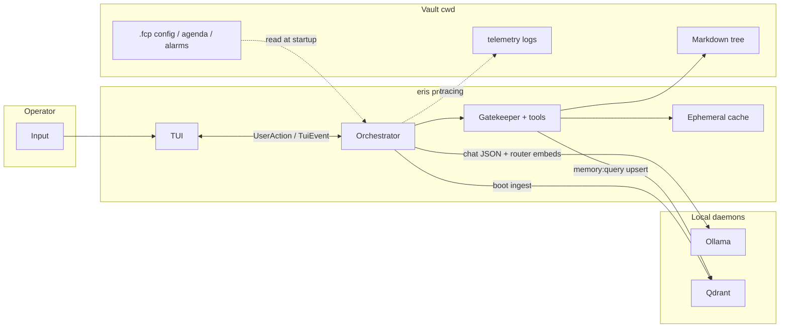

# Eris

**Episodic Reasoning & Inference System** — a local, vault-centric TUI assistant: Ollama for chat/embeddings, optional Qdrant for semantic memory, Markdown vault on disk, tools behind a JSON-schema gatekeeper.

## Scope

- **In scope:** Interactive `chat` from a vault directory, tool use (vault, memory, web, agenda, clocks, etc.), structured logging under `.fcp/telemetry/logs/`.
- **Out of scope today:** `eris run` and `eris tool` are present in the CLI but **not implemented** for production use; use `chat`.

Architecture detail: [docs/updated_architecture/README.md](docs/updated_architecture/README.md).

## Prerequisites

### Rust

- **Stable** toolchain, **Edition 2024** (see `Cargo.toml`).
- Used to compile and run tests from this repo.

### Ollama (LLM + embeddings)

Eris talks to Ollama over HTTP; defaults match `AppConfig` (`ollama_host`, typically `**http://localhost:11434`**).

1. **Install** [Ollama](https://ollama.com) for your OS and ensure the daemon is running (`ollama serve`, or the background service the installer sets up).
2. **Pull a chat model** — must match `**model_name`** in `.fcp/config.toml` (default in code: `**llama3.2**`):
  ```bash
   ollama pull llama3.2
  ```
   Use any tag you prefer (`llama3.2:3b`, etc.); set `model_name` accordingly.
3. **Pull an embedding model** — must match `**embed_model_name`** (default: `**nomic-embed-text**`) for ToolRouter similarity and Qdrant upserts:
  ```bash
   ollama pull nomic-embed-text
  ```
4. **Context length:** If you raise `num_ctx` in config, ensure Ollama can serve that context for your model (see Ollama docs for `OLLAMA_CONTEXT_LENGTH` / model limits).

If Ollama is down, chat cannot run.

### Qdrant (vector DB)

Used for semantic memory (`memory:query`), boot ingest, and web-artifact cleanup. The client uses the URL in `**qdrant_url`** (default `**http://localhost:6334**`). gRPC must be reachable after TCP connect.

**Option A — Docker (typical)**

```bash
docker run -p 6333:6333 -p 6334:6334 qdrant/qdrant
```

- **6333** — REST/dashboard (optional).
- **6334** — gRPC (what Eris uses by default).

**Option B — native/binary** — install Qdrant from upstream and listen on the same ports, or change `qdrant_url` in `.fcp/config.toml`.

If Qdrant is unreachable and `**require_semantic_brain`** is `true` (default), **chat startup fails** after retries. Set `require_semantic_brain = false` only if you want chat without vector tools.

### Checklist


| Piece       | `.fcp/config.toml` keys | Notes                                               |
| ----------- | ----------------------- | --------------------------------------------------- |
| Ollama HTTP | `ollama_host`           | Default `http://localhost:11434`                    |
| Chat model  | `model_name`            | Match what you `ollama pull` (default `llama3.2`)   |
| Embed model | `embed_model_name`      | Default `nomic-embed-text` (768-d vectors → Qdrant) |
| Qdrant URL  | `qdrant_url`            | Default `http://localhost:6334` (gRPC)              |


Figment also merges `**FCP_`* environment variables** over TOML (e.g. `FCP_WORKSPACE`, `FCP_LOG_LEVEL`, `FCP_USER_NAME`). For other fields, match `AppConfig` in `[src/config.rs](src/config.rs)` to the env key shape your Figment build expects.

## Installation

From the repository root:

```bash
cargo build --release
```

The binary is `target/release/eris` (package name `eris`).

```bash
cargo test
```

## Workspace initialization

1. **Choose or create a directory** that will be the vault (notes, `.fcp/`, etc.).
2. `**cd` into that directory** — configuration and paths are resolved from the **current working directory**, not from `FCP_VAULT` alone for normal chat.
3. **First run:** if `.fcp/seal` is missing, the app runs an **ignition** wizard (model, identity scaffold). It creates `.fcp/`, `00_Core/`, standard folders, and config.
4. **Config:** edit `.fcp/config.toml` as needed (model name, `num_ctx`, Qdrant URL, `workspace` id for collection `fcp_vault_{workspace}`, etc.). Environment overrides use the `**FCP_`** prefix (e.g. `FCP_WORKSPACE`).

Multi-machine note: copy or recreate `.fcp/config.toml` per environment; keep the same `workspace` string if you want the same Qdrant collection name.

## Usage

```bash
cd /path/to/your/vault
/path/to/eris chat
```

Common flags (see `eris chat --help`):

- `**-w` / `--workspace**` — logical partition (Qdrant collection suffix, ephemeral snapshot id). Env: `FCP_WORKSPACE` (default `default`).
- `**-v` / `--vault**` — legacy/config override for `vault_root` in `AppConfig`; normal chat still expects you to **launch from** the vault directory.

Verbose tracing: `**-V`**, `**-VV**`.

## Programm Flow

**Mental model — data and interaction flow** (one chat turn, simplified):




You type in the **TUI**; messages flow through **channels** to the **orchestrator**, which calls **Ollama** for structured JSON replies and embedding-based routing. **Tools** run only through the **gatekeeper** (validated args, state-checked): they read/write **Markdown** under the vault, use **ephemeral** staging, and hit **Qdrant** for semantic memory. **Logs** go to `.fcp/telemetry/` — not mixed into the chat deck.

- **Terminal:** Full-screen **ratatui** UI: chat deck, status, telemetry; `Ctrl+C` exits and tears down daemons this process started.
- **Logs:** Rotating files under `**<vault>/.fcp/telemetry/logs/`** (tracing); not printed to the TUI buffer for normal operation.
- **Semantics:** If Qdrant is reachable, boot may **ingest** markdown into the collection `fcp_vault_{workspace}`. If not and `require_semantic_brain` is true, startup fails; if false, chat runs without vector tools.
- **Developers:** New tools and gatekeeper rules: [docs/ADDING_A_TOOL.md](docs/ADDING_A_TOOL.md).

