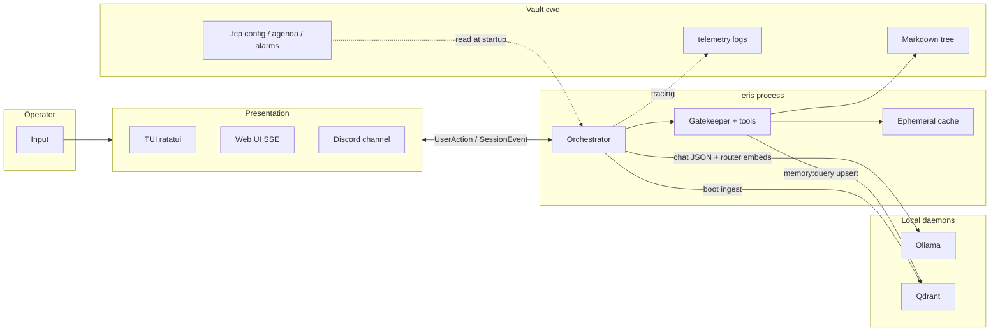

# Eris

[](https://github.com/janpauldahlke/eris/actions/workflows/ci.yml)
[](https://doc.rust-lang.org/edition-guide/rust-2024/index.html)
[](https://codecov.io/gh/janpauldahlke/eris)

**Episodic Reasoning & Inference System** — a local, vault-centric assistant: same orchestrator and tools whether you use the **full-screen terminal UI (ratatui)**, **`eris chat --web`** (localhost Axum + SSE), or an **optional Discord sidecar** that shares the live session. Ollama drives chat and embeddings; optional Qdrant holds semantic memory; notes live in a Markdown vault; tools run only through the JSON-schema gatekeeper.

Architecture detail: [docs/updated_architecture/README.md](docs/updated_architecture/README.md).

## Prerequisites

### Rust

- **Stable** toolchain, **Edition 2024** (see `Cargo.toml`).
- Used to compile and run tests from this repo.

### Ollama (LLM + embeddings)

Eris talks to Ollama over HTTP; defaults match `AppConfig` (`ollama_host`, typically `http://localhost:11434`).

1. **Install** [Ollama](https://ollama.com) for your OS and ensure the daemon is running (`ollama serve`, or the background service the installer sets up).
2. **Pull a chat model** — must match `model_name` in `.fcp/config.toml` (default in code: `gemma4:26b`):

```bash
 ollama pull gemma4:26b
```

Use any tag you prefer; set `model_name` accordingly.

3. **Pull an embedding model** — must match **`embed_model_name`** (default: **`nomic-embed-text`**) for ToolRouter similarity and Qdrant upserts:

```bash
 ollama pull nomic-embed-text
```

4. **Context length:** If you raise `num_ctx` in config, ensure Ollama can serve that context for your model (see Ollama docs for `OLLAMA_CONTEXT_LENGTH` / model limits).

If Ollama is down, chat cannot run.

### Qdrant (vector DB)

Used for semantic memory (`memory:query`), boot ingest, and web-artifact cleanup. The client uses the URL in `qdrant_url` (default `http://localhost:6334`). gRPC must be reachable after TCP connect.

**Option A — Docker (typical)**

```bash
docker run -p 6333:6333 -p 6334:6334 qdrant/qdrant
```

- **6333** — REST/dashboard (optional).
- **6334** — gRPC (what Eris uses by default).

**Option B — native/binary** — install Qdrant from upstream and listen on the same ports, or change `qdrant_url` in `.fcp/config.toml`.

If Qdrant is unreachable and `require_semantic_brain` is `true` (default), \*\*chat startup fails\*\* after retries. Set `require_semantic_brain = false` only if you want chat without vector tools.

### Web UI (browser)

`eris chat --web` serves a minimal chat page on **`web_bind_addr` / `web_port`** (see `AppConfig`; example vaults use `127.0.0.1` and `8787`). Figment accepts **`FCP_WEB_BIND_ADDR`**, **`FCP_WEB_PORT`**, and **`FCP_WEB_OPEN_BROWSER`**. Stopping the `eris` process (or the shared cancellation token) tears down the HTTP server and ends the session.

### Discord (optional)

With **`[discord]`** in `.fcp/config.toml` (`enabled = true`, **`application_id`**, **`channel_id`** or **`channel_name`**, and a non-empty **`bot_token`**), a Serenity **gateway sidecar** runs in parallel with the active view and forwards a guild text channel into the same orchestrator queue. If Discord is enabled in config but the bot token is missing, chat still runs without the sidecar (see tracing). Details: [docs/updated_architecture/01_BOOTSTRAP_AND_EXECUTIVE.md](docs/updated_architecture/01_BOOTSTRAP_AND_EXECUTIVE.md), [06_UI_TELEMETRY_OPERATIONS.md](docs/updated_architecture/06_UI_TELEMETRY_OPERATIONS.md).

### Gmail (optional)

**`mail:*`** tools need **`[google]`** with `enabled = true`, `service_account_key`, and `impersonate_user` (Workspace domain-wide delegation). See `GoogleConfig` in `src/config.rs` and `src/tools/mail/`.

### Checklist

| Piece       | `.fcp/config.toml` keys                         | Notes                                                                     |
| ----------- | ----------------------------------------------- | ------------------------------------------------------------------------- |
| Ollama HTTP | `ollama_host`                                   | Default `http://localhost:11434`                                          |
| Chat model  | `model_name`                                    | Match what you `ollama pull` (default `gemma4:26b`)                       |
| Embed model | `embed_model_name`                              | Default `nomic-embed-text` (768-d vectors → Qdrant)                       |
| Qdrant URL  | `qdrant_url`                                    | Default `http://localhost:6334` (gRPC)                                    |
| Web UI      | `web_bind_addr`, `web_port`, `web_open_browser` | Loopback + port for `eris chat --web`; optional `FCP_WEB_*` env overrides |
| Discord     | `[discord]` table                               | Optional; needs `bot_token` + app id + channel when `enabled = true`      |

Figment also merges `FCP_` environment variables over TOML (e.g. `FCP_WORKSPACE`, `FCP_LOG_LEVEL`, `FCP_USER_NAME`). For other fields, match `AppConfig` in `[src/config.rs](src/config.rs)` to the env key shape your Figment build expects.

**Installing a release binary (PATH, first-run wizard, day-to-day use):** [docs/END_USER_README.md](docs/END_USER_README.md).

## Workspace initialization

1. **Choose or create a directory** that will be the vault (notes, `.fcp/`, etc.).
2. `cd` into that directory — configuration and paths are resolved from the \*\*current working directory\*\*, not from `FCP_VAULT` alone for normal chat.
3. **First run:** if `.fcp/seal` is missing and stdin is a TTY, an optional **setup welder** may run first (environment probes, vault-root confirmation); then the **ignition** wizard scaffolds identity and config. It creates `.fcp/`, **`00_Invariants/`** (and the rest of the v2 vault layout), and writes `config.toml`.
4. **Config:** edit `.fcp/config.toml` as needed (model name, `num_ctx`, Qdrant URL, `workspace` id for collection **`fcp_vault_v2_{workspace}`**, web bind/port, Discord block, etc.). Environment overrides use the `**FCP_`\*\* prefix (e.g. `FCP_WORKSPACE`).

Multi-machine note: copy or recreate `.fcp/config.toml` per environment; keep the same `workspace` string if you want the same Qdrant collection name.

## Usage

```bash
cd /path/to/your/vault
/path/to/eris chat
```

Same vault, browser UI:

```bash
cd /path/to/your/vault
/path/to/eris chat --web
```

Common flags (see `eris chat --help`):

- **`-w` / `--workspace`** — logical partition (Qdrant collection suffix, ephemeral snapshot id). Env: `FCP_WORKSPACE` (default `default`).
- **`-v` / `--vault`** — legacy/config override for `vault_root` in `AppConfig`; normal chat still expects you to **launch from** the vault directory.
- **`--web`** — localhost web chat (Axum + SSE) instead of ratatui.

Verbose tracing: **`-V`**, **`-VV`**.

## Program flow

**Mental model — data and interaction flow** (one chat turn, simplified):



You interact through the **TUI**, a **localhost web page**, and/or **Discord**; all paths funnel **`UserAction`** into the same orchestrator task and receive **`SessionEvent`** updates (see `src/presentation/`). The orchestrator calls **Ollama** for structured JSON and uses **ToolRouter** embeddings for pre-LLM gating. **Tools** run only through the **gatekeeper**: they read/write **Markdown**, use **ephemeral** staging, and hit **Qdrant** for semantic memory. **Logs** go to `.fcp/telemetry/` — not mixed into the chat deck.

- **Terminal:** Full-screen **ratatui** UI under `src/ui/terminal/`: chat deck, status, telemetry; `Ctrl+C` exits and tears down daemons this process started.
- **Web:** `src/ui/web/` — Axum router, SSE stream of `SessionEvent`, small static JS; suitable for the same machine or SSH port-forward.
- **Discord:** Optional Serenity sidecar in `src/ui/discord/`; assistant lines are `try_send` to a bounded queue from the presentation multiplexer when enabled.
- **Logs:** Rotating files under **`<vault>/.fcp/telemetry/logs/`** (tracing); not printed to the TUI buffer for normal operation.
- **Semantics:** If Qdrant is reachable, boot may **ingest** markdown into **`fcp_vault_v2_{workspace}`**. If not and `require_semantic_brain` is true, startup fails; if false, chat runs without vector tools.
- **Developers:** New tools and gatekeeper rules: [docs/ADDING_A_TOOL.md](docs/ADDING_A_TOOL.md).

## Natural language → tool routing (phrase compendium)

Tool choice is **not** parsed from rigid commands. The orchestrator’s **ToolRouter** (`[src/orchestrator/tool_router.rs](src/orchestrator/tool_router.rs)`) embeds your text with the same model as vector memory (`embed_model_name` in config, default `nomic-embed-text`) and compares it to **precomputed** vectors—one per tool built from the tool name, JSON-schema description, and (when present) **`routing_hints`** from the embedded TOML descriptors in `[src/tools/specs.rs](src/tools/specs.rs)`. If a tool has no descriptor hints, **`routing_phrases::fallback_triggers`** in `[src/tools/routing_phrases.rs](src/tools/routing_phrases.rs)` supplies compile-time “typical phrasing” for embeddings and the slim phrase compendium. Tools whose **cosine similarity** meets `tool_match_threshold` in `.fcp/config.toml` (default **0.50**) are surfaced to the LLM.

The **gatekeeper** only enforces **state** and **JSON Schema** on tool calls (`[src/tools/gatekeeper.rs](src/tools/gatekeeper.rs)`); it does not map phrases to tools.

**Extra rules (outside pure similarity):**

- **Short utterances** (≤3 words or ≤15 characters) are treated as chat-only unless you include a URL, a leading `/`, a domain-like token (e.g. `news.ycombinator.com`), or explicit web wording such as `search the web` / `look up online`.

Representative **`routing_hints`** (say things _like_ this—the model still decides, and similarity is fuzzy):

| Tool                       | Typical phrasing                                                                                                 |
| -------------------------- | ---------------------------------------------------------------------------------------------------------------- |
| **vault:list**             | list files, show directory, browse folder, what files exist                                                      |
| **vault:read**             | read file, open note, show file, inspect markdown                                                                |
| **vault:write**            | save note, write file, append note, create markdown                                                              |
| **memory:query**           | search memory, do you remember, what is my name, who am I, user preferences, my identity, recall context         |
| **memory:stage**           | remember this, stage memory, temporary memory, hold in staging                                                   |
| **memory:staged_list**     | show staged memory, list staged ids, what is staged                                                              |
| **memory:commit**          | commit staged memory, persist one memory, save to vault, keep forever                                            |
| **memory:commit_all**      | commit all memories, flush staged memory, bulk commit staged                                                     |
| **agenda:push**            | add task, remind me, todo, queue task                                                                            |
| **agenda:list**            | show tasks, list agenda, pending tasks                                                                           |
| **agenda:remove**          | remove task, cancel agenda, delete from list, drop task, never mind                                              |
| **agenda:remind_at**       | remind me at/in/about, remember to, nudge/ping me at, snooze, on my agenda or todo list, task reminder           |
| **agenda:complete**        | task done, complete task, mark done, finished the …                                                              |
| **(deprecated) web:fetch** | open website, read web page, fetch URL, news from — plus URLs and the lexical phrases above                      |
| **web:artifact_query**     | search fetched page, query artifact, find in web artifact                                                        |
| **system:health**          | health check, system status, CPU/memory usage, Ollama status, diagnostics                                        |
| **clock:now**              | what time is it, current time, timezone, date and time                                                           |
| **clock:timer**            | in 30 minutes, countdown, generic timer, label-only reminder (not agenda)                                        |
| **clock:alarm**            | wake me up, alarm clock only, standalone alarm, no todo                                                          |
| **weather:current**        | weather now, temperature outside, is it raining, current conditions                                              |
| **weather:forecast**       | forecast, hourly, next days, will it rain tomorrow                                                               |
| **wiki:summary**           | Wikipedia, encyclopedia, what is X, who was, define (topic—not a URL)                                            |
| **db:find_connections**    | train from/to, Zugverbindung, ICE/IC/RE, Deutsche Bahn, next connection, platforms, delays, city-to-city transit |
| **mail:check**             | check email, inbox, unread, new mail, who emailed me                                                             |
| **mail:read**              | read email, open message, full email, message content                                                            |
| **mail:write**             | send email, compose mail, reply, email to                                                                        |
| **mail:digest**            | summarize email, today’s mail, digest, recap inbox                                                               |
| **mail:delete**            | delete email, trash message, discard                                                                             |
| **mail:move**              | move to folder, label email, file under, move to spam                                                            |

To change operator-facing routing text, prefer **`routing_hints`** in `[src/tools/specs.rs](src/tools/specs.rs)`; for tools without TOML hints, edit **`fallback_triggers`** in `[src/tools/routing_phrases.rs](src/tools/routing_phrases.rs)`. The lexical phrase lists inside `tool_router.rs` remain for URL/page detection and short-input guards (not the full tool roster).

## Copyright

Copyright (c) 2026 Jan Dahlke. All Rights Reserved.

## Contributors and IP

To retain the unilateral ability to monetize or dictate the future open-source license of the project, you must implement a **Contributor License Agreement (CLA)** or a **Copyright Assignment** agreement before any trusted contributor makes their first commit.

- **Copyright assignment:** The contributor legally transfers total ownership of their code to you.
- **Broad CLA:** The contributor retains their copyright but grants you a perpetual, irrevocable, worldwide, royalty-free license to use, modify, distribute, and re-license their contributions both commercially and non-commercially.

### Automated CLA on GitHub

This repository uses [**Contributor Assistant**](https://github.com/contributor-assistant/github-action) via [`.github/workflows/cla.yml`](.github/workflows/cla.yml). On each pull request, contributors who are not on the workflow **allowlist** must sign using the phrase the bot posts; signatures are stored in [`signatures/version1/cla.json`](signatures/version1/cla.json). The legal text they agree to is in **[`docs/CLA.md`](docs/CLA.md)**.

**Configure after merge:** Edit the workflow if your default branch is not `main`, if the repo moves (update the `path-to-document` raw URL), or if your GitHub username is not `janpauldahlke` (allowlist). If **branch protection** prevents the bot from committing signature updates, create a **personal access token** with `repo` scope, add it as repository secret `PERSONAL_ACCESS_TOKEN`, and uncomment the corresponding line in the workflow.

**Security note:** That workflow uses `pull_request_target` by design; do not extend it with steps that build or execute unchecked PR code.
