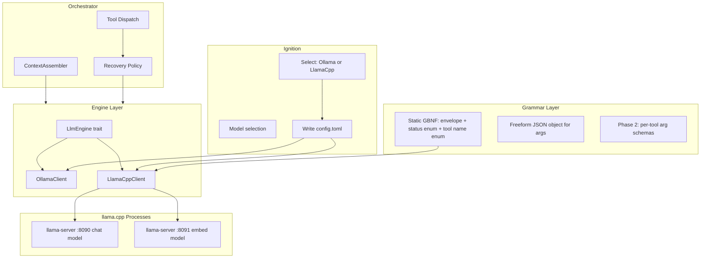

# llama.cpp Engine Integration — Meta Plan

## Current State

The codebase has a clean `LlmEngine` trait ([src/engine/traits.rs](src/engine/traits.rs)) with a single implementation `OllamaClient` ([src/engine/ollama.rs](src/engine/ollama.rs)). The orchestrator embeds tool JSON schemas into the system prompt between `<<<FCP_TOOL_DEFS_JSON>>>` delimiters, and the LLM is instructed to reply with a single JSON object `{ thought, status, message_to_user, tool_calls }`. When JSON parsing fails, `RecoverFromFuckup` injects error hints + raw JSON examples back into the stack — this is the tight coupling that breaks under grammar constraint.

Embeddings for both `ToolRouter` ([src/orchestrator/tool_router.rs](src/orchestrator/tool_router.rs)) and `SemanticBrain` ([src/memory/semantic.rs](src/memory/semantic.rs)) currently go through Ollama's embedding API with `nomic-embed-text`.

Backend selection happens implicitly (Ollama only). Ignition ([src/executive/ignition.rs](src/executive/ignition.rs)) picks a model from `ollama ps`. Config ([src/config.rs](src/config.rs)) stores `ollama_host`, `model_name`, `embed_model_name`, and Ollama-specific GPU knobs.

## Architecture Target



## Principles

- **Ollama path untouched.** Every change is additive. The Ollama path must compile and work identically after every phase.
- **Runtime backend selection.** No cargo feature flags. Both implementations compile always. `AppConfig` determines which is instantiated.
- **No `unsafe`.** llama.cpp is accessed via HTTP (llama-server), not C FFI.
- **llama.cpp is an external dependency.** Eris does not compile it. The user builds llama.cpp separately; eris resolves the binary path from config. This is the same pattern as Ollama (external daemon, HTTP client).

---

## Phase 0 — Config, Types, and Backend Enum

**Goal:** Extend `AppConfig` and ignition so the system knows which backend is active, where llama-server lives, and what ports to use. No behavioral changes.

**Files touched:**

- [src/config.rs](src/config.rs) — add `LlmBackend` enum, `LlamaCppConfig` struct
- [src/executive/ignition.rs](src/executive/ignition.rs) — backend selection prompt
- Vault `config.toml` schema documentation

**Key additions to `AppConfig`:**

```rust
#[derive(Debug, Clone, Deserialize, Serialize, PartialEq, Eq, Default)]
pub enum LlmBackend {
    #[default]
    Ollama,
    LlamaCpp,
}

#[derive(Debug, Clone, Deserialize, Serialize, PartialEq)]
pub struct LlamaCppConfig {
    /// Path to the llama.cpp build directory (contains bin/llama-server).
    /// Resolved during ignition or set manually in config.toml.
    pub home: PathBuf,
    /// Host:port for the chat model llama-server instance.
    pub chat_server_url: String,        // default "http://127.0.0.1:8090"
    /// Host:port for the embedding model llama-server instance.
    pub embed_server_url: String,       // default "http://127.0.0.1:8091"
    /// GGUF model path for chat (user provides; selected during ignition).
    pub chat_model_path: PathBuf,
    /// GGUF model path for embeddings.
    pub embed_model_path: PathBuf,
    /// GPU layers to offload (--n-gpu-layers); 0 = CPU only.
    pub n_gpu_layers: u32,
}
```

**Ignition flow change:** After "Agent Name" / "Your name" prompts, a new `Select` asks `Backend: [Ollama, llama.cpp]`. If llama.cpp: prompt for `llama_cpp_home` directory (validate `bin/llama-server` exists), GGUF model path for chat, GGUF model path for embed, and **`num_ctx`** (top-level; used for managed `llama-server --ctx-size` and orchestrator budgets). Write the `[llama_cpp]` section to `config.toml` and set `llm_backend = "LlamaCpp"`.

**Deliverable:** Config round-trips through TOML. Existing vaults with no `llm_backend` field default to `Ollama`. Tests: serialize/deserialize, ignition path validation.

---

## Phase 1 — LlamaCppClient: Engine Implementation

**Goal:** Implement `LlmEngine` for llama-server's `/v1/chat/completions` endpoint. No grammar yet — just a working HTTP client that replaces Ollama for generation. This validates the integration before adding grammar complexity.

**Files created:**

- `src/engine/llama_cpp.rs` — `LlamaCppClient` struct, `impl LlmEngine`

**Files touched:**

- [src/engine/mod.rs](src/engine/mod.rs) — add `pub mod llama_cpp;`
- [src/executive/chat_session.rs](src/executive/chat_session.rs) — branch on `LlmBackend` to instantiate either `OllamaClient` or `LlamaCppClient`

**LlamaCppClient design:**

```rust
pub struct LlamaCppClient {
    http: reqwest::Client,
    chat_url: String,     // "http://127.0.0.1:8090/v1/chat/completions"
    config: Arc<AppConfig>,
    token_metrics_tx: Option<watch::Sender<LlmTokenSnapshot>>,
}
```

The `generate` implementation:

- Builds an OpenAI-compatible `messages` array from the `&[Message]` stack (same role mapping as `OllamaClient`)
- POSTs to `/v1/chat/completions` with `stream: true` (or false)
- For streaming: parses SSE `data:` lines, forwards content deltas to `stream_tx`
- Extracts `usage.prompt_tokens` and `usage.completion_tokens` from the final chunk
- Publishes to `token_metrics_tx`

The `available_tools_json` parameter is ignored (same as current Ollama path — schemas are in the system prompt).

**Deliverable:** `LlamaCppClient` passes the same kind of wiremock tests as `OllamaClient` (timeout, network fault, valid response). Manual smoke: `eris chat` with `llm_backend = "LlamaCpp"` and a running `llama-server`, model responds conversationally.

---

## Phase 2 — Process Management for llama-server

**Goal:** Eris manages llama-server lifecycle the same way it manages Ollama in `PeripheralLifecycle` ([src/executive/peripherals.rs](src/executive/peripherals.rs)). Two processes: chat server + embed server.

**Files touched:**

- [src/executive/peripherals.rs](src/executive/peripherals.rs) — add `llama_chat: Option<ManagedProcess>`, `llama_embed: Option<ManagedProcess>`, spawn/ready-probe/shutdown logic

**Spawn command (chat):**

```
{llama_cpp_home}/bin/llama-server \
    --model {chat_model_path} \
    --port 8090 \
    --ctx-size {num_ctx} \
    --n-gpu-layers {n_gpu_layers}
```

**Spawn command (embed):**

```
{llama_cpp_home}/bin/llama-server \
    --model {embed_model_path} \
    --port 8091 \
    --embedding \
    --ctx-size {num_ctx}
```

Ready probe: TCP connect + `GET /health` returning `200 {"status":"ok"}` within `READY_TIMEOUT_SECS`.

**Shutdown:** same SIGTERM-then-SIGKILL as the existing Ollama `sync_reap_managed_child`.

**Deliverable:** `eris chat` with llama.cpp backend spawns both servers, waits for readiness, and tears them down on exit. If either fails to start, error with clear message.

---

## Phase 3 — Embedding Abstraction

**Goal:** `ToolRouter` and `SemanticBrain` currently take `Arc<Ollama>` and call `generate_embeddings`. Extract an `EmbeddingProvider` trait so both backends can supply vectors.

**Files created:**

- `src/engine/embedding.rs` — trait + two impls

```rust
#[async_trait]
pub trait EmbeddingProvider: Send + Sync {
    async fn embed(&self, text: &str) -> Result<Vec<f32>>;
}
```

- `OllamaEmbedding` wraps `Arc<Ollama>` + `embed_model_name` (extracts current logic from `ToolRouter::embed` and `SemanticBrain`)
- `LlamaCppEmbedding` wraps `reqwest::Client` + embed server URL, calls `/v1/embeddings`

**Files touched:**

- [src/orchestrator/tool_router.rs](src/orchestrator/tool_router.rs) — replace `ollama: Arc<Ollama>` + `embed_model: String` with `embed: Arc<dyn EmbeddingProvider>`
- [src/memory/semantic.rs](src/memory/semantic.rs) — replace `Ollama` embedding calls with `Arc<dyn EmbeddingProvider>`
- [src/executive/chat_session.rs](src/executive/chat_session.rs) — construct the right `EmbeddingProvider` based on backend, inject into `ToolRouter` and `SemanticBrain`

**Deliverable:** Both backends produce identical embedding pipelines. ToolRouter and SemanticBrain work without knowing which backend is active.

---

## Phase 4 — GBNF Grammar: Static Envelope

**Goal:** Build the core grammar that constrains LLM output to valid FCP protocol JSON. This is the critical phase that eliminates parse failures.

**Files created:**

- `src/engine/grammar/mod.rs`
- `src/engine/grammar/envelope.rs` — static GBNF for the outer protocol shape
- `src/engine/grammar/tool_names.rs` — dynamic enum of registered tool names

**The static GBNF constrains:**

- Root must be a single JSON object
- Required keys: `thought` (string), `status` (enum: `"Task"`, `"Reflect"`, `"Idle"`, `"Process"`), `tool_calls` (array)
- Optional key: `message_to_user` (string or null)
- Each `tool_calls` element: `{ "name": <tool_name_enum>, "args": <any_json_object> }`
- No trailing content after the closing `}`

**Dynamic part:** The tool name enum is built at runtime from `Gatekeeper::registered_tool_names()`, producing a GBNF rule like:

```
tool-name ::= "\"vault:read\"" | "\"vault:write\"" | "\"memory:stage\"" | ...
```

**Grammar compilation function:**

```rust
pub fn compile_fcp_envelope_grammar(
    tool_names: &[String],
) -> String { ... }
```

This returns a complete GBNF string. Called once at session start (tool set is fixed) and cached. Passed to `LlamaCppClient` which forwards it as the `grammar` parameter on every `/v1/chat/completions` request.

**Key design decision:** `args` is `any-json-object` in the grammar (freeform). Tool argument validation remains in the Gatekeeper post-hoc. This is Phase 4 (C). Phase 7 can optionally tighten `args` per tool.

**Deliverable:** Grammar compiles, is syntactically valid GBNF, and the LLM's output always parses as `LlmResponse`. Tests: generate grammar string, parse representative outputs through it.

---

## Phase 5 — Recovery Redesign for Grammar Path

**Goal:** With grammar enforcement, JSON parse failures are impossible. The recovery taxonomy collapses. This phase decouples recovery for the llama.cpp path.

**Current recovery tiers (Ollama path, unchanged):**

1. `RecoverFromFuckup` — JSON parse failure, trailing content, missing status. Injects error hint + JSON examples into stack.
2. `TargetedSchemaRetry` — Valid JSON, but tool args fail schema validation. Injects the specific tool's full parameter schema.
3. `Recoverable` — Tool execution error (network, IO). Model gets error message, retries.

**llama.cpp path recovery (new):**

1. ~~`RecoverFromFuckup`~~ — **Eliminated.** Grammar makes this structurally impossible. If it somehow fires (defensive), log at `error!` level and treat as fatal (indicates grammar bug, not model drift).
2. `TargetedSchemaRetry` — **Kept, redesigned.** When the Gatekeeper rejects tool args, instead of injecting raw JSON schema text into the chat stack (which would be double-constrained by grammar), the recovery message is a **structured natural-language description** of what went wrong and what the correct args shape is. The grammar still constrains the retry output.
3. `SkillGuidance` — **New.** On tool failure, if the failing tool has a `suggested_skills` entry in its descriptor (like `db:find_connections` has `"db-connections-recovery"`), load and inject the skill body as guidance. This makes recovery domain-aware.
4. `Recoverable` — **Kept as-is.** Tool execution errors (network, IO) get the same treatment in both paths.

**Files touched:**

- [src/orchestrator/loop/recovery_policy.rs](src/orchestrator/loop/recovery_policy.rs) — add `backend: LlmBackend` parameter to `classify_tool_failure`; grammar path skips `TargetedSchemaRetry` raw JSON injection
- [src/orchestrator/context/resolved_tool_recovery/markers.rs](src/orchestrator/context/resolved_tool_recovery/markers.rs) — grammar-path markers
- [src/orchestrator/llm_support/json_envelope.rs](src/orchestrator/llm_support/json_envelope.rs) — add `llm_schema_recovery_natural_language` function that describes the expected args in prose (not raw JSON)
- [src/orchestrator/core/step.rs](src/orchestrator/core/step.rs) — skip `parse_llm_response_protocol` error branch when grammar is active (defensive: log + fatal instead of recovery loop)

**Recovery message format (grammar path):**

```
Tool "vault:write" rejected your args.

Error: missing required field "mode".

Expected arguments:
- relative_path (string, required): path relative to vault root
- content (string, required): file content
- mode (string, required): "overwrite" or "append"

Retry with corrected tool_calls.
```

This is plain text inside a `system` message. The grammar constrains the model's _response_ to valid JSON — the _input_ (system/user messages) can contain anything.

**Deliverable:** Grammar path never enters `RecoverFromFuckup`. Schema retries use natural language. Skills are loaded on relevant failures. Full test coverage for the new classifier.

---

## Phase 6 — Health Check and Tracing Integration

**Goal:** `system:health` reports the active backend. Tracing covers the new engine. Token metrics work for both paths.

**Files touched:**

- [src/tools/system/health.rs](src/tools/system/health.rs) — add `llm_backend` field, llama-server health endpoint results when active
- [src/engine/token_metrics.rs](src/engine/token_metrics.rs) — verify `LlamaCppClient` publishes snapshots (it does via Phase 1 already; this phase adds integration tests)
- [src/telemetry/preflight.rs](src/telemetry/preflight.rs) — preflight check for llama-server reachability when backend is LlamaCpp

**Health output when llama.cpp is active:**

```json
{
  "llm_backend": "LlamaCpp",
  "llama_cpp": {
    "chat_server": "http://127.0.0.1:8090",
    "chat_model": "/models/qwen2.5-14b.gguf",
    "embed_server": "http://127.0.0.1:8091",
    "embed_model": "/models/nomic-embed-text.gguf"
  },
  "cpu": { ... },
  "ram": { ... }
}
```

**Deliverable:** Health tool works for both backends. Tracing events use consistent field names. Token metrics publish on both paths.

---

## Phase 7 — Dynamic Per-Tool Arg Grammar (Stretch)

**Goal:** Tighten the GBNF grammar so `args` is constrained per tool, eliminating schema validation failures entirely.

This is the hard phase. Each turn, the set of offered tools is known (from `Gatekeeper` + pre-LLM routing). Their `parameters_schema()` returns `schemars::RootSchema`. The grammar compiler translates each tool's JSON Schema into GBNF rules and unions them under the `tool-name` branch.

```
tool-call ::= "{" ws "\"name\":" ws tool-with-args ws "}"
tool-with-args ::=
    "\"vault:read\"" ws "," ws "\"args\":" ws vault-read-args
  | "\"vault:write\"" ws "," ws "\"args\":" ws vault-write-args
  | ...

vault-read-args ::= "{" ws "\"relative_path\":" ws string ws "}"
vault-write-args ::= "{" ws "\"relative_path\":" ws string ws ","
                      ws "\"content\":" ws string ws ","
                      ws "\"mode\":" ws ("\"overwrite\"" | "\"append\"") ws "}"
```

**This reuses the existing JIT schema compilation** — `Tool::parameters_schema()` already produces JSON Schema. The new code translates JSON Schema to GBNF rules (a bounded subset: object, string, number, boolean, enum, array, required/optional fields).

**Files created:**

- `src/engine/grammar/schema_to_gbnf.rs` — JSON Schema to GBNF rule compiler

**Risk:** This phase has the highest complexity and failure risk. It should only proceed after Phases 0-6 are stable and tested. The freeform-args grammar from Phase 4 is a fully functional fallback.

**Deliverable:** Per-tool-selection grammar compilation. If the schema-to-GBNF compiler encounters an unsupported schema construct, it falls back to freeform JSON object for that tool's args (graceful degradation).

---

## Phase 8 — Documentation and Operator Manual

**Files touched:**

- [docs/OPERATOR_MANUAL.md](docs/OPERATOR_MANUAL.md) — llama.cpp setup instructions, GGUF model acquisition, build steps, config.toml reference
- New `docs/LLAMA_CPP_SETUP.md` — dedicated guide

**Content:**

- How to clone and build llama.cpp (platform-specific: macOS Metal, Linux CUDA, CPU-only)
- How to obtain GGUF models (huggingface-cli, direct download)
- Config.toml `[llama_cpp]` section reference
- Ignition walkthrough with the new backend selector
- Troubleshooting: port conflicts, GPU layer tuning, context size vs VRAM

---

## What This Plan Does NOT Change

- Ollama code paths: zero modifications to `OllamaClient`, Ollama-specific config fields, or Ollama process management
- Tool implementations: tools remain backend-agnostic (they never see the engine)
- Orchestrator state machine: `AgentState`, `LoopDirective`, `StateTransition` — unchanged
- Chat stack format: `Vec<Message>` with role/content strings — unchanged
- Context view and condensation: backend-agnostic, unchanged
- Presentation layer: completely decoupled from engine, unchanged

## Critical Risks

1. **GBNF grammar correctness.** If the grammar is too restrictive, the model cannot express valid tool calls. Mitigation: extensive test suite in Phase 4 against real model outputs from logs.
2. **llama-server stability.** Process crashes, OOM kills, stuck slots. Mitigation: health probes, timeout handling, same patterns as Ollama.
3. **Embedding dimension mismatch.** If the llama-server embedding model produces vectors with a different width than what Qdrant expects. Mitigation: validate dimensions at startup, fail fast.
4. **Recovery message format.** Natural-language schema descriptions might confuse smaller models more than raw JSON examples. Mitigation: test with target models (qwen2.5:14b GGUF), keep the prose tight.

## Execution Order

Phases 0 through 6 are sequential dependencies. Phase 7 is optional/stretch. Phase 8 runs in parallel with later phases.

Estimated scope: ~2500 lines of new Rust, ~300 lines of modified Rust, ~200 lines of docs. No existing tests break. ~40 new tests across all phases.

### note from user

the current llama ccp is here, but we might change this later and handle it in the config as mentioned in later steps

`/Users/jandahlke/dev/hagbards_stuff/_utils/llama.cpp`
