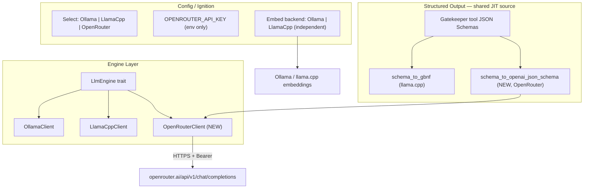

# OpenRouter Engine Integration — Meta Plan

## Current State

The codebase has a clean `LlmEngine` trait ([src/engine/traits.rs](../../src/engine/traits.rs)) with two implementations dispatched at runtime through the `AnyEngine` enum ([src/engine/mod.rs](../../src/engine/mod.rs)):

- `OllamaClient` ([src/engine/ollama.rs](../../src/engine/ollama.rs)) — `ollama-rs`, JSON enforced via `FormatType::Json` (JSON mode, no grammar). Recovery loop reprompts on parse failure.
- `LlamaCppClient` ([src/engine/llama_cpp.rs](../../src/engine/llama_cpp.rs)) — `reqwest` → local `llama-server` `/v1/chat/completions`, JSON enforced via **GBNF grammar** compiled per turn.

Backend selection is `config.llm_backend: LlmBackend` (enum `Ollama | LlamaCpp` in [src/config.rs](../../src/config.rs)), wired in [src/executive/chat_session.rs](../../src/executive/chat_session.rs) (factory), [src/benchmark/runner.rs](../../src/benchmark/runner.rs), [src/executive/peripherals.rs](../../src/executive/peripherals.rs) (daemon lifecycle), [src/executive/ignition.rs](../../src/executive/ignition.rs) (first-run wizard), and [src/telemetry/preflight.rs](../../src/telemetry/preflight.rs).

**Key existing machinery we will reuse:**

- Per-turn structured-output constraint. In [src/orchestrator/core/step.rs](../../src/orchestrator/core/step.rs) (~L432–463) the orchestrator computes the offered-tool set for the hop (`slim_offered_tool_names` / `targeted_tools`) and compiles a **GBNF subset** via `GbnfSubsetCache::get_or_compile_subset` ([src/orchestrator/core/llama_gbnf_subset.rs](../../src/orchestrator/core/llama_gbnf_subset.rs)). That subset is passed to the engine through `LlmGenerateOptions.grammar_override`.
- The subset compiler pulls each tool's JSON Schema from `Gatekeeper::parameters_root_schema_for(name)` (a `schemars::RootSchema`) and turns it into GBNF via `schema_to_gbnf_rule` ([src/engine/grammar/schema_to_gbnf.rs](../../src/engine/grammar/schema_to_gbnf.rs)).
- The FCP envelope shape is fixed: `{ thought: string, status: "Task"|"Reflect"|"Idle"|"Process", message_to_user: string|null, tool_calls: [{name, args}] }` (see [src/engine/grammar/envelope.rs](../../src/engine/grammar/envelope.rs)).
- Recovery on malformed protocol JSON already branches on backend in [src/orchestrator/core/llm_directive.rs](../../src/orchestrator/core/llm_directive.rs). The **non-llama.cpp branch (`else`)** is the Ollama-style best-effort path — OpenRouter naturally falls into it.

## Goal

Add **OpenRouter** as a third runtime backend so the operator can point Eris at a hosted, capable, fast model via an API key — without a local daemon. Because OpenRouter exposes the **same OpenAI `/v1/chat/completions`** API as `llama-server`, `LlamaCppClient` is ~80% of the implementation. The two substantive differences:

1. **Transport:** remote base URL + `Authorization: Bearer` (key from env, never persisted).
2. **Envelope enforcement:** no GBNF. Instead emit `response_format: { type: "json_schema", strict: true, ... }` — derived from the **same** offered-tool schemas the GBNF subset uses (the "JIT"). Fallback ladder to `json_object`, then prompt-only, all backed by the existing recovery loop.

Embeddings stay **local** (Ollama or llama.cpp): OpenRouter has no embeddings endpoint, and the operator wants embeddings on-machine (larger context budgets, no per-token cost).

## Architecture Target



## Principles

- **Additive & non-breaking.** Ollama and llama.cpp paths compile and behave identically after every phase. Every change gated on the new enum variant or a decoupled embed field.
- **Runtime selection, no cargo features.** All three engines compile always; `AppConfig` picks one.
- **Secrets never touch disk.** API key comes from `OPENROUTER_API_KEY` (or `FCP_OPENROUTER_API_KEY`); `config.toml` stores only model id / base URL / non-secret headers. All key handling routes through `FcpError` with `?` — no `unwrap`/`expect` (per `.cursorrules`).
- **One structured-output source of truth.** OpenRouter's `json_schema` and llama.cpp's GBNF are both derived from the same `Gatekeeper` tool schemas + offered-tool set, so prompt / constraint / validation cannot drift.
- **Graceful degradation.** `json_schema (strict)` → `json_object` → prompt-only, each falling back to the existing recovery loop if the model returns malformed protocol JSON.
- **Embeddings decoupled from chat.** Introduce an independent embed-backend selector so chat=OpenRouter can run embeddings locally.
- **Data governance is a first-class concern.** Eris is local-first (private vault, local models, `.fcp/` on disk). Routing chat to OpenRouter sends vault content, tool outputs, and memories to a third party (and possibly its sub-providers). This is a **trust-boundary change**, not a transport detail: it requires explicit consent, provider data-collection controls, and never exfiltrating secrets. See "Cross-Cutting Hardening" §Privacy.
- **No silent fail-open.** A remote provider that ignores `response_format`/tools returns unconstrained prose with HTTP 200 — the same fail-open hazard the GBNF path warns about. Structured requests must pin `provider.require_parameters = true`.

---

## Phase 0 — Config, Types, Backend Enum, Embed Decoupling

**Goal:** Teach `AppConfig` about OpenRouter and split embed-backend selection from chat-backend selection. No behavioral change for existing vaults.

**Files touched:**

- [src/config.rs](../../src/config.rs) — add `LlmBackend::OpenRouter` (+ `Display` arm); add `OpenRouterConfig`; add `openrouter: Option<OpenRouterConfig>`; add `is_openrouter()`; add `validate_openrouter_config()`; add an **`embed_backend: Option<EmbedBackend>`** (defaulting to "same as `llm_backend` when it is a local backend, else Ollama") so chat can be remote while embeddings stay local.

```rust
pub enum LlmBackend { #[default] Ollama, LlamaCpp, OpenRouter }

pub struct OpenRouterConfig {
    /// Default "https://openrouter.ai/api/v1".
    pub base_url: String,
    /// e.g. "google/gemini-2.5-flash", "openai/gpt-4o-mini", "anthropic/claude-3.5-haiku".
    pub model: String,
    /// Optional OpenRouter attribution headers (non-secret).
    pub referer: Option<String>,   // HTTP-Referer
    pub title: Option<String>,     // X-Title
    /// json_schema (strict) -> json_object -> off. Default: JsonSchema.
    pub response_format_mode: ResponseFormatMode,
    /// Upper bound on completion tokens (OpenAI `max_tokens`). Default 2048.
    pub max_tokens: i32,
    /// Env var name holding the API key. Default "OPENROUTER_API_KEY".
    pub api_key_env: String,

    // --- resilience / cost / privacy (see Cross-Cutting Hardening) ---
    /// Only route to providers that honor sent params (response_format/tools). Default true.
    pub require_parameters: bool,
    /// Provider data-collection policy: "deny" (default) keeps requests off training data.
    pub data_collection: DataCollection,   // Deny | Allow
    /// Must be true before any request is sent for this vault (consent gate). Default false.
    pub consent_acknowledged: bool,
    /// Enable prompt caching (cache_control breakpoint on the static system prefix). Default true.
    pub prompt_caching: bool,
    /// Optional per-1M-token pricing for local cost math (else use reported credits).
    pub price_per_mtok_in: Option<f64>,
    pub price_per_mtok_out: Option<f64>,
    /// Bounded retry for transient 429/5xx; honors Retry-After. Default 3.
    pub max_retries: u32,
    /// Separate from a local-tuned default: hosted reasoning can take minutes.
    pub request_timeout_secs: u64,         // total
    pub stream_idle_timeout_secs: u64,     // inter-chunk
    /// Ordered fallback model ids for provider-outage resilience (OpenRouter `models`). Optional.
    pub fallback_models: Vec<String>,
    /// Optional determinism / shaping passthrough.
    pub seed: Option<i64>,
    pub top_p: Option<f32>,
    pub stop: Vec<String>,
}

pub enum EmbedBackend { Ollama, LlamaCpp }  // NOT OpenRouter — no embeddings endpoint
```

- `validate_openrouter_config()` — ensures `[openrouter]` exists, `model` non-empty, and the key env var is set (fail fast with a clear `FcpError::Config`, no key value logged).

**`num_ctx` semantics (important for condensation & cost).** For Ollama/llama.cpp, `num_ctx` doubles as the local server `--ctx-size`. For OpenRouter there is no local server, but `num_ctx` still drives the orchestrator's budgets and the rolling-condensation ceiling (`condensation_stack_est_ceiling_tokens(num_ctx)`). It must therefore be set to the **hosted model's context window** (e.g. 1M for Gemini 2.5 Flash, 128k for GPT-4o-mini). Add `OpenRouterConfig::context_window` (or reuse top-level `num_ctx`) and surface it in ignition so condensation neither wastes context nor over-folds.

**Pricing (optional, for cost display).** Add `OpenRouterConfig::price_per_mtok_in` / `price_per_mtok_out` (f64, optional). Used by Phase 1 cost accounting. If unset, cost display falls back to OpenRouter's reported credits (see Phase 1).

**Deliverable:** Config round-trips through TOML. Existing vaults (no `llm_backend`) default to Ollama. Vaults with `llm_backend = "OpenRouter"` and no `[openrouter]` fail validation with a helpful message. Tests: serde round-trip, missing-key error, embed decoupling default, `num_ctx` propagation to the condensation ceiling.

---

## Phase 1 — OpenRouterClient: Engine Implementation

**Goal:** Implement `LlmEngine` against OpenRouter's OpenAI-compatible endpoint. Adapt from `llama_cpp.rs`.

**Files created:**

- `src/engine/openrouter.rs` — `OpenRouterClient` + `impl LlmEngine`.

**Files touched:**

- [src/engine/mod.rs](../../src/engine/mod.rs) — `pub mod openrouter;`, `AnyEngine::OpenRouter(OpenRouterClient)` variant, match arm in `generate`, no-op arm in `set_grammar`.

**Design:**

```rust
pub struct OpenRouterClient {
    http: reqwest::Client,          // default Authorization + attribution headers baked in
    chat_url: String,               // "{base_url}/chat/completions"
    model: String,
    config: Arc<AppConfig>,
    token_metrics_tx: Option<watch::Sender<LlmTokenSnapshot>>,
    // per-turn structured constraint set via generate options (see Phase 3)
}
```

`generate()`:

- Reuse `normalize_system_messages` + `merge_trailing_assistant_messages` from the llama.cpp path (hosted models are equally strict about role ordering) — factor them into a shared `src/engine/openai_wire.rs` helper module so both backends share one copy.
- Build OpenAI request: `model`, `messages`, `stream`, `temperature`, `max_tokens` (not `n_predict`), and optional `response_format` (Phase 3). **Drop** `grammar` and `chat_template_kwargs` (llama-server-only).
- API key read once at construction from `config.openrouter.api_key_env`; set as a default header on the `reqwest::Client`. Never logged.
- Streaming: reuse the SSE parser (same `data:` framing, `[DONE]` sentinel, `choices[].delta.content`, `usage`).
- Map HTTP 401 → `FcpError::Config("OpenRouter rejected API key")`, 402/429 → `NetworkFault` (quota/rate), timeouts/connect → `NetworkFault`, mirroring the llama.cpp error mapping.
- Publish `LlmTokenSnapshot` on success.

**Cost accounting (answers "can we count tokens/costs precisely?").** OpenRouter returns `usage.prompt_tokens` / `completion_tokens` natively (already consumed), so token counts are **exact, not estimated**. Two ways to get money:

1. **Local pricing** — multiply exact tokens by `price_per_mtok_in/out` from config. Simple, no extra round-trip, no dependency on OpenRouter accounting.
2. **Reported credits** — send `"usage": { "include": true }` in the request body; OpenRouter then returns `usage.cost` (actual credits, incl. its routing) in the same response. Optionally reconcile via `GET {base_url}/generation?id={id}` for the authoritative post-hoc number.

Extend `LlmTokenSnapshot` with optional `cost_usd: Option<f64>` and a running `session_cost_usd` accumulator (or a sibling `CostSnapshot` on the same `watch` channel to avoid touching the local backends' hot path). The TUI/web status line already subscribes to token metrics, so cost renders next to tokens/s with no new plumbing. Ollama/llama.cpp simply leave `cost_usd = None` (local = free).

**Deliverable:** `wiremock` tests parallel to `llama_cpp.rs`: non-streaming, streaming, auth header present, 401/429/500 mapping, `max_tokens` serialized, `response_format` omitted when disabled, exact token pass-through, and cost computed from both local pricing and a mocked `usage.cost`. Manual smoke: `eris chat` with `llm_backend="OpenRouter"` responds conversationally and shows live token + cost.

---

## Phase 2 — Wiring, Preflight, and the `is_ollama()` Audit

**Goal:** Instantiate `OpenRouterClient` from config; keep embeddings local; audit every backend branch.

**Files touched:**

- [src/executive/chat_session.rs](../../src/executive/chat_session.rs) — add `LlmBackend::OpenRouter` arm to the engine factory (~L262). **Decouple** the `embed_provider` match (~L276) to key off `config.embed_backend` (resolved) instead of `config.llm_backend`, so OpenRouter chat + local embeddings coexist.
- [src/benchmark/runner.rs](../../src/benchmark/runner.rs) — add the OpenRouter arm.
- [src/executive/peripherals.rs](../../src/executive/peripherals.rs) — OpenRouter has **no local daemon**: skip spawn; still allow spawning the local embed daemon if `embed_backend` requires it.
- [src/telemetry/preflight.rs](../../src/telemetry/preflight.rs) — add a lightweight OpenRouter reachability/auth probe (e.g. `GET {base_url}/models` or a tiny auth check) when chat backend is OpenRouter.
- **Audit `is_ollama()` / `is_llamacpp()` call sites.** `is_ollama()` returns `true` only for `Ollama`; several sites assume "not llama.cpp ⇒ Ollama". For OpenRouter **both** helpers return `false`, which is the correct behavior for the recovery path in [src/orchestrator/core/llm_directive.rs](../../src/orchestrator/core/llm_directive.rs) (falls into the Ollama-style `else`). Verify each site listed by grepping `is_ollama|is_llamacpp|LlmBackend::` and confirm the OpenRouter fall-through is intended: `step.rs`, `tool_dispatch.rs`, `llm_directive.rs`, `health.rs`, `render.rs`, `ui/web/settings_merge.rs`.

**Deliverable:** `eris chat` with OpenRouter chat + local embeddings boots, passes preflight, and holds a conversation. No local chat daemon spawned. Ollama/llama.cpp unaffected.

---

## Phase 3 — Structured Output: `response_format` from the JIT schemas

**Goal:** Give OpenRouter the same "help the model be precise" guarantee GBNF gives llama.cpp, by emitting a per-turn `response_format: json_schema` built from the **same** offered-tool schemas.

**Files created:**

- `src/engine/structured/mod.rs` + `src/engine/structured/schema_to_openai.rs` — transform a tool's `schemars::RootSchema` into an OpenAI-structured-outputs-compatible schema fragment (inline `$defs`/`$ref`, force `additionalProperties: false`, mark all listed properties required, drop unsupported keywords). Analogous to `schema_to_gbnf_rule`.

  **Use a typed DTO, not raw `serde_json::Value` munging** (answers the schemars question). schemars emits Draft-7 with `definitions`/`$ref` and keywords (`format`, `default`, `oneOf` at odd places, `minimum`, …) that strict structured-output rejects. Rather than pattern-matching a `Value` tree in place, define a small closed DTO that models *only* the accepted subset and `Serialize`s to exactly the right JSON:

```rust
#[derive(Serialize)]
#[serde(tag = "type", rename_all = "lowercase")]
enum OpenAiSchema {
    Object { properties: IndexMap<String, OpenAiSchema>,
             required: Vec<String>,
             #[serde(rename = "additionalProperties")] additional_properties: bool }, // always false
    String { #[serde(skip_serializing_if = "Option::is_none")] r#enum: Option<Vec<String>> },
    Integer, Number, Boolean,
    Array { items: Box<OpenAiSchema> },
    // discriminated union for tool_calls[].args keyed on the sibling `name`
    #[serde(untagged)] OneOf { one_of: Vec<OpenAiSchema> },
}
```

  A `lower(&RootSchema) -> Result<OpenAiSchema>` walker inlines refs and normalizes; unsupported constructs return `Err`, and the per-tool caller falls back to a permissive `Object{ additionalProperties:false, properties:{} }` (graceful degradation, mirroring `schema_to_gbnf`'s fallback). This makes the transform unit-testable field-by-field and makes the `additionalProperties:false` + all-required invariants unrepresentable-to-violate rather than enforced by hand. Because tool args are already typed Rust structs deriving `JsonSchema`, most tools will lower cleanly.
- `src/engine/structured/envelope_schema.rs` — build the full FCP envelope JSON Schema: fixed `thought`/`status`(enum)/`message_to_user`(string|null), and `tool_calls` as an array whose items are a **discriminated union** (`oneOf`, discriminator `name`) over the offered tools, each with its args schema. Empty offered-set ⇒ `tool_calls` constrained to `[]`. Mirrors `compile_fcp_envelope_grammar_dynamic`.
- `src/orchestrator/core/openai_schema_subset.rs` — a `JsonSchemaSubsetCache` mirroring `GbnfSubsetCache` (same cache-key-by-sorted-tool-names strategy), returning `Arc<serde_json::Value>`.

**Files touched:**

- [src/engine/traits.rs](../../src/engine/traits.rs) — extend `LlmGenerateOptions` with `response_json_schema: Option<Arc<serde_json::Value>>` (ignored by Ollama/llama.cpp). Keeps the trait signature stable.
- [src/orchestrator/core/step.rs](../../src/orchestrator/core/step.rs) — where GBNF subset is computed (~L432), add a parallel branch: when `config.is_openrouter()`, compile the JSON-Schema subset from the **same** offered-tool list and set `response_json_schema`. (llama.cpp keeps `grammar_override`; they are mutually exclusive by backend.)
- `src/engine/openrouter.rs` — when `response_json_schema` is `Some` and `response_format_mode == JsonSchema`, send `response_format: {type:"json_schema", json_schema:{name:"fcp_envelope", strict:true, schema:<value>}}`.

**Fallback ladder (per `response_format_mode`, with graceful downgrade on 400 "unsupported response_format"):**

1. `JsonSchema` (strict) — richest; supported by structured-output models (GPT-4o family, Gemini 2.5, etc.).
2. `JsonObject` — `response_format:{type:"json_object"}`; guarantees valid JSON, not shape. Envelope shape enforced by prompt + recovery loop.
3. `Off` — prompt-only; relies entirely on the existing recovery loop (identical to Ollama behavior today).

If a model rejects strict `json_schema` (HTTP 400), log at `warn!`, downgrade to `json_object` for the session, and continue — never crash.

**Deliverable:** OpenRouter turns emit a per-hop `json_schema` that lists exactly the offered tools. Tests: envelope schema for empty/typed/fallback tools, `$ref` inlining, discriminated union over 2+ tools, cache hit/miss, downgrade-on-400. Reuse the `slim_offered_tool_names` fixtures from `llama_gbnf_subset.rs` tests to prove GBNF and JSON-Schema subsets offer the identical tool set.

---

## Phase 3b — Reasoning on hosted models

**Goal:** Optionally let capable OpenRouter models reason before answering — safely, because hosted reasoning is segregated from `content`.

**Why this is different from local.** `enable_reasoning_fsm` (default `false`) exists because local backends emit `<think>…</think>` **into `message.content`**, contaminating the FCP envelope that must begin with `{` (hence `.think(false)`, `enable_thinking:false`, `--reasoning off`, and the defensive `strip_leading_redacted_thinking_block`). OpenRouter returns reasoning in a **separate field** (`choices[].message.reasoning` / `reasoning_details`, tokens in `usage.completion_tokens_details.reasoning_tokens`) — `content` stays a clean envelope. So the correctness objection vanishes; enabling reasoning becomes purely a **cost/latency** tradeoff.

**Do NOT overload `enable_reasoning_fsm`** — its semantics are local `<think>` suppression. Add a dedicated `OpenRouterConfig::reasoning`:

```rust
pub enum OpenRouterReasoning {
    Off,                          // default — fast chat assistant
    Effort(ReasoningEffort),      // "high" | "medium" | "low"  (OpenAI o-series, Grok, ...)
    MaxTokens(u32),               // explicit budget (Anthropic, Gemini)
}
```

Mapped to the request `reasoning` object; `Off` omits it (or sends `{ "exclude": true }` where a model reasons unconditionally).

**Engine handling (`src/engine/openrouter.rs`):**

- Envelope: keep parsing `message.content` only — unchanged.
- Trace: capture `message.reasoning` / `reasoning_details` and forward to the existing `ModelThought` display / tracing (a separate stream), **not** re-injected into the paid chat stack.
- Cost: include `reasoning_tokens` in the Phase 1 accounting — they bill as output and can dominate spend; surface them distinctly (e.g. `out: 120 (+340 reasoning)`).
- Streaming: reasoning deltas arrive on `delta.reasoning`; route to the thought stream, keep `delta.content` for the envelope.

**Two "reasoning" concepts — keep separate.** The model's **native reasoning trace** (hosted channel, optional telemetry, cost-bearing) vs. the FCP envelope's **`thought`** field (protocol-internal, drives runtime + thought display). `thought` remains the source of truth; native reasoning is richer optional telemetry.

**Interaction with structured output.** Most reasoning models reason first, then emit the constrained answer — compatible with `json_schema`. A few reject `reasoning` + strict `json_schema` (or `reasoning` + `temperature`); add that combination to the Phase 3 fallback ladder (downgrade structured mode, or drop temperature, on the specific 400).

**Deliverable:** `reasoning` configurable per vault (default off). When on, reasoning traces render in the thought stream, envelope parsing is unaffected, and reasoning tokens appear in cost. Tests: `reasoning` param serialized per variant; `content` parsed while `reasoning` captured; reasoning tokens summed into cost; strict-schema+reasoning downgrade path.

---

## Phase 4 — Ignition, Health, Preflight, and Tracing

**Goal:** First-run wizard offers OpenRouter with a **fundamentally different flow** (no local model discovery), and every check that today assumes a local backend is made backend-aware.

### 4a. Ignition flow (materially different from the two local backends)

Today [src/executive/ignition.rs](../../src/executive/ignition.rs) (L72–85) is a 2-option `Select` whose branches both discover *local* resources: Ollama model from `ollama ps`, or llama.cpp `home` + GGUF paths + GPU layers. OpenRouter shares none of that.

- Extend the backend `Select` to `["Ollama", "llama.cpp", "OpenRouter"]`.
- New `LlmBackend::OpenRouter` branch prompts for:
  1. **Model id** — a curated `Select` of fast/capable defaults (`google/gemini-2.5-flash`, `openai/gpt-4o-mini`, `anthropic/claude-3.5-haiku`, `deepseek/deepseek-chat`) with an "Other…" free-text escape.
  2. **Context window / `num_ctx`** — prefilled per known model, editable (drives condensation ceiling & budgets; see 4c).
  3. **Attribution headers** — optional `HTTP-Referer` / `X-Title`.
  3b. **Reasoning** — optional `Select` `[Off, low, medium, high]` (default Off); maps to `OpenRouterConfig::reasoning` (Phase 3b). Warn that non-Off increases latency and cost.
  4. **API key** — do **not** prompt for or store it. Check `std::env::var(api_key_env)`; if absent, print the exact `export OPENROUTER_API_KEY=…` line and continue (config is still written).
  4b. **Consent gate** — a clear prompt naming exactly what leaves the machine (vault content, tool outputs, memories, condensation summaries) and to whom; only sets `consent_acknowledged = true` on explicit yes. No request is ever sent without it.
  5. **Nested embed-backend sub-wizard** — because embeddings stay local, ask `Embeddings: [Ollama, llama.cpp]` and run the *existing* local embed prompts (embed model / embed server / embed GGUF). This is the key structural change: chat and embed wizards become independent.
- Write `llm_backend = "OpenRouter"`, `[openrouter]`, and the resolved `embed_backend` (+ its local section) to `config.toml`.

### 4b. Check inventory — every site that assumes "local backend"

Audit and make backend-aware (grep seed: `is_ollama|is_llamacpp|LlmBackend::|ollama_host|llama_cpp`):

| Site | Today assumes | OpenRouter behavior |
|---|---|---|
| `peripherals.rs` | spawn/probe local daemon | **no chat daemon**; still spawn local **embed** daemon if `embed_backend` needs it |
| `preflight.rs` | local reachability (`/api/tags`, `/health`) | **free** `GET /api/v1/key` (validates key + reads remaining credits) + model-id check vs `/models` + local embed probe — never a paid generation |
| `ignition.rs` | local model discovery | remote model list + env-key check (4a) |
| `health.rs` | local server URLs/models | hosted model id, base URL, embed backend, structured mode, session cost — **never the key** |
| `chat_session.rs` embed match | embed backend == chat backend | key off decoupled `embed_backend` |
| `llm_directive.rs` recovery | `is_llamacpp` ⇒ GBNF path, else Ollama | OpenRouter → `else` (best-effort JSON + recovery) — **verify intended** |
| `render.rs` / `web/settings_merge.rs` | show local backend | show hosted model; `llm_backend` stays read-only at runtime |

### 4c. Rolling condensation — keep, and make it cost-aware

`execute_condensation` ([src/orchestrator/core/condensation.rs](../../src/orchestrator/core/condensation.rs)) already calls `engine.generate(..., attach_session_grammar:false)` and is fully backend-agnostic — **it works with OpenRouter unmodified.** It is *more* valuable here: folding the tail into a rolling summary directly reduces paid prompt tokens on every subsequent turn. No code change required, but two things must be right:

- `num_ctx` reflects the hosted context window (Phase 0 / 4a) so the ceiling `condensation_stack_est_ceiling_tokens(num_ctx)` is meaningful.
- The summarizer pass itself is a paid OpenRouter call. Its `usage`/cost flows through the Phase 1 accounting like any other generation, so its cost is visible. (Optional: allow the summarizer to route to a cheaper model or the local helper model — see Future Directions.)

### 4d. Health / tracing

- [src/tools/system/health.rs](../../src/tools/system/health.rs) — report backend, model, base URL, embed backend, structured-output mode, and cumulative session cost. Never the key.
- Add a test asserting the API key never appears in health/tracing output.

**Deliverable:** Fresh `eris` ignition configures an OpenRouter chat + local embed vault end to end; every local-assuming check is backend-aware; condensation runs and its cost is accounted; health shows the hosted model + running cost.

---

## Phase 5 — Documentation

**Files touched/created:**

- `docs/OPENROUTER_SETUP.md` — getting an OpenRouter key, exporting `OPENROUTER_API_KEY`, `[openrouter]` config reference, choosing a fast/capable model, decoupled local embeddings, structured-output modes & fallbacks, troubleshooting (401/402/429).
- [docs/OPERATOR_MANUAL.md](../../docs/OPERATOR_MANUAL.md) — cross-link the new backend.

---

## Cross-Cutting Hardening (Senior Sweep)

Concerns that span phases. **P0 = ship-blocker, P1 = resilience/cost, P2 = completeness.**

### Privacy & Data Governance (P0)

- **Consent gate.** Refuse to send until `consent_acknowledged = true` (set via an explicit ignition/first-use prompt that names what leaves the machine). No silent first request.
- **Provider data policy.** Send `provider.data_collection = "deny"` by default; document that some models/providers still log or train unless denied. Surface the active model's data policy in `health`.
- **Secret hygiene.** API key only as an `Authorization` header; **never** serialized to `config.toml`, snapshots, or logs. No `tracing::debug!(?request_body)` (body carries vault content). Add a test asserting the key never appears in health/tracing output.
- **Redaction/opt-out (doc).** Note that condensation summaries and tool outputs also transit; operators wanting local-only data must keep chat on a local backend.

### Correctness of Structured Output over a Router (P0)

- **`provider.require_parameters = true`** whenever a `response_format`/tool request is sent — prevents routing to a provider that silently drops the schema (fail-open → unconstrained prose at HTTP 200). Mirrors the GBNF fail-open warning in [envelope.rs](../../src/engine/grammar/envelope.rs).
- **Model capability quirks.** Some models reject `system` role (OpenAI o-series wants `developer`), reject `temperature`, or don't support `response_format`/tools. Add a small per-model capability map (or detect-and-downgrade on the specific 400): re-role `system`→`developer`, drop `temperature`, downgrade structured mode. Extends `normalize_system_messages`, which only fixes ordering.
- **Streaming usage & framing.** Send `stream_options: { include_usage: true }` or streamed turns report **zero** tokens/cost. Handle SSE comment keep-alives (`: OPENROUTER PROCESSING`) and **mid-stream error objects** (a `data:` chunk with an `error` field must surface as `FcpError`, not be skipped).

### Resilience (P1)

- **Retry/backoff.** Bounded exponential backoff (`max_retries`) honoring `Retry-After`; classify retryable (429, 502/503, timeouts) vs fatal (400/401/402). Add `FcpError::RateLimited { retry_after_secs }` (currently only `Config`/`NetworkFault` exist) so the UI can message quota exhaustion distinctly.
- **Timeouts.** Use `request_timeout_secs` (total, generous for reasoning) + `stream_idle_timeout_secs` (inter-chunk), not the local-tuned `generation_timeout_secs`.
- **Interrupt semantics.** `step.rs` cancels by dropping the generate future — reqwest aborts only while connecting/streaming. A long **non-streaming** reasoning call keeps running (and billing) until it returns. **Default OpenRouter to streaming** for interruptibility + responsiveness.
- **Fallback models / routing.** Optional `fallback_models` → OpenRouter `models[]` + `route:"fallback"` to survive single-provider outages.

### Cost (P1)

- **Prompt caching.** Put a `cache_control` breakpoint on the large static system-prompt + tool-schema prefix (Anthropic/OpenAI/Gemini via OpenRouter). Biggest single lever for a paid backend; complements condensation. Requires the static prefix to stay byte-stable across turns (it does, modulo the rolling summary which sits after the prefix).
- **Free preflight & balance.** Use `GET /api/v1/key` to validate the key and read remaining credits (no paid call); validate the model id against `/models`. Show remaining balance in `health`.
- **Estimate vs actual.** Budgeting keeps using heuristic `estimate_stack_tokens`; cost uses exact `usage`. Do not conflate. Accurate pre-send cost preview would need a per-model tokenizer — out of scope, noted.

### Completeness (P2)

- **Vision limitation.** `Message.content: String` cannot carry image parts, so OpenRouter vision is unreachable without growing the trait to content-parts — a **regression vs llama.cpp** (which has `mmproj`/vision). Explicit non-goal for v1; flag in docs.
- **Benchmark harness.** Live runs cost money and aren't deterministic: gate behind an env flag, pass `seed` where supported, and add a mock OpenRouter engine paralleling `InstrumentedOllamaClient` ([src/benchmark/mock_engine.rs](../../src/benchmark/mock_engine.rs)).
- **OpenAI-compatible gateways.** `base_url` already lets this backend target LiteLLM / Azure / OpenAI-direct — call out as a supported feature; ensure the preflight/auth probe respects it.
- **Identity headers.** Set a `User-Agent` (and `X-Title`) identifying eris + version for OpenRouter attribution/debugging.

## What This Plan Does NOT Change

- `OllamaClient` / `LlamaCppClient` behavior and their config fields — untouched.
- The `LlmEngine` trait signature — only an additive optional field on `LlmGenerateOptions`.
- Orchestrator state machine, chat stack format, context view/condensation, tool implementations, presentation layer — backend-agnostic, unchanged.
- GBNF path — the new JSON-Schema path is a parallel branch; GBNF code is reused as the reference design, not modified.

## Critical Risks

0. **Privacy / trust boundary (P0).** Local-first vault content leaves the machine. Mitigation: consent gate, `data_collection:"deny"`, secret hygiene + redaction test, `health` disclosure (see Cross-Cutting Hardening §Privacy).
1. **Model support for strict `json_schema` varies on OpenRouter.** Mitigation: the fallback ladder (§Phase 3) + downgrade-on-400; `json_object`/prompt-only always work with the recovery loop.
2. **`schemars` → OpenAI schema fidelity.** OpenAI structured outputs support a JSON-Schema subset (no arbitrary `$ref` chains, `additionalProperties:false` required, all-required properties). Mitigation: a bounded transformer with per-tool fallback to a permissive object schema (same graceful-degradation philosophy as `schema_to_gbnf`).
3. **`is_ollama()` fall-through.** A missed site could mis-handle OpenRouter as Ollama-with-JSON-mode. Mitigation: the Phase 2 audit; add a debug-assert or explicit `match` where semantics matter.
4. **Secret leakage.** Key in logs/health/config. Mitigation: env-only, never serialized, never logged; a test that asserts the key never appears in health/tracing output.
5. **Cost/latency surprises.** Remote token billing. Mitigation: `max_tokens` cap in config; token metrics already surface usage per turn.

## Future Directions

### Remote orchestrator delegating to a local helper model

Idea: the strong hosted model (the "principal") offloads bulk or cheap subtasks to a **small local model** running in leftover VRAM (e.g. a small Gemma at a modest context) — summarization, extraction, classification, draft generation, or the condensation summarizer pass. This is not weird; it maps cleanly onto the existing architecture:

- It's just another `Tool` (per the `Tool` trait plugin boundary) — call it `llm:delegate` — that internally holds a **second `LlmEngine`** (a local `OllamaClient`/`LlamaCppClient` pointed at the small model). No new abstraction: `LlmEngine` is already the seam.
- We're **already** decoupling embeddings onto a local server (Phase 0–2), so running one more small local generation server is the same operational pattern (extra VRAM budget, health probe, lifecycle in `peripherals.rs`).
- Cost/latency win: the principal spends its tokens on planning and hard reasoning; the helper absorbs high-volume, low-stakes work for free and fast. The condensation summarizer is the natural first customer (§4c).
- The Actor-model rule (`.cursorrules`: mpsc, no shared mutable state) is preserved — the delegate tool owns its engine and communicates via the normal tool-dispatch channel.

Sketch: `[openrouter]` principal + `[helper_llm]` (local, small) + `[embed]` (local). Three independently-configured engines, one orchestrator. Out of scope for the initial integration, but the phased design above (decoupled backends, `LlmEngine` seam, per-engine token/cost metrics) is deliberately shaped so this drops in later without rework.

## Execution Order

Phases 0→2 are sequential and yield a **working conversational OpenRouter backend** (prompt-only enforcement, local embeddings). Phase 3 adds the precision layer (structured output) and is where most new code lives. Phases 4–5 are polish and can overlap.

Rough scope: ~1200–1600 lines new Rust (most in Phase 3 structured-output), ~250 lines modified, ~150 lines docs. No existing tests break; ~30 new tests.
