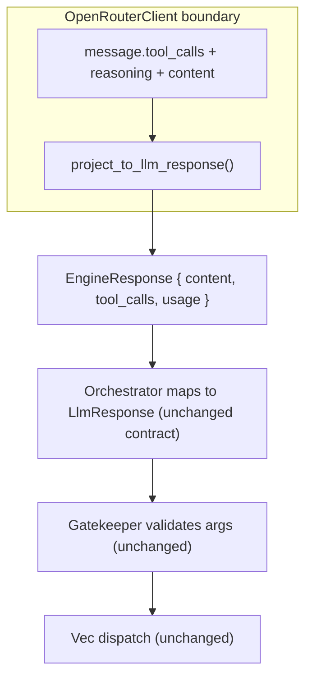

# OpenRouter Native Tool-Calling Migration

Status: IN PROGRESS — Phase 0–2 DONE (native `tools`/`tool_choice` + SSE fragment assembly + envelope projection; HTTP 400 downgrades to `response_format`). Phase 3 (role:tool round-trip) and Phase 5 (docs/health) pending. Phase 4 Solution B landed with Phase 2.
Scope: OpenRouter backend only. Ollama (JSON-mode) and llama.cpp (GBNF) are untouched.
Author handoff: this doc is self-contained so a small model can execute one phase at a time.

---

## 1. Goal

Move the OpenRouter backend from **system-prompt schema injection + strict `response_format` envelope** to **OpenAI-native tool calling** (`tools` / `tool_choice` / `message.tool_calls`), while keeping the FCP envelope contract (`thought` / `status` / `message_to_user` / `tool_calls`) fully intact for the orchestrator.

The envelope is **not removed**. It becomes a projection the engine assembles from the native response channels. Gatekeeper, the orchestrator state machine, transitions, recovery, and both local backends stay behaviorally identical.

## 2. Why this improves Eris

- **Grounded arguments.** Tool argument schemas move into `tools[].function.parameters` (strict per-function), the API's first-class channel, instead of being narrated as prompt text. Less prompt noise, fewer "model invented the wrong shape" failures.
- **Fixes the class of bug seen in vault `billy`.** `memory:query` etc. currently fall back to an empty-object args schema and loop to max-recovery (see Section 8). The lowerer fix (Phase 0) repairs this even before native tools land.
- **Cleaner separation of concerns.** `thought` maps onto the hosted reasoning channel; `status` is derived from response shape; `message_to_user` is plain content. The model no longer has to hand-author protocol scaffolding.
- **Standard-aligned.** Puts Eris on the same tool-calling contract as the wider OpenAI/OpenRouter ecosystem, easing future model swaps and gateways (LiteLLM, etc.).

## 3. Absolute rules (from `.cursorrules` — non-negotiable)

- **Zero panics.** No `unwrap()` / `expect()` outside `#[test]`. Use `?` and the `FcpError` taxonomy.
- **No `unsafe`.** Anywhere.
- **Async isolation.** CPU-heavy work (schema lowering, bincode, heavy JSON) goes through `tokio::task::spawn_blocking`. Do not block the tokio runtime.
- **Actor model.** No new `Arc<Mutex<T>>` shared mutable state across threads; communicate via `tokio::sync::mpsc`.
- **Test FS ephemerality.** Any test writing to disk uses the `tempfile` crate. Never write to `./tmp` or leave stray files.
- **Telemetry, not stdout.** No `println!` in logic. Use `tracing` (`debug!`/`info!`/`warn!`/`error!`). The API key must NEVER appear in any log, health output, or serialized config.
- **No git autonomy.** Do not `git add` / `commit`. The human commits.
- **Trait boundaries only.** Keep concrete types internally; do not over-abstract. The `LlmEngine` seam already exists — extend it additively.

## 4. Core architectural insight (read before touching code)

The orchestrator consumes a single `LlmResponse` (`src/orchestrator/state.rs`). Today OpenRouter fills it by parsing one strict-JSON `content` blob. After this migration, `OpenRouterClient` fills the SAME `LlmResponse` by projecting native fields:

| Envelope field | Native OpenRouter source |
|---|---|
| `tool_calls` | `message.tool_calls[]` (name + JSON-string arguments) |
| `status` | Derived from tool-call presence / `finish_reason` (logic already exists in `LlmResponse::status()`) |
| `thought` | `message.reasoning` (separate hosted field) or content preamble; optional, non-fatal if absent |
| `message_to_user` | `message.content` on talk turns |

The adapter lives entirely inside the engine + a thin mapping step. Nothing above the engine boundary changes its contract.



## 5. Non-goals

- No change to Ollama or llama.cpp behavior or their config.
- No change to the orchestrator state machine, chat-stack format, context view/condensation, tool implementations, or presentation layer.
- No vision/content-parts work (Message stays text; native tools do not require it).
- No migration of `status`/`thought` into control-tools (explicitly rejected as a dead-end; envelope stays projected).
- No new cargo features; runtime selection only.

---

## 6. Phase 0 — Fix `schema_to_openai` (PREREQUISITE, ships value alone) — ✅ DONE

> Implemented in `src/engine/structured/schema_to_openai.rs`: `lower_schema_object` now routes
> `oneOf`/`anyOf`/`allOf` through `lower_subschemas` instead of hard-erroring. Handled shapes
> (confirmed against real schemars 0.8 output): single-element `allOf: [T]` (annotated `$ref`
> wrapper, e.g. `memory:query.memory_sort`, `db:find_connections.time_constraint`) unwraps and
> lowers `T`; two-arm nullable `anyOf`/`oneOf` `[T, null]` (e.g. `memory:stage.kind`/`tier`,
> `news:today.category`) → `Nullable(T)`. Genuinely unsupported unions (multi-element `allOf`,
> >2-arm / non-nullable) still `Err` → per-tool `warn!` + empty-object fallback. Bare fieldless
> enum `$ref` was already handled. Parity test `gbnf_and_json_schema_subsets_offer_identical_tools`
> stays green. `doc:list` intentionally stays empty-object (free-form `serde_json::Value` args).
> Added 8 tests; full `schema_to_openai` suite: 17 passed.

This is required regardless of native tools, and independently fixes vault `billy`.

**Problem.** `src/engine/structured/schema_to_openai.rs` hard-errors on ANY `oneOf`/`anyOf`/`allOf` anywhere in a tool's schema tree and drops the whole tool to `OpenAiSchema::empty_object()` (args must be `{}`). schemars renders `Option<T>` fields, fieldless enums (e.g. `MemorySortArg`), and `$ref` wrappers using these constructs, so `memory:query`, `memory:stage`, `memory:staged_list`, `news:today`, `db:find_connections`, `doc:list` all collapse to empty args and then fail Gatekeeper's required-field validation.

**Fix (in `lower_schema_object` and helpers):**
1. `allOf: [ { $ref } ]` (single-element allOf that is just a ref wrapper, schemars' pattern for annotated field types) -> unwrap and lower the referenced definition.
2. `anyOf: [ T, { "type": "null" } ]` (and `oneOf` of the same 2-arm nullable shape) -> lower as `OpenAiSchema::Nullable(Box<T>)`. This mirrors the existing `[T, null]` instance-type branch already handled in the Vec arm.
3. Fieldless enum `$ref` -> resolve to `OpenAiSchema::String { enum_values }` (reuse `lower_string`).
4. Keep the graceful per-tool fallback for genuinely unsupported constructs, but log at `warn!` with the specific construct so we can see remaining gaps.

**Cross-check.** `src/engine/grammar/schema_to_gbnf.rs` already handles the nullable and enum cases (see `compile_nullable_type`, enum handling). Match its coverage so GBNF and OpenAI subsets offer identical shapes. There is a test asserting parity: `gbnf_and_json_schema_subsets_offer_identical_tools` in `src/orchestrator/core/openai_schema_subset.rs` — keep it green.

**Deliverable.** In vault `billy` (OpenRouter + qwen3.6 via LiteLLM), `memory:query` executes with a real `query` arg on the first try. No `schema_to_openai: falling back to permissive empty-object` warnings for the tools listed above.

**Tests (add to `schema_to_openai.rs` `#[cfg(test)]`):**
- `option_string_field_lowers_to_nullable`
- `allof_ref_wrapper_unwraps`
- `fieldless_enum_ref_lowers_to_string_enum`
- `memory_query_lowers_with_required_query` (build `RootSchema` from `MemoryQueryArgs`, assert `query` is required and not empty-object)
- Keep the existing `unsupported_*` fallback test for a truly unsupported construct.

---

## 7. Phase 1 — Engine seam: structured tool-call return (additive) — ✅ DONE

> Implemented: `EngineToolCall` + `EngineResponse.tool_calls` (empty on Ollama/llama.cpp/OpenRouter for now).
> Option A: `Role::Tool`, `Message.tool_call_id` / `Message.tool_calls`, constructors `Message::tool` /
> `assistant_with_tool_calls`. `openai_wire` serializes native `role:"tool"` frames and assistant
> `tool_calls` (omitted when empty so llama.cpp JSON stays `{role, content}`); consecutive tool
> frames are not coalesced. Fields unused on the chat stack until Phase 3.

Extend the trait return and message model so a backend CAN carry native tool calls. Local backends leave the new field empty; nothing about them changes.

**`src/engine/traits.rs`:**
```rust
#[derive(Debug, Clone, PartialEq, Eq)]
pub struct EngineToolCall {
    pub id: Option<String>,   // provider tool_call id, for the tool-result round-trip
    pub name: String,
    pub arguments: String,    // raw JSON string exactly as returned; parsed at the boundary
}

pub struct EngineResponse {
    pub content: String,
    pub tool_calls: Vec<EngineToolCall>, // NEW; empty for Ollama/llama.cpp
    pub prompt_tokens: usize,
    pub generated_tokens: usize,
    pub generation_ms: u64,
}
```
Update `Default` and all constructors. Ollama/llama.cpp set `tool_calls: Vec::new()`.

**Message model (for the Phase 3 tool-result round-trip). Two options — pick during Phase 1:**
- Option A (minimal, recommended first): add a `Role::Tool` variant plus optional `tool_call_id: Option<String>` and assistant-side `tool_calls: Vec<EngineToolCall>` on `Message`. Wire mapping in `openai_wire.rs` emits `role:"tool"` frames.
- Option B (defer): keep folding tool results into system->user text (current `normalize_system_messages` behavior) for Phases 1-2, add the `tool` role only in Phase 3.

Recommendation: implement the fields in Phase 1 but keep them unused until Phase 3 to avoid a mid-series refactor.

**Rule reminder.** This is a pure additive trait change; do not introduce generics or trait objects. Concrete `Vec<EngineToolCall>`.

**Deliverable.** Workspace compiles; Ollama and llama.cpp behavior byte-identical (their `tool_calls` always empty). No runtime behavior change yet.

**Tests:** serde/round-trip for `EngineToolCall`; assert local backends return empty `tool_calls`.

---

## 8. Phase 2 — OpenRouter native tools (hybrid envelope projection) — ✅ DONE

> Implemented: `LlmGenerateOptions.native_tools` / `tool_choice`; `JsonSchemaSubsetCache` emits
> the same offered names as native `tools[]` (strict parameters from Phase 0). OpenRouter attaches
> `tools` and omits envelope `response_format` on those turns. SSE accumulates
> `delta.tool_calls[]` fragments (Phase 4 Solution B). HTTP 400 with tools attached disables
> native tools for the session and retries with envelope `response_format`. Orchestrator projects
> via `llm_response_from_engine` (native calls → Reflect; prose talk → Idle; envelope JSON
> unchanged for local backends / downgrade). Hosted `reasoning` fills `thought`, never `content`.

Make `OpenRouterClient` send `tools`/`tool_choice` and project the native response back into the envelope.

**Request (`src/engine/openrouter.rs`, `ChatCompletionRequest`):**
- Add `tools: Option<Vec<ToolDef>>` and `tool_choice: Option<Value>`.
  ```
  tools = [ { "type":"function", "function": { "name", "description", "parameters": <lowered args schema> } } ]
  ```
- `parameters` comes from the SAME per-tool lowered schema Phase 0 produces (reuse `tool_args_schema` / the subset cache). Set `strict: true` where the model supports it.
- When `tools` is attached, DO NOT also attach the strict envelope `response_format`. They are mutually exclusive for tool turns. (Keep the envelope `response_format` path as the downgrade for models without tool support.)
- `tool_choice`: from the pre-LLM router decision in `src/orchestrator/core/step.rs`. When the router is confident (targeted/slim subset non-empty) send `"required"`; otherwise `"auto"`. Plumb a new optional field on `LlmGenerateOptions` (e.g. `tool_choice: Option<ToolChoice>`), ignored by local backends.

**Offered-tool set.** Reuse the existing offered/targeted logic in `step.rs` (the `response_json_schema` branch around lines 469-500). Where that computes the OpenAI schema subset, also (or instead) build the `tools[]` list for OpenRouter from the identical names, so router / constraint / validation cannot drift.

**Response projection (new `project_to_llm_response` in `openrouter.rs`):**
- `EngineResponse.tool_calls` <- `message.tool_calls[]` (id, name, arguments string).
- `EngineResponse.content` <- `message.content` (may be empty on tool turns).
- Capture `message.reasoning` into the existing reasoning/thought stream (already parsed as `Delta.reasoning`).
- Cost/usage handling unchanged.

**Orchestrator mapping (thin, at the engine boundary in the orchestrator or a small adapter):**
- If `EngineResponse.tool_calls` non-empty: build `LlmResponse` with `tool_calls` mapped (`serde_json::from_str(arguments) -> ToolCall.args`; on parse error, keep `{}` and let Gatekeeper + recovery handle it), `status = Reflect` (derived), `thought` from reasoning if present, `message_to_user = None`.
- Else: parse `content` as today (talk turn); `status` derives to Idle/Task via existing `LlmResponse::status()`.
- `ToolCall` already aliases `arguments`/`action`/`tool` and defaults args to `{}` (`src/orchestrator/state.rs`), so mapping is minimal.

**Capability downgrade.** If a model returns HTTP 400 for `tools` (unsupported), downgrade this session to the existing `response_format` envelope path and retry once, mirroring the current structured-mode downgrade ladder. Log at `warn!`.

**Deliverable.** OpenRouter turns attach `tools`; the model returns native `tool_calls`; Eris dispatches them through the unchanged Gatekeeper/dispatch path. Talk turns still return `message_to_user`. Vault `billy` holds a normal tool-using conversation.

**Tests (wiremock, parallel to existing openrouter tests):**
- `tools_attached_when_offered_subset_nonempty`
- `tool_choice_required_when_router_confident`
- `native_tool_calls_map_to_llm_response_reflect`
- `talk_turn_without_tool_calls_maps_to_idle`
- `arguments_string_parsed_into_args_value`
- `unsupported_tools_400_downgrades_to_response_format`
- `reasoning_field_routed_to_thought_not_content`

---

## 9. Phase 3 — Tool-result round-trip (`role:"tool"`)

Replace the "fold tool result into a system->user message" behavior with the native `role:"tool"` + `tool_call_id` round-trip for OpenRouter.

- On dispatch, remember each executed call's `tool_call_id` (from Phase 1's `EngineToolCall.id`).
- After execution, append a `Message` with `Role::Tool`, `tool_call_id`, and the tool output as content.
- `openai_wire.rs` maps `Role::Tool` to `{ "role":"tool", "tool_call_id":..., "content":... }`. Assistant turns that requested tools carry `tool_calls` on the assistant message so the provider can correlate.
- Keep the existing system-message folding as the fallback for Ollama/llama.cpp (they do not use tool ids).

**Deliverable.** OpenRouter conversations use the standard tool-call/tool-result message protocol end to end. Multi-round tool use (batch dispatch) still works.

**Tests:** wire mapping emits correct `tool` frames; multi-tool batch produces matching `tool_call_id`s; local backends unaffected (still fold to text).

---

## 10. Phase 4 — Streaming decision (contained; not a blocker) — ✅ DONE (Solution B, with Phase 2)

The UI channels (idle / chat / thought+reflect) are blocking, so streaming is used only for cost/usage, interruptibility, and idle-timeout — not live display. **Chosen: Solution B.** `consume_sse_stream` accumulates `delta.tool_calls[].function.arguments` fragments keyed by index and finalizes on `[DONE]`. Cost, usage, mid-stream `error`, and interrupt (drop the generate future) stay on the same SSE path.

The UI channels (idle / chat / thought+reflect) are blocking, so streaming is used only for cost/usage, interruptibility, and idle-timeout — not live display. Choose ONE:

- Solution A (fast): request non-streaming (`stream:false`) on tool-attached turns; `message.tool_calls` arrives whole. Keep streaming for talk turns for cost + interrupt. Simplest; only loses mid-flight interrupt on a tool/reasoning turn.
- Solution B (recommended, ~30-40 lines): keep streaming; extend `consume_sse_stream` to accumulate `delta.tool_calls[].function.arguments` fragments keyed by index, finalize on `[DONE]`. Preserves cost + interrupt uniformly since both already ride the stream (`StreamOutcome`).

**Deliverable.** Tool turns work under the chosen streaming mode; token/cost accounting and interrupt semantics preserved. Document which solution was chosen inline.

**Tests:** streamed tool-call fragment assembly (Solution B) or non-streaming tool path (Solution A); usage still captured; mid-stream `error` object still surfaces as `FcpError`.

---

## 11. Phase 5 — Docs & health

- Update `docs/HOW_TO/OPENROUTER_SETUP.md`: note native tool calling, `tools`/`tool_choice`, model capability requirement (`supported_parameters=tools`), and the downgrade-to-`response_format` behavior for models without tools.
- `src/tools/system/health.rs`: report structured-output mode as `native_tools | json_schema | json_object | off`. Never the key.
- Add/confirm a test asserting the API key never appears in health or tracing output.

---

## 12. Global acceptance criteria

- `cargo check` and `cargo clippy -D warnings` clean; no `unwrap`/`expect`/`unsafe`/`println!` added.
- Ollama and llama.cpp behavior unchanged (their `EngineResponse.tool_calls` always empty; no wire changes).
- Vault `billy` (OpenRouter + LiteLLM qwen3.6): `memory:query` and other `Option`/enum-arg tools succeed first try; a multi-tool conversation completes without hitting max-recovery.
- GBNF and OpenAI/native tool subsets offer the identical tool set (parity test stays green).
- The API key never appears in logs, health, or serialized config (test-asserted).
- Do NOT run the full local suite interactively on this host (hybrid-GPU GNOME session-drop heisenbug — see `docs/TODO/SOFTEN_TEST_FULL_OOM.md`). Use `cargo check` / targeted `cargo test <name>` or the detached script.

## 13. Execution order & handoff notes

Phase 0 is independent and should land first (it fixes `billy` now). Phases 1->2->3 are sequential. Phase 4 can be done alongside Phase 2. Phase 5 is polish.

Key files (all under `src/`):
- `engine/structured/schema_to_openai.rs` — Phase 0 lowerer fix.
- `engine/structured/envelope_schema.rs` — reference for the shared schema shapes.
- `engine/traits.rs` — Phase 1 `EngineToolCall` / `EngineResponse` / `Message` additions.
- `engine/openrouter.rs` — Phases 2-4 request/response/streaming.
- `engine/openai_wire.rs` — Phase 3 `role:"tool"` mapping.
- `orchestrator/core/step.rs` — offered-tool set + `tool_choice` plumbing (see the `response_json_schema` branch ~L469-500).
- `orchestrator/state.rs` — `LlmResponse` / `ToolCall` mapping target (unchanged contract; already aliases `arguments`).
- `tools/system/health.rs` — Phase 5 reporting.

One phase per PR. Keep each phase compiling and the two local backends behaviorally identical after every phase.
