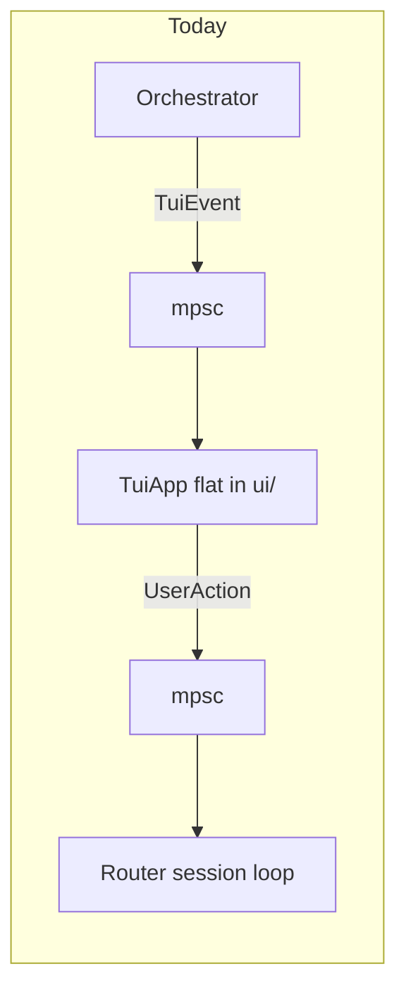
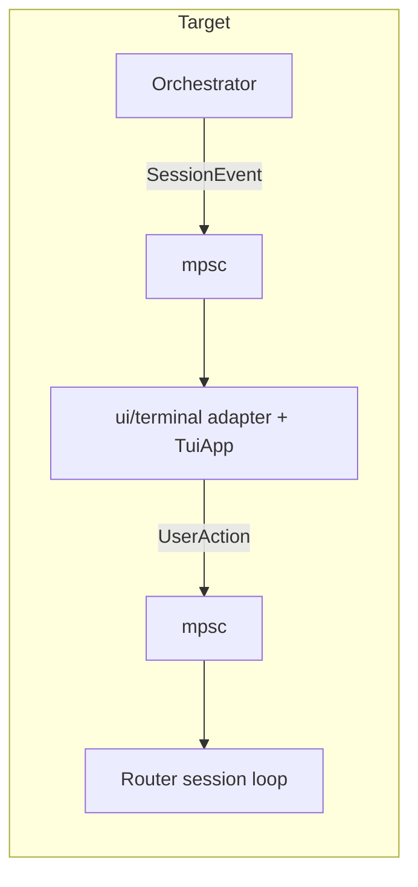
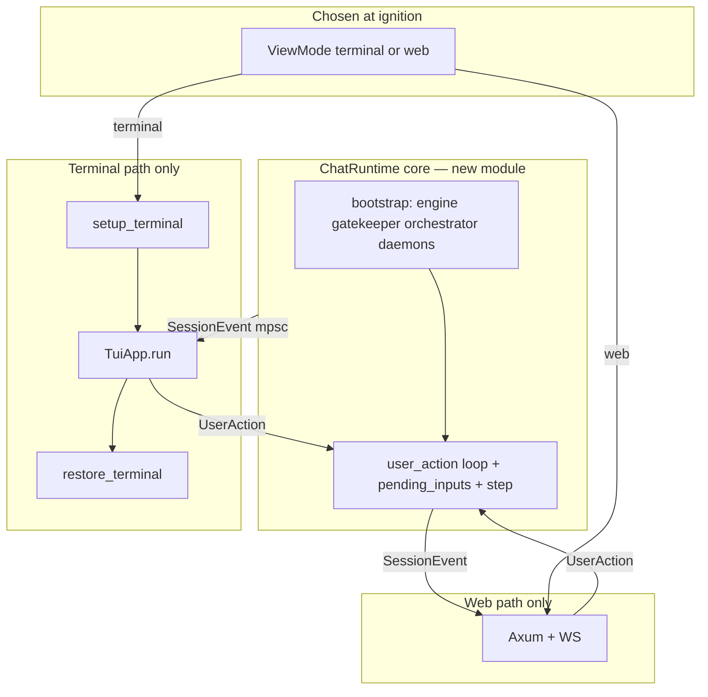

# Decouple orchestrator from terminal UI (abstraction + encapsulated terminal only)

## Scope of this phase

- **In scope**: `presentation` module, orchestrator/alarm/router wired to `SessionEvent` / `UserAction`, **nested terminal package** at [`src/ui/terminal/`](src/ui/terminal/), terminal UI **rewritten** so the session channel carries only presentation-neutral events.
- **Out of scope (deferred)**: Axum, WebSockets, browser UI, JSON wire protocol, bind addresses, auth tokens.

A later phase can add a web transport that deserializes into the same `UserAction` and serializes `SessionEvent` without touching orchestrator internals.

**Product rule (locked):** the user picks **either terminal or web at ignition** (CLI flag and/or config). **One process runs one view**—no multiplexing, no simultaneous Ratatui + browser for the same session.

**Channel naming (avoid confusion):** **`SessionEvent` / `session_tx`** = **outbound** from core to whatever UI is active (status, deck lines, errors, alarms). **`UserAction` / `action_tx`** = **inbound** user intent (submit, cancel, alarm-injected turns). The word “session” here is presentation/session-updates, not “user session input.”

## Current state (what is “tight” today)

- **[`Orchestrator`](src/orchestrator/core/orchestrator.rs)** holds `tui_tx: Option<mpsc::Sender<TuiEvent>>` and imports [`crate::ui::events`](src/ui/events.rs). Same pattern in deck, step, transitions, tool_dispatch, and [`scheduler.rs`](src/orchestrator/alarms/scheduler.rs).
- **[`router.rs` `Commands::Chat`](src/executive/router.rs)** builds channels, bootstraps the world, and runs [`TuiApp`](src/ui/app.rs). Inbound intent is already [`UserAction`](src/ui/events.rs).
- [`TuiEvent`](src/ui/events.rs) mixes orchestrator-bound payloads with unused variants (`Tick`, `Input`) never sent on the orchestrator→UI channel.

## Target architecture (this phase)

- **Orchestrator + alarm scheduler** depend only on **`crate::presentation`** (not `crate::ui`).
- **Terminal (Ratatui) implementation** lives under **`src/ui/terminal/`**; only that subtree imports `ratatui`, `crossterm`, and low-level terminal setup. [`src/ui/mod.rs`](src/ui/mod.rs) re-exports what the rest of the binary needs (e.g. `TuiApp`) via `pub mod terminal` + `pub use terminal::TuiApp` so call sites can stay `crate::ui::TuiApp` or use `crate::ui::terminal::TuiApp`—pick one style and apply consistently.
- **Module layout note**: today’s [`src/ui/terminal.rs`](src/ui/terminal.rs) cannot sit beside a `terminal/` directory with the same name. Move its contents into the folder as e.g. **`src/ui/terminal/setup.rs`** (or `tty.rs`) declared from `terminal/mod.rs`, alongside `app.rs` and `render.rs`.
- **Session channel**: `mpsc::Receiver<SessionEvent>` into the terminal run loop; **local** concerns (tick interval, `EventStream` keys) stay inside `ui/terminal` and are **not** part of `SessionEvent`.

Channel rules unchanged: **mpsc** / **watch**; no `Arc<Mutex<...>>` for UI state.

## Phase 1 — Presentation model and orchestrator decoupling

1. **Add [`src/presentation/`](src/presentation/)** (e.g. `mod.rs` + `session.rs` / `commands.rs` if helpful):
   - **`SessionEvent`**: `StateUpdate(AgentStateUpdate)`, `IncomingMessage(String)`, `SystemError(String)`, `SystemAlarm(AlarmPayload)` — same semantics as current outbound `TuiEvent` arms; **no** `KeyEvent`, **no** `Tick`.
   - **`UserAction`**, **`AlarmPayload`**, **`SYSTEM_ALARM_PREFIX`**, **`AgentStateUpdate`**: live here (moved out of `ui/events.rs`).
   - **`serde::Serialize`** on `SessionEvent` / `UserAction` (and related structs) is **optional but recommended** so a future web layer has a stable contract without another refactor. Skip `Deserialize` until you need inbound JSON.
   - **If you enable `Serialize` on `AgentStateUpdate`:** add **`serde::Serialize`** to **`AgentState`** in [`src/orchestrator/state.rs`](src/orchestrator/state.rs) (it currently has no `Serialize`; nested derive will fail without it). Prefer keeping `AgentState` in `orchestrator` and deriving there to avoid circular deps.

2. **Wire the crate root:** add **`pub mod presentation;`** to [`src/main.rs`](src/main.rs) next to the other `pub mod` lines.

3. **Rename `tui_tx` → `session_tx`** (or keep a name like `presentation_tx`) on `Orchestrator`: `Option<mpsc::Sender<SessionEvent>>`, and update all **emit** sites (orchestrator `broadcast_state`, deck, step, transitions, tool_dispatch, scheduler, router).

4. **Optional** `SessionSink` trait at the boundary only if tests need a mock; otherwise `Option<Sender<SessionEvent>>` is enough. **Semantics of `None`:** define explicitly—e.g. **chat / interactive modes require `Some`**; **`None` only for headless tests or batch runners** that must not push deck lines. Avoid `None` in production `chat` or you get silent loss of all outbound UI.

5. **Delete or shrink [`src/ui/events.rs`](src/ui/events.rs)** after types move to `presentation`; do not leave duplicate enums.

6. **Non-obvious import updates (same refactor pass):**
   - [`src/orchestrator/core/pre_llm_routing.rs`](src/orchestrator/core/pre_llm_routing.rs) — **`SYSTEM_ALARM_PREFIX`** from `presentation`, not `ui::events`.
   - [`src/orchestrator/alarms/missed_startup.rs`](src/orchestrator/alarms/missed_startup.rs) — doc comment still says `TuiEvent::SystemError`; update to **`SessionEvent`** when renamed.

## Phase 2 — Nest and rewrite the terminal UI

1. **Create `src/ui/terminal/`** and **move**:
   - Former [`terminal.rs`](src/ui/terminal.rs) → e.g. `terminal/setup.rs` (export `setup_terminal` / `restore_terminal` from `terminal/mod.rs`).
   - [`app.rs`](src/ui/app.rs) → `terminal/app.rs`
   - [`render.rs`](src/ui/render.rs) → `terminal/render.rs`
   - Add `terminal/mod.rs` with `mod setup; mod app; mod render;` and `pub use app::TuiApp` (plus any setup symbols the router needs).

2. **Update [`src/ui/mod.rs`](src/ui/mod.rs)** to a thin facade, e.g. `pub mod terminal;` + `pub use terminal::TuiApp;` (+ `pub use terminal::setup_terminal` / `restore_terminal` if the router keeps calling them through `ui`). **Orchestrator and presentation must not import `ui::terminal::render`**.

3. **Rewrite the terminal event loop** so the **only** messages from the orchestrator on the shared channel are **`SessionEvent`**. Inside `ui/terminal`:
   - `tokio::select!` over: tick, crossterm input, **`session_rx.recv()`** handling `SessionEvent` (same state updates as today).
   - **`SystemAlarm`**: keep translating to `UserAction` + `try_send` to `action_tx` here (presentation-neutral alarm payload; terminal-specific _routing_ to the session loop).

4. **Router / executive**: import `UserAction` / `SessionEvent` from `crate::presentation`; import `TuiApp` and terminal setup from `crate::ui` (facade) or `crate::ui::terminal` explicitly.

## Phase 3 — Extract chat session runtime (shared core for terminal and future web)

This phase is **recommended** (not strictly required for Phase 1–2), but it is the main lever that keeps a future **browser UI** from duplicating hundreds of lines of [`Commands::Chat`](src/executive/router.rs). The idea is: **one place** owns vault/engine/gatekeeper/orchestrator construction, background tasks, and the **`UserAction` consumer loop**; the **active view** (terminal _or_ web—never both) only owns that transport and bridges it to the same handles.

### View mode at ignition (terminal XOR web)

- **Single runtime, single view:** at startup the user chooses **terminal** or **web** (e.g. `eris chat` vs `eris chat --web`, or a field in the vault’s `.fcp/config.toml` read during ignition). The router (or `chat_session::start`) branches **once**: either call `setup_terminal` + `TuiApp::run`, or bind Axum + run the WS server + block until shutdown—**not** both.
- **Scope for this TODO (phases 1–2 + Phase 3 extract):** implement the **`ViewMode::Terminal`** path only. The **`Web` branch** remains **unimplemented** until the follow-up milestone (no Axum in this doc). If you introduce the `match` early, use **`unreachable!()` / `todo!()`** or a **feature flag** so default builds never hit it.
- **No multiplexer:** because only one view runs per process, the **`UserAction` channel** has exactly one producer side from the UI layer (terminal input loop _or_ WS ingress task). You do **not** need a merge task for TUI + browser.
- **Orchestrator stays identical:** same `session_tx` / `SessionEvent` and `action_rx` / `UserAction` wiring either way.

### Why this helps the web view

- Today, everything from Ollama client creation through `orchestrator.step` lives inside the `Chat` arm of the router. A WebSocket server would otherwise need to **copy** that sequence or call into a monolithic router—both are brittle.
- After extraction, the **web branch** does **not** import `ratatui` or touch the terminal. It only needs the **`UserAction` sender** (held by the WS read loop) and the **`SessionEvent` receiver** (or a `broadcast` subscribe if you later want multiple tabs **within web mode only**—see below).
- **Teardown** (`peripheral_lifecycle.shutdown_started_peripherals`, cancel) stays tied to **session lifetime**, not to “TUI exited,” so web mode uses the same shutdown path when the server stops or the user disconnects.

**Diagram note:** `SessionEvent` is produced anywhere the code holds **`session_tx`** (orchestrator `broadcast_state`, deck, tool paths, **and** the `action_rx` loop in the router for queue/fatal messages)—not “only” the user-action loop. The edge `Loop -->|SessionEvent| Axum` means: in web mode, the **runtime** forwards those outbound events to the web transport after Phase 3 / follow-up.

### Suggested module layout

- New file or small directory under executive, e.g. [`src/executive/chat_session.rs`](src/executive/chat_session.rs) (or `src/session/` if you prefer a top-level crate module—keep it next to the code that already owns `execute_command` for discoverability).
- [`router.rs`](src/executive/router.rs) **`Commands::Chat`** becomes a **thin orchestration script**: read **view mode** from CLI/config → create channels → call `chat_session::start(...)` → **`match` on mode**: terminal branch runs `TuiApp` + restore; web branch runs Axum loop (future). Shared teardown after the chosen UI exits.

### What moves into `chat_session` (the “runtime”)

Roughly everything that is **not** crossterm/ratatui-specific, from the current `Chat` arm:

1. **Workspace / vault services** (after ignition): identity watch spawn, `identity_rx`, workspace paths used by tools.
2. **Peripherals** (`ensure_peripherals_for_chat`), **Ollama URL parse**, **engine** + **`token_metrics`** watch pair.
3. **Semantic brain** connect + optional vault ingest.
4. **`ApiHttpClient`**, **Gatekeeper** construction, **alarm reschedule** `mpsc::unbounded`, **all `gatekeeper.register(...)`** blocks.
5. **Descriptor registry**, **ToolRouter** optional construction.
6. **Interrupt** `watch` channel, **idle heartbeat** spawn when enabled.
7. **`spawn_alarm_scheduler`** and **startup overdue agenda** task (both already take `session_tx` once Phase 1 lands).
8. **`spawn_snapshot_daemon`** with promotion suppression flag.
9. **`Orchestrator::new`** and the **`tokio::spawn` async block** that owns `action_rx`, `pending_inputs`, `orchestrator.step`, cancel handling, and **`SessionEvent`** notifications (today `TuiEvent::SystemError` for queue/fatal paths).

### What stays in the router (or terminal-specific driver)

1. **Terminal-only path**: `setup_terminal` / `restore_terminal` and panic hook—run **only** when view mode is terminal (skip entirely in web mode so the process never touches the alternate screen).
2. **Optional early UX**: the first “startup” lines can stay as **`session_tx.send(SessionEvent::SystemError(...))`** (or a dedicated `SessionEvent::Log` variant if you add one) so **both** terminal and web see the same bootstrap narrative—either sent from `Chat` before calling `chat_session::start`, or as the first steps inside `start` if you pass `session_tx` in.
3. **Ignition / seal check** could stay in the router _or_ move into `chat_session::start` with `workspace_root` + `cli`; if moved, the terminal still only needs to exist for drawing, not for seal logic.

### Public API shape (sketch)

Define a **`ChatRuntime`** or **`StartedChatSession`** struct returned by an async function, for example:

- **`start_chat_session(...)` → `Result<StartedChatSession>`** where `StartedChatSession` holds at least:
  - **`user_action_tx: mpsc::Sender<UserAction>`** — the **one** active view (terminal loop or WS reader) uses this to submit input, cancel, and alarm-derived actions. No second UI in the same process.
  - **`token_metrics_rx: watch::Receiver<LlmTokenSnapshot>`** — terminal passes into `TuiApp::run`; web UI can ignore until you extend `SessionEvent` or add a parallel stream.
  - **`peripheral_lifecycle`** (or an opaque handle with a **`shutdown()`** method) — router calls after UI finishes, as today.
  - Optionally **`cancel_token`** child or documentation that the global **`CancellationToken`** passed in is what the spawned tasks already observe.

The **`mpsc::Receiver<UserAction>`** for the core loop should be **taken** inside `start_chat_session` so callers cannot accidentally read it twice.

**Who owns the `SessionEvent` channel ends:** pick **one** pattern and stick to it—**(A)** caller creates `(session_tx, session_rx)` and passes **`session_tx`** into `start_chat_session`, keeps **`session_rx`** for `TuiApp::run`; or **(B)** `start_chat_session` creates the pair and returns **`session_rx`** (and clones **`session_tx`** for internal spawns). Avoid splitting ownership across modules without a clear rule.

**Parameters** to `start_chat_session` should include everything the moved code needs: `Arc<AppConfig>`, `PathBuf` workspace root, `CancellationToken`, plus either a supplied **`mpsc::Sender<SessionEvent>`** or an internal channel per (A)/(B) above. **`Cli`** or a narrower **`ChatLaunchOptions`** avoids pulling the whole CLI into the module. **View mode** as `Terminal` | `Web` is for later branch behavior; core engine setup stays identical.

### Single consumer of `UserAction`

**One task** drains `action_rx` and drives `Orchestrator`—unchanged. With **terminal XOR web**, the UI layer has a single ingress into `user_action_tx`; **no multiplexer** across views.

### Outbound fan-out (optional, web-only)

For **terminal mode**, a single **`mpsc::Sender<SessionEvent>`** is enough. If **web mode** later needs **multiple browser tabs** on the same session, consider **`broadcast::Sender<SessionEvent>`** so each tab subscribes—still **one** web _server_ process, not TUI + web together.

### Tests and regressions

- **`#[cfg(test)] mod tests`** in [`router.rs`](src/executive/router.rs) already does `use crate::ui::events::{UserAction, SYSTEM_ALARM_PREFIX}` — repoint to **`crate::presentation`** after the move.
- Any test that constructs an **`Orchestrator`** with a fake channel will need **`SessionEvent`** instead of **`TuiEvent`**.
- If Phase 3 lands, tests that inlined **`Commands::Chat`** bootstrap may call **`start_chat_session`** with stubs or keep a minimal channel pair.
- **Stretch:** one integration-style test on `chat_session`: stub engine, `user_action_tx.send(Submit)` eventually drives **`step`**.

### Order of work relative to Phases 1–2

- **Easiest**: perform Phase 3 **after** Phase 1 renames emits to `SessionEvent` so the extracted module never mentions `TuiEvent`.
- **Acceptable**: extract first using current types, then rename in Phase 1 (more churn).
- Phase 2 (nest `ui/terminal`) can proceed in parallel conceptually, but merging is simpler if **`token_metrics_rx`** is already part of `StartedChatSession` when you move `TuiApp::run` call site.

## Follow-up (explicitly not in this plan)

- Axum + WebSocket server, browser client, bind/auth, WS integration tests—behind the **web** branch of the ignition-time view flag (same `chat_session` core).
- **Token metrics**: today [`LlmTokenSnapshot`](src/engine/token_metrics.rs) is `watch` + render-only; if a future UI needs it on the wire, extend `SessionEvent` or add a separate stream then.

## Risk notes

- **Ordering**: keep a **single** task consuming `UserAction` (as today).
- **Outbound channel backpressure:** router and orchestrator use **`send(...).await`** on the presentation channel in many places; the alarm scheduler uses **`try_send`** on the same path—if the channel is **full**, **alarms can be dropped silently** (today with `TuiEvent`, same after rename). Keep capacity **≥ 100** unless you add logging/metrics on drop. Renaming to `SessionEvent` does not fix this; document or harden if alarms must never drop.
- **Imports checklist** (run after refactors):
  - `crate::ui::events` / `TuiEvent` / `UserAction` / `SYSTEM_ALARM_PREFIX` anywhere under **`src/orchestrator/`**, **`src/executive/`**, **`src/ui/`**.
  - **`pre_llm_routing.rs`** (`SYSTEM_ALARM_PREFIX`).
  - **`missed_startup.rs`** comments.
  - Router **`#[cfg(test)]`** imports.
- **`orchestrator` must not depend on `ui::terminal::render`**—only on **`presentation`** for shared types.

## Suggested implementation order

1. Add `presentation` types; **`pub mod presentation`** in [`main.rs`](src/main.rs); switch orchestrator, alarms, router emits to `SessionEvent` / `UserAction`; fix **`pre_llm_routing`**, **`missed_startup`** doc, and router tests per Phase 1 §6.
2. Create `ui/terminal/`, move/rename files (including resolving `terminal.rs` vs `terminal/`), fix `ui/mod.rs` facade, update all `crate::ui::*` imports.
3. Rewire `TuiApp::run` to `Receiver<SessionEvent>` and remove dead `TuiEvent` variants from the session path.
4. Extract **`chat_session`** (Phase 3): `StartedChatSession` + `start_chat_session`, slim `Commands::Chat` to **view switch** (terminal vs future web) + shared teardown.
