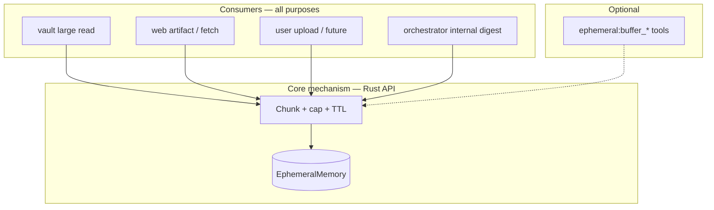

# Big-content mechanism (unified ephemeral staging)

## What this feature is **for** (single sentence)

**One blob-agnostic Rust mechanism** to hold **large text** in [`EphemeralMemory`](src/memory/ephemeral) under **shared caps and TTL**, expose **stable chunked access** (and optionally **in-buffer search**), so **every ingress path**—vault reads, web artifacts, user uploads, agent-supplied paste—can **reuse the same behavior** instead of re-implementing truncate / map / page logic in each place.

That is the **goal**. Optional **`ephemeral:buffer_*` tools** are only one possible **façade**; they are **not** what defines the feature.

## Do we “need” this?

We could keep **separate** implementations forever ([`vault:read`](src/tools/vault/read.rs) truncation + header map, [`web:fetch`](src/tools/web/fetch.rs) + [`web:artifact_query`](src/tools/web/artifact_query.rs), future upload handling). That works until caps, chunk shapes, TTL, and error semantics **drift**.

This plan says: **extract a shared core** once **multiple consumers** care about the same problem (“text too big for `num_ctx`, must stage and read in bounded windows”). If only one consumer ever existed, a shared layer would be optional—but **vault and web already solved overlapping problems differently**; uploads and orchestrator-driven file open will add a **third** unless we unify.

## Problem being solved

- **Operational:** Stay within **[`AppConfig::num_ctx`](src/config.rs)**-consistent budgets so a single response or staged blob does not pretend a larger context than the model has.
- **Structural:** Any **large** string (file body, fetch body, upload) is **chunked**, **addressable** by index/page, and **short-lived** (TTL), so callers can implement **deterministic Rust pipelines** (e.g. internal summarize-then-inject) **or** hand control to the chat agent via tools—**without** writing the blob to the vault as part of the mechanism itself.

**Not** the primary goal: a second long-term semantic index of every staged blob in Qdrant (durable recall stays [`memory:query`](src/tools/) / vault-backed paths after condensation).

**Assumption (v1):** one operator per runtime; no cross-user buffer isolation.

---

## Architecture: three layers

| Layer | What it is | Who uses it |
| ----- | ---------- | ----------- |
| **1. Core (mechanism)** | Rust types + operations: chunk input, store in ephemeral with tags, `buffer_id`, receipt (`chunk_count`, coverage hints, optional `source_label`), **page** (slice of chunks), caps/TTL, **recoverable error shapes** for bad id / expired / out-of-range page / over cap. | All consumers below. |
| **2. Consumers (call sites)** | **Vault:** large `vault:read` (or executive path that opens invariants). **Web:** large fetched / artifact bodies. **Uploads / TUI:** future pipe of user files. **Orchestrator:** fixed multi-step “read pages → summarize → inject digest” **without** exposing paging to the roster. | Each wires the core where bytes enter the system. |
| **3. Optional tool façade** | `ephemeral:buffer_stage` / `buffer_page` / (optional) `buffer_query` registered like other tools. | Only when the **chat agent** must **decide** when to stage or which page to read (e.g. huge paste with no other ingestion API). |

**Rule of thumb:** Prefer **layer 2** (Rust calls core) for **system-initiated** content (opened path, fetch result, upload). Prefer **layer 3** only when **only the LLM** can choose staging/paging.

---

## Core semantics (authoritative)

These apply **whether** the caller is a tool, `vault:read`, or the orchestrator.

- **Staging:** Accept bounded text → chunk → persist under ephemeral with tag(s) e.g. `ephemeral_buffer` + metadata → return **receipt**: opaque `buffer_id`, `chunk_count`, optional `char_estimate`, optional `source_label`, TTL hint / config key reference.
- **Paging:** `page` (0-based), `page_size` (chunks per page, clamped) → returns chunk window + **`page_count`** (or equivalent formula) so callers can plan full coverage without loading everything.
- **TTL:** Buffers expire (default **600 s**, configurable, e.g. `ephemeral_buffer_ttl_secs`). After expiry, only **re-stage** (upstream must re-supply bytes).
- **Identity:** Opaque **`buffer_id`** (UUID or existing ephemeral id style). No `title-date-page` as primary key; optional `source_label` for logs/UI.
- **Caps:** All budgets **aligned with `num_ctx`** (and same *kind* of ratio pattern as [`vault_read_ratio`](src/config.rs)); no default staging or single-page response may assume a larger effective window than the configured context story allows.
- **Errors (recoverable):** Same table as before: unknown id → re-stage or fix id; expired → re-stage; out-of-range page → return bounds, never empty success; over cap → name cap; schema → recovery path. **Orchestrator** and **tools** share these semantics so recovery passes behave predictably.

### Optional: in-buffer query (core capability, not required for v1)

**Meaning:** search **inside** staged chunks (lexical / optional semantic)—**not** “ask the user a clarifying question.”

- May live as a **function on the core** (for vault/web helpers) even if **no** `ephemeral:buffer_query` tool is registered.
- **Default product stance:** ship **stage + page** first; add query when “jump to chunk” without linear scan is proven necessary. **No** Qdrant upsert of ephemeral buffers unless explicitly justified.

### What the chat LLM “sees” (depends on consumer)

- **Consumer-driven:** Often only a **digest** or **one bounded excerpt** the orchestrator or tool puts in context—**no** `buffer_id` in the main prompt if the pipeline handled everything internally.
- **Tool-driven:** Receipt + per-page tool results; model must iterate or use optional query, then promote facts via existing **memory** tooling for cross-turn recall.

---

## Relationship to existing code (intent, not prescription)

- **Vault:** Today [`vault:read`](src/tools/vault/read.rs) truncates + header map. Long term, **large file** path should **call the core** (same chunks/caps as web) and optionally run **Rust-orchestrated** summarization before/in addition to what the model sees.
- **Web:** [`web:fetch`](src/tools/web/fetch.rs) / [`web:artifact_query`](src/tools/web/artifact_query.rs) are the **reference behavior** to **factor into the core**; web tools become **consumers** of the shared module, reducing drift with vault/upload.
- **Shared type:** e.g. `BufferedArtifact { source_label: Option<String>, chunks: Vec<String> }` (or evolved `WebArtifact` in a **shared** module under [`src/tools/buffer/`](src/tools/buffer/) or [`src/ingest/`](src/ingest/)).

---

## Optional tool façade (when implemented)

| Tool | Role |
| ---- | ---- |
| `ephemeral:buffer_stage` | Agent-visible staging; same receipt as core. |
| `ephemeral:buffer_page` | Agent-visible paging; same semantics as core. |
| `ephemeral:buffer_query` | Optional; same as core query if exposed. |

**Context view:** If these tools exist, use `ToolContextViewHint::Snippet` on page/query so [`build_llm_view`](src/orchestrator/context/view.rs) stays lean.

**Registration (only if façade ships):** [`executive/router.rs`](src/executive/router.rs), [`tools/gatekeeper.rs`](src/tools/gatekeeper.rs), [`tools/specs.rs`](src/tools/specs.rs), [`tools/routing_phrases.rs`](src/tools/routing_phrases.rs).

---

## Config (implementation phase)

- `ephemeral_buffer_ttl_secs` (default **600**).
- Caps / chunk targets: derived from **`num_ctx`** (+ ratio); dedicated keys as needed (`ephemeral_buffer_max_bytes`, `ephemeral_buffer_max_chunks`, `ephemeral_buffer_chunk_target_chars`, per-page char ceiling).

---

## Explicit non-goals

- The **core** does **not** by itself run a **hidden LLM** “auto-summarize this buffer.” **Consumers** (e.g. orchestrator, enriched `vault:read`) **may** call the engine with a **fixed recipe**; that is **policy**, not part of the minimal staging API.
- **No vault persistence** as part of the staging mechanism (durable write remains **explicit** memory/vault tools).
- **No** multi-tenant isolation in v1.

---

## Implementation order (after plan approval)

1. **Shared core:** `BufferedArtifact` (or equivalent), chunking, caps from `num_ctx`, unit tests; **Rust API** that reads/writes [`EphemeralMemory`](src/memory/ephemeral) (exact module path TBD—prefer `memory` / `ingest` over forcing everything through `tools/`).
2. **First consumer migration:** Either refactor **one** of vault large-read or web artifact path to use the core (proves the abstraction).
3. **Second consumer:** Wire the other major path so **web and vault** no longer diverge.
4. **Optional:** Register `ephemeral:buffer_stage` / `buffer_page` if agent-driven staging is required.
5. **Optional:** In-buffer query in core + optional tool + Qdrant only if justified.

---

## Documentation

- This file is the **authoritative design** for the **mechanism** and its **consumers**.
- Optionally add a one-line pointer in [`docs/STATE.MD`](docs/STATE.MD) when implementation starts.

---

## Post-read: open issues

1. **TTL vs ephemeral tiers:** Map buffer rows to a clear tier or **`ephemeral_buffer_ttl_secs`** only—document the choice for operators.
2. **Token vs char budgets:** Document conversion/heuristic (align with [`chat_session.rs`](src/executive/chat_session.rs) patterns).
3. **Stage atomicity:** All-or-nothing vs partial buffer on failure.
4. **Which consumer first:** Vault vs web—pick based on current pain (large invariant files vs large fetches).
5. **Tool façade default-off:** Decide whether v1 ships **zero** new tools (core + consumer only) or always exposes stage/page for pastes.

---

name: Big-content mechanism
overview: Unified Rust core for ephemeral chunked staging (num_ctx-aligned caps, TTL, recoverable errors, coverage metadata) shared by vault, web, uploads, and orchestrator; optional ephemeral:buffer_* tools are a façade, not the feature definition.
todos:

- id: doc-01-big-content
  content: Living spec in docs/TODO/01_BIG_CONTENT_LENS.md (core vs consumers vs optional tools)
  status: completed
- id: shared-buffer-core
  content: BufferedArtifact + chunking + EphemeralMemory Rust API; caps from num_ctx; unit tests
  status: pending
- id: consumer-vault-or-web
  content: Migrate first large-content path (vault read or web artifact) to core
  status: pending
- id: consumer-second-path
  content: Wire second ingress path to same core (no drift)
  status: pending
- id: optional-buffer-tools
  content: If needed: ephemeral:buffer_stage + buffer_page + gatekeeper/router/specs/phrases
  status: pending
- id: optional-buffer-query
  content: Core + optional tool: in-buffer query lexical-first; Qdrant only if justified
  status: pending
- id: config-caps-ttl
  content: AppConfig: buffer TTL, num_ctx-aligned caps; wire into core/consumers
  status: pending
  isProject: false

---
