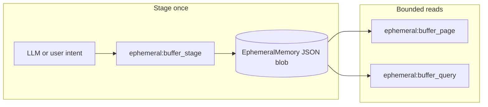

# Ephemeral big-content lens (pagination + query)

## Goal

Handle **large blobs only in ephemeral** ([`EphemeralMemory`](src/memory/ephemeral)): stage once, return a **small receipt** to the LLM, then read back via **ordered pages** (chunk windows) and/or **top-k query** over chunks—same mental model as [`web:fetch`](src/tools/web/fetch.rs) + [`web:artifact_query`](src/tools/web/artifact_query.rs), but **not** tied to URLs or vault paths.

## Naming (recommended)

| Tool                     | Role                                                                                                                                                                        |
| ------------------------ | --------------------------------------------------------------------------------------------------------------------------------------------------------------------------- |
| `ephemeral:buffer_stage` | Accept large text (caps TBD), chunk, `ephemeral.insert` with tags e.g. `ephemeral_buffer`, return `{ buffer_id, chunk_count, preview_head, ttl_hint }`.                     |
| `ephemeral:buffer_page`  | Args: `buffer_id`, `page` (0-based), `page_size` (chunks per page, clamped). Response: `total_chunks`, `page`, `chunks: [{ index, text }]`, enforce **max response chars**. |
| `ephemeral:buffer_query` | Same behavior as current artifact query: `query`, `top_k` (clamped), semantic + lexical fallback; reuse trimming ([`trim_snippets_to_budget`](src/ingest/)).                |

**Internal type:** Introduce something like `BufferedArtifact { source_label: Option<String>, chunks: Vec<String> }` (or evolve `WebArtifact` in a **shared** module) so [`web:fetch`](src/tools/web/fetch.rs) can optionally migrate later without duplicating chunk JSON shape.

## Code placement

- **New:** [`src/tools/ephemeral/`](src/tools/ephemeral/) — `mod.rs`, `buffer_stage.rs`, `buffer_page.rs`, `buffer_query.rs`.
- **Shared:** [`src/tools/buffer/`](src/tools/buffer/) or [`src/ingest/buffer_artifact.rs`](src/ingest/) — `BufferedArtifact`, chunking helper (align with existing ingest chunking if present), limits; **both** web tools and ephemeral tools import this.
- **Registration:** [`executive/router.rs`](src/executive/router.rs) tool construction, [`tools/gatekeeper.rs`](src/tools/gatekeeper.rs) allowlists for `Chat` / `Reflect` / `Recover` (mirror `web:artifact_query` policy), [`tools/specs.rs`](src/tools/specs.rs), [`tools/routing_phrases.rs`](src/tools/routing_phrases.rs), tool map in gatekeeper’s registry list (~line 299 pattern).

## Pagination lens (semantics)

- **Stable unit:** chunk index (aligns with optional Qdrant indexing later).
- **Errors:** out-of-range `page` → explicit `ToolFault` / `SchemaViolation`, not empty success.
- **Context view:** `ToolContextViewHint::Snippet` on page/query tools so [`build_llm_view`](src/orchestrator/context/view.rs) stays lean.

## Query lens

- Factor lexical scoring + optional semantic path from [`artifact_query.rs`](src/tools/web/artifact_query.rs) into shared functions; wire Qdrant the same way as `search_web_artifact` or a parallel `search_buffer_chunks` with metadata filter on `buffer_id` (implementation detail in implementation phase).

## Config (implementation phase)

- New keys under [`AppConfig`](src/config.rs): e.g. `ephemeral_buffer_max_bytes`, `ephemeral_buffer_max_chunks`, `ephemeral_buffer_chunk_target_chars`, TTL reuse vs dedicated override—defaults safe for laptop.

## Documentation (first landable artifact)

- Populate [`docs/TODO/01_BIG_CONTENT_LENS.md`](docs/TODO/01_BIG_CONTENT_LENS.md) with this design (user-facing spec: tools, args, non-goals). Optionally add a one-line pointer in [`docs/STATE.MD`](docs/STATE.MD) when work starts.

## Explicit non-goals

- **No vault** read/write for this feature.
- **No** automatic summarization in v1 (optional follow-up: separate tool or orchestrator policy).
- **No** requirement to re-enable `web:fetch`; buffers can be fed by paste, future upload path, or tools that call `buffer_stage` internally.

## Implementation order (after plan approval)

1. Shared `BufferedArtifact` + chunking + unit tests.
2. `ephemeral:buffer_stage` + `ephemeral:buffer_page` + gatekeeper/router/specs/phrases.
3. `ephemeral:buffer_query` + vector path if semantic brain present.
4. Optional: refactor `web:fetch` / `web:artifact_query` to use shared type (reduces drift).

---

name: Ephemeral big content lens
overview: Design and (when implemented) add ephemeral-only tools to stage large text as chunked buffers in `EphemeralMemory`, expose a deterministic **pagination lens** and an optional **query lens** (pattern of `web:artifact_query`), plus shared buffer types—without writing to the vault.
todos:

- id: doc-01-big-content
  content: Write full spec into docs/TODO/01_BIG_CONTENT_LENS.md (tools, args, lenses, non-goals)
  status: pending
- id: shared-buffer-type
  content: Add BufferedArtifact + chunking module; unit tests
  status: pending
- id: tools-stage-page
  content: Implement ephemeral:buffer_stage + buffer_page; register in router, gatekeeper, specs, routing_phrases
  status: pending
- id: tool-query
  content: Implement ephemeral:buffer_query via shared query logic + optional Qdrant
  status: pending
- id: config-caps
  content: Add AppConfig knobs and wire into tools
  status: pending
  isProject: false

---
