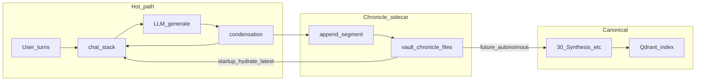

# Conversation chronicle sidecar (architectural plan)

## Intent

Give Eris a **durable, human-readable trail** of *what the session meant*, separate from the **protocol-heavy** `chat_stack` (JSON turns, tool system lines, recovery spans). The chronicle is **append-only**, **time/session keyed**, lives **under the vault** (or `.fcp` under vault root), and is **small on cold start** (load last day + session slice only). A later **autonomous worker** can read older segments, cross-check against tools/vault/Qdrant, and **promote** verified content into persistent synthesis—without pretending every rolling-summary sentence is already truth.

This complements—not replaces—today’s in-process rolling summary in [`condensation.rs`](../../src/orchestrator/core/condensation.rs) and stack planning in [`window.rs`](../../src/orchestrator/context/window.rs).

### Plan reiteration (at a glance)

1. **Write:** After successful condensation (and optionally shutdown / idle / interrupt), append an immutable **segment** (session + day + provenance + payload aligned with `RollingSummaryV1` or equivalent).
2. **Read (startup):** Hydrate **one** capped resume blurb into `chat_stack`; treat as **hint**, not canonical memory.
3. **Later:** Autonomous job reconciles older segments with vault + tools; **merge with citations** into `30_Synthesis` / memory commit paths.
4. **Guardrails:** Exclude chronicle from blind Qdrant ingest if it would duplicate noise; handle condensation no-ops and degraded normalizer output (see risk table below).

Related external inspiration: **[MemPalace](https://github.com/milla-jovovich/mempalace)** (local Python + ChromaDB + MCP, “store verbatim, retrieve on demand,” hierarchical metadata). See [§ MemPalace and lessons for Eris](#mempalace-and-lessons-for-eris).

**Diagram note:** `User` does **not** append to the chronicle on every message. Default append is **`Cond → Append`** (after a successful condensation). A **`User → Append`** path exists only for **explicit** triggers (e.g. `user_checkpoint`, optional shutdown tail flush)—draw it that way in mental model or extend the diagram when those exist.

---

## Conceptual data model

**Session identity**

- Stable **session_id** (UUID or ULID) created when interactive chat starts (or when the orchestrator loop for that vault/workspace starts).
- **day_key** in UTC or local (pick one vault-wide rule and document it): e.g. `2026-04-09`.

**Chronicle segment (one append unit)**

Each append is an **immutable record** after write, containing at minimum:

- `session_id`, `day_key`, **monotonic** `segment_seq` (or timestamp + hash).
- **Provenance**: optional `turn_seq` range, “trigger” (`condensation` | `session_end` | `user_checkpoint` | `crash_recovery`).
- **Payload**: the same semantic content you already ask the condenser to produce—aligned with [`RollingSummaryV1`](../../src/orchestrator/context/window.rs) (`summary`, `key_facts`, `open_threads`, `last_updated`)—plus optional **user-visible excerpt** (last `message_to_user` only) if you want the chronicle readable without JSON protocol noise.

**Storage layout (two viable families—choose one product-wise)**

1. **Hidden operator surface** (consistent with [`.fcp` layout](../../src/vault_layout.rs)): e.g. `vault_root/.fcp/chronicle/<day_key>/<session_id>.md` or `.jsonl` append log + small index file.
2. **Visible Obsidian tree**: e.g. `vault_root/40_Chronicle/<day_key>/...` so you edit/merge by hand.

Recommendation for v1: **`.fcp/chronicle/`** for fewer accidental wiki links and clear “system band” semantics; mirror or export to a visible folder later if you want.

---

## Lifecycle

**Append**

- On each successful **condensation** completion: append one segment (payload = new rolling summary JSON or a normalized markdown front matter + body).
- **Condensation no-op:** When `plan_sliding_condensation` returns nothing to fold, `execute_condensation` skips the LLM summarizer—there is **no** new rolling JSON that turn. If chronicle append is **only** hooked to “condensation completed with new summary,” long stretches of chat can produce **zero** segments until a fold happens. Mitigate with optional **tail flush** (shutdown / idle / periodic) as below.
- Optionally on **graceful shutdown** or **idle boundary**: flush a “tail” segment if the stack had uncondensed user+assistant narrative worth freezing.
- **Interrupt / crash:** The executive path can persist stack on cancel/interrupt; without an explicit policy, the chronicle may **lag** behind operator expectations. Tie `crash_recovery` / `session_end` provenance to real hooks (e.g. shutdown, interrupt handler) when implementing.
- **Never** rewrite past segments in the hot path; corrections belong in autonomous merge or a new segment that says “supersedes segment_seq N”.

**Startup hydration**

- Read index or scan **latest `day_key`**, then **latest `session_id`** for that day (or configurable “yesterday + today”).
- Inject **one** compact system (or user) message into [`chat_stack`](../../src/orchestrator/core/orchestrator.rs) before first user turn: e.g. “[CHRONICLE_RESUME] …” with capped character budget. This competes with the **assembled system prompt** (tools, invariants, JIT)—budget hydration explicitly so you do not starve the rest of the prompt before tools load.
- Rule: **chronicle is hint, not ground truth** until verified and merged.

**Future autonomous mode**

- Separate **job**: walk `day_key` / `session_id` older than “loaded window,” run read-only or gated tools (`vault:read`, `memory:query`, etc.), emit **merge proposals** (new synthesis nodes, tags, or explicit “rejected: hallucination” logs).
- Human or policy gate for first-class promotion to vault synthesis trees (e.g. `vaults/<name>/30_Synthesis/`) / memory commit tools under [`src/tools/memory/`](../../src/tools/memory/).

---

## Where things can go wrong

| Risk | Mechanism | Mitigation direction |
|------|-----------|----------------------|
| **False memory promotion** | Summaries assert facts never grounded in tool output | Autonomous merge requires **citations** (vault path, tool run id, or staged_id); default is “note only,” not canonical. |
| **Forked reality** | Operator edits chronicle by hand; stack and Qdrant disagree | Treat chronicle as **append-only** for the agent; edits go through new segments or a declared “operator_override” type. |
| **Disk growth** | Every condensation appends; multi-hour sessions explode | Segment size caps; daily rollover; optional “compaction” job that writes a **day rollup** and archives raw segments. |
| **PII / secrets in plain files** | Tool results or pasted keys get summarized into vault | Redaction policy in summarizer instruction; exclude raw tool blobs from chronicle payload (only digests). |
| **Race with condensation failure** | Condenser LLM returns bad JSON; you still append? | Append **only after** `normalize_rolling_summary_response` returns `Ok` **and** (optionally) extra quality gates pass; on hard failure, log + optional “gap” marker segment. |
| **Degraded “success” from normalize** | `normalize_rolling_summary_response` can still **succeed** by wrapping arbitrary text in `RollingSummaryV1::new` when JSON parse fails ([`window.rs`](../../src/orchestrator/context/window.rs)) | Treat “normalized” ≠ “high quality.” Optional: reject segments whose `kind`/`summary` fail heuristics, or tag `payload_quality: degraded`. |
| **Vault ingest / Qdrant noise** | Chronicle files live under `vault_root`; a watcher may index `.fcp/chronicle/` into the vector store | Decide explicitly: **exclude** `.fcp/chronicle` from v2 ingest, or place chronicle outside ingested roots—avoid duplicating rolling text as searchable memory. |
| **Concurrent writers** | Autonomous reconciler + interactive session both touch the same `session_id` file | Prefer append-only **per-segment files** (`segment_seq`), file locks, or single-writer policy; JSONL append is safer than rewriting one blob from two processes. |
| **Session boundary confusion** | Restart mid-day creates two session_ids; hydration loads wrong “latest” | Index file listing `(session_id, started_at, ended_at)`; “latest” = most recently **closed** or **active** per policy. |
| **Clock skew / timezone** | `day_key` splits a long night session; local vs UTC confuses “latest day” | Pick **one** vault-wide rule (UTC recommended for logs); store `started_at` with offset; optional “spans midnight” in index. |
| **Duplicate semantics** | Same fact appended every condensation | Rolling summary already merges; chronicle stores **deltas** (optional) or full snapshot per fold—full snapshot is simpler but heavier; delta needs merge discipline. |

---

## What could work well

- **Inspectability**: You can `grep` the vault for “Axum” or “snorkeling” when the in-context rolling blob is gone—addresses the pain you saw in logs.
- **Alignment with existing condensation**: The condenser already produces structured JSON; **serializing that artifact** is a small conceptual step from “stack-only.”
- **Gradual autonomy**: Phase 1 = write-only chronicle + startup blurb; Phase 2 = read-only “chronicle digest” tool for the model; Phase 3 = background reconciler with merge rules.
- **Separation of concerns**: `chat_stack` remains the **canonical execution trace**; chronicle is the **narrative archive**. The LLM usually sees [`build_llm_view`](../../src/orchestrator/context/view.rs) (slim tools, omitted recovery spans)—**not** identical to raw stack. Archive what condensation **folded** (raw tail content / rolling JSON), not only the slimmed view, unless you deliberately want parity with model-visible text.
- **Git-friendly audit** (if vault is versioned): session history becomes a reviewable artifact.

---

## Deliberate non-goals (for v1)

- Replacing Qdrant or memory tools under [`src/tools/memory/`](../../src/tools/memory/) (`memory:stage`, `memory:commit`, etc.).
- Guaranteeing that chronicle text is **true**—only that it is **faithful to what the model believed** at append time.
- Loading full multi-day history into context on every startup.

---

## Open decisions (before any implementation)

1. **Payload shape**: raw `RollingSummaryV1` JSON per segment vs markdown with YAML front matter (human-first vs machine-first).
2. **Hydration budget**: max chars/tokens injected at startup vs “summary only + pointer to path.”
3. **Workspace model**: one chronicle tree per vault root vs per `workspace` string (matches [`ephemeral_bin`](../../src/vault_layout.rs) pattern).
4. **Vault ingest**: whether `.fcp/chronicle/` is excluded from semantic indexing (recommended default: exclude).
5. **`day_key` timezone**: UTC vs local; document for operators and autonomous jobs.

---

## Suggested integration touchpoints (when you code later)

- **Write path**: hook immediately after successful stack rebuild in [`execute_condensation`](../../src/orchestrator/core/condensation.rs) (and optionally shutdown / idle / interrupt boundaries for tail or gap segments).
- **Read path**: early in orchestrator construction or first `step` in [`router.rs`](../../src/executive/router.rs) spawn path—after vault root is known, before heavy tool registration if hydration must be tiny.
- **Paths**: extend [`vault_layout.rs`](../../src/vault_layout.rs) with `chronicle_dir` helpers for consistency with `.fcp` conventions.

---

## MemPalace and lessons for Eris

**Reference:** [milla-jovovich/mempalace](https://github.com/milla-jovovich/mempalace) — open-source local memory stack (ChromaDB, optional SQLite temporal KG, MCP tools, Claude Code hooks). README emphasizes **raw verbatim storage + semantic search** and **rich metadata** (“wings / halls / rooms”) to narrow retrieval, plus a **tiny always-on context** (~L0+L1) and **on-demand** deep search. It is **not** part of Eris; treat it as a **pattern library**. The project is new (2026); benchmarks and claims deserve independent reproduction if you rely on them—the authors added a candid README correction note about earlier overstatements.

### What we can borrow **without** abandoning the vault

| MemPalace idea | Eris-aligned improvement (vault stays source of truth) |
|----------------|--------------------------------------------------------|
| **Save before compaction** | **Pre-condensation / pre-interrupt flush:** append chronicle segment (or tail snapshot) *before* `execute_condensation` drops stack tail—same role as MemPalace’s PreCompact hook. |
| **Tiny “wake-up” layer** | You already load **Identity**; optional **L1-style** block: operator-curated or auto-summarized **critical facts** (short markdown under `00_Invariants/` or `.fcp`) injected with a strict token cap—*canonical* notes, not full chat. |
| **Metadata-first retrieval** | Strengthen **Qdrant payload / filters**: `vault_key`, `workspace`, `kind`, `session_id`, folder prefix—so `memory:query` and ingest behave like “wing + room” filtering without a second product. |
| **Verbatim vs summary** | MemPalace keeps **drawers** (verbatim) and uses closets as pointers; Eris keeps **vault markdown** as verbatim-ish **canonical** and uses **chronicle + rolling summary** as **derivatives**. Clarifies roles: don’t expect one condensation blob to be the archive of record. |
| **Temporal facts (optional)** | If autonomous mode needs “what was true in January?”, a **small SQLite KG** or dated front matter on synthesis notes could complement markdown—**alongside** vault files, not replacing them. |
| **Hooks discipline** | Their **periodic save** idea maps to Eris **telemetry + chronicle append policy** (rate limits, segment caps)—operator visibility without pasting 19M tokens into context. |

### What we should **not** copy blindly

- **Second vector silo:** Duplicating everything into a parallel Chroma world fights Qdrant+vault ingest unless you unify—prefer **one** vector index with clear metadata.
- **AAAK-style lossy compression** for storage: their README now states **raw** mode wins benchmarks; Eris should keep **human-legible** vault text for audit and autonomous merge.
- **Star count as maturity:** use MemPalace for **ideas**, verify **security** (their issues mentioned hook hardening, dependency pins) if you ever integrate via MCP sidecar.

---

## Is the vault-as-markdown approach “the issue”?

**Short answer: no—the vault is a strength.** Markdown under a git-friendly tree is an excellent **human canonical layer**: diffable, editable, Obsidian-compatible, and a natural target for **autonomous** tools (`vault:read` / `vault:write`) and **promotion** (`30_Synthesis`).

What *is* fragile is **using one representation for everything**:

| Layer | Role | Risk if collapsed into “just markdown” |
|-------|------|----------------------------------------|
| **Hot `chat_stack`** | Protocol JSON, tool lines, recovery | Treating this as durable memory → noise and parse failures. |
| **Rolling condensation** | Lossy working-set summary | Treating this as **ground truth** → forgotten nuance (e.g. “snorkeling” dropped). |
| **Ephemeral** | Staging, TTL, tiers | Expecting it to replace vault → lost after TTL or wrong tier semantics. |
| **Qdrant** | Retrieve by meaning | Expecting it to replace files → opaque, needs payload discipline. |
| **Vault `.md`** | Canonical narrative + structure | **Good** as long as **ingestion**, **tiers**, and **chronicle** don’t fight each other. |

So: **LLM memory is not “markdown” alone**—it is **stack + summaries + vectors + vault + policies**. Markdown is the **right substrate for durable, operator-trustworthy memory**; the improvement is **clearer lanes** (chronicle append, pre-compaction save, metadata filters, optional tiny L1) so the LLM is not asked to **remember** inside a single lossy channel.

---

## Reviewer notes (repo alignment, 2026)

These items were checked against the current tree; keep them in mind when returning to implementation.

- **Links in this file** use `../../src/...` so they resolve from `docs/TODO/` in editors and GitHub.
- **Condensation trigger** (elsewhere): rolling condensation runs when the **last** Ollama response’s `prompt_tokens + generated_tokens` exceeds `num_ctx * condensation_threshold`—not “whole stack size.” Chronicle design does not depend on this, but operators debugging “why no fold yet?” should know.
- **`normalize_rolling_summary_response`**: rarely leaves you with a hard error; **quality** may still be poor—see risk row “Degraded success.”
- **Provenance `crash_recovery`**: name it in the index when you implement interrupt/shutdown flush so autonomous jobs can find incomplete sessions.

This plan stays descriptive so your brother’s future implementer can argue with the tradeoffs without being locked into a single file format.
