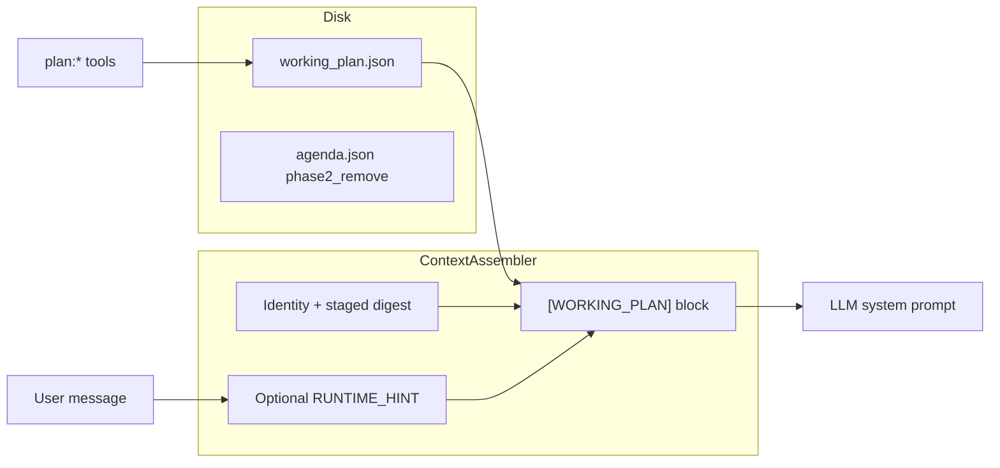

# Working plan vs agenda (implementation plan)

## Goal

Split **mission state** (goal, steps, scratch, validation / wait semantics) from **operator todos / reminders**. The working plan is **structured**, **on disk**, and **re-injected each LLM turn** so long sessions survive condensation. Users stay in **natural language**; they do **not** need to type `plan:` or tool names unless they want a power-user shortcut.

Agenda remains until phase 2 handles **agenda-linked alarms** (or you accept losing that until replaced).

## Natural language and chained workflows

**Principle:** The model interprets messy utterances (“do foo, then bar, wait zara, then mail…”). Rust does **not** parse arbitrary English into a DAG. Core code can only **nudge** and **surface state**.

**System prompt ([`ContextAssembler::build_tool_prompt`](src/orchestrator/context/assembler.rs)) should state:**

- **Triggers for plan first:** Multiple actions in one message; “first / then / after / next / and also”; numbered lists; **dependencies** (e.g. “send mail” after “get address from memory”); “validate / assert / check” between tool steps.
- **Workflow:** On those triggers, call `plan:set` or `plan:update` **before** other tools (unless trivial single-tool). Execute **current step** only; after significant tool results, update plan (mark done, advance `current_step_id`, append `scratch`).
- **Ambiguous middles** (“wait zara”): Encode as `clarify`, `human_wait`, or a reminder step; use scratch for unresolved meaning. Literal timed waits remain **alarms / phase-2** reminder tooling.
- **Separation:** Working plan = **mission and step ordering**; [`memory:stage`](src/memory/ephemeral.rs) / staged digest = **facts and snippets** — do not duplicate long content in both.

**Tool copy:** [`src/tools/specs.rs`](src/tools/specs.rs) `when_to_use` for `plan:update` / `plan:set` should explicitly mention multi-step and dependent chains. [`src/tools/routing_phrases.rs`](src/tools/routing_phrases.rs) should include phrases like “first then”, “workflow”, “sequence”, “step by step”, “after that”, “multi-step”, “validate then”.

**Users:** No required `plan: foo bar` syntax. Optional later: `/plan` or `PLAN:` prefix in TUI to set a **strong** “user wants a tracked workflow” flag (same as aggressive `RUNTIME_HINT`).

## Optional runtime hints (core `src`)

Lightweight, deterministic assistance so the model does not skip `plan:update` on long one-shot requests.

**1. Heuristic hint (recommended v1):** Before or inside assembly, scan **last user message** for markers (e.g. `then`, `after`, `first`, `next`, `and then`, `;`, numbered lines). If count ≥ threshold, set a boolean on [`Orchestrator`](src/orchestrator/core/orchestrator.rs) for this turn (cleared each `step()`), passed into `ContextAssembler`.

**2. Router-assisted hint (optional):** If [`run_pre_llm_routing`](src/orchestrator/core/pre_llm_routing.rs) / `ToolRouter::match_tools` returns **≥2** top tools above noise threshold with **distinct** names (e.g. weather + mail), set the same flag.

**3. Prompt line:** When flag is true, append a single fixed line (e.g. `[RUNTIME_HINT] User message looks multi-step; normalize with plan:update or plan:set before executing dependent tools unless the request is trivial.`) next to `[WORKING_PLAN]` injection. False positives only add a soft nudge.

**4. Avoid:** Full NL planning in Rust; `Arc<Mutex<>>` for this — keep state on the orchestrator struct for the active step only.

Implement `chain-hints` after basic injection works, or behind a config flag `working_plan_runtime_hints` default `true`.

## Schema extension (optional but useful)

On each step, optional **`kind`** (model-filled, core stores only): e.g. `tool` | `validate` | `clarify` | `human_wait`. Lets “assert weather and route are valid” appear as an explicit **validate** step between **tool** steps without new tools.

## Phase 1 — Working plan (ship first)

### 1. Path and types

- Add [`src/vault_layout.rs`](src/vault_layout.rs): `working_plan_json(workspace_root: &Path) -> PathBuf` → `.fcp/tools/working_plan.json` (same root as [`agenda_json`](src/vault_layout.rs)).
- New module [`src/tools/working_plan/`](src/tools/working_plan/): `WorkingPlan { goal, outcome, steps[], current_step_id, scratch, updated_at, version }`; steps with `status` (`pending|active|done|skipped|blocked`) and optional `kind` as above.
- **`render_prompt_block(&self, max_chars: usize) -> String`:** template (goal/outcome, current step, next steps, scratch tail); omit if missing or empty.

### 2. Tools

Mirror [`src/tools/agenda/push.rs`](src/tools/agenda/push.rs) / [`list.rs`](src/tools/agenda/list.rs): async `tokio::fs`, `FcpError`, **`tempfile`** tests only.

| Tool          | Role                                                           |
| ------------- | -------------------------------------------------------------- |
| `plan:read`   | Full JSON                                                      |
| `plan:set`    | Replace entire plan                                            |
| `plan:update` | Patch steps, goal, scratch append, `current_step_id`, statuses |
| `plan:clear`  | Reset                                                          |

Register in [`src/executive/router.rs`](src/executive/router.rs) (~193–210). Extend [`src/tools/gatekeeper.rs`](src/tools/gatekeeper.rs): allow `plan:*` in Chat / Reflect / Idle per policy; **do not** block `plan:update` in Chat like `agenda:complete`.

Optional sugar: **`plan:advance`** (mark current done + move pointer) if it reduces bad partial writes.

### 3. Prompt injection (critical)

[`ContextAssembler`](src/orchestrator/context/assembler.rs): augment **all four** paths — [`assemble`](src/orchestrator/context/assembler.rs), [`assemble_slim_tool_map`](src/orchestrator/context/assembler.rs), [`assemble_with_selected_tools`](src/orchestrator/context/assembler.rs), [`assemble_conversational`](src/orchestrator/context/assembler.rs).

- Store **`workspace_root: PathBuf`** on `ContextAssembler`; plumb from [`Orchestrator::new`](src/orchestrator/core/orchestrator.rs) / router (chat uses `workspace == ""`; avoid inferring vault root from `core_dir` alone).
- Async helper: load file → parse → `render_prompt_block`; config `working_plan_prompt_max_chars` (~800–1500) in [`src/config.rs`](src/config.rs).
- Append `\n\n[WORKING_PLAN]\n...\n` after staged sidebar; inject **NL/plan policy** inside `build_tool_prompt` (and a short parallel note in conversational JSON instructions if needed).
- Pass optional **`suggest_plan_for_chains: bool`** (or equivalent) from orchestrator for `[RUNTIME_HINT]`.

### 4. Idle / interrupt path

[`src/orchestrator/core/step.rs`](src/orchestrator/core/step.rs): prefer **working plan** (goal + current step + maintain via `plan:update`) over [`agenda_json`](src/vault_layout.rs) for autonomous injection; keep agenda fallback until phase 2.

### 5. Docs and tests

- [`docs/updated_architecture/`](docs/updated_architecture/) — new `05_WORKING_PLAN.md` or extend orchestrator doc: file path, injection, tools, NL policy, hints, memory split.
- Optional scratchpad: [`docs/TODO/03_WORKING_PLAN.md`](docs/TODO/03_WORKING_PLAN.md) for human notes (not required for build).
- Tests: tool CRUD, render cap, assembler with/without file, optional hint on/off fixture strings.

---

## Phase 2 — Deprecate agenda (after replacement)

**Blocker:** [`agenda:remind_at`](src/tools/agenda/remind_at.rs), [`alarms.json`](src/vault_layout.rs), [`turn_entry`](src/orchestrator/core/turn_entry.rs) `AGENDA_CONFIRM`, [`agenda:complete`](src/tools/agenda/complete.rs).

- **A.** Plan rows or top-level plan carry `remind_at` / `alarm_id`; generalize payload (`plan_step_id` or `task_id`); reuse [`src/orchestrator/alarms/`](src/orchestrator/alarms/) + [`src/executive/router.rs`](src/executive/router.rs).
- **B.** Minimal `reminder:*` without `agenda.json`.

Then remove agenda tools, grep targets, and UI strings in [`src/ui/app.rs`](src/ui/app.rs) as needed.

---

## Implementation order (recommended)

1. `vault_layout` + serde + `render_prompt_block` (+ optional `step.kind`)
2. `plan:read` + `plan:update` / `plan:set` — vertical slice
3. `workspace_root` on `ContextAssembler` + injection in all four assemble paths + NL policy in `build_tool_prompt`
4. Remaining tools + gatekeeper + specs + routing_phrases
5. Heuristic (+ optional router) `RUNTIME_HINT` + config
6. Idle path in `step.rs`
7. Tests + architecture doc
8. Phase 2 per A or B

---

## Constraints (repo rules)

- No `unwrap`/`expect` outside tests; no `unsafe`.
- File read in `assemble` is fine; use `spawn_blocking` only if parsing becomes heavy.
- Filesystem tests: **`tempfile`** only.
