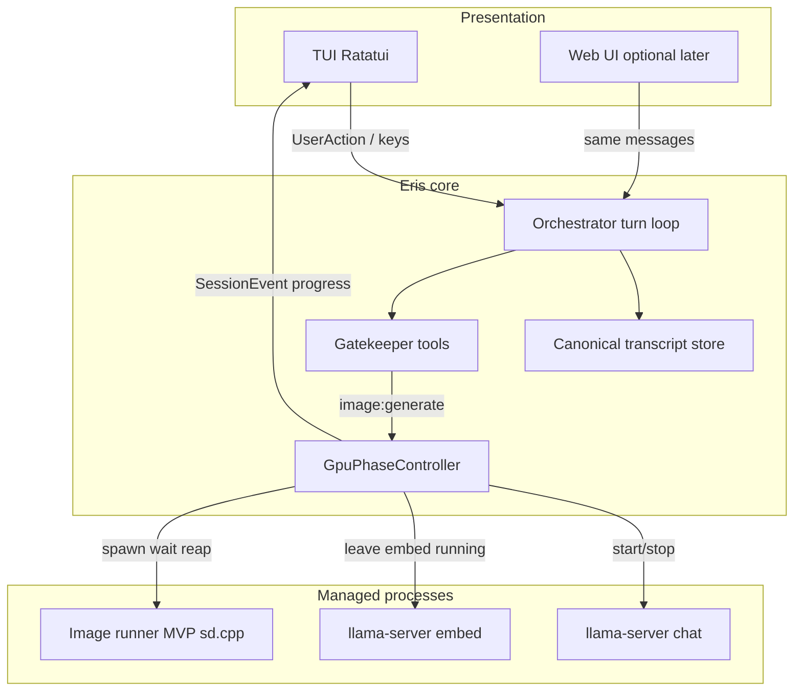
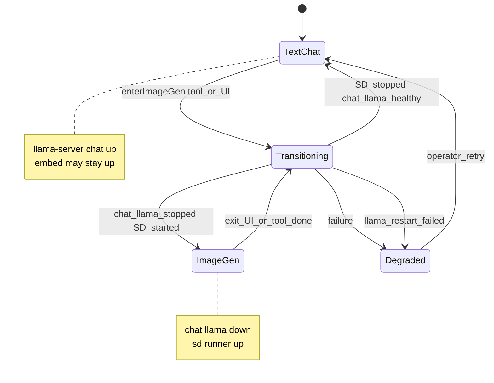
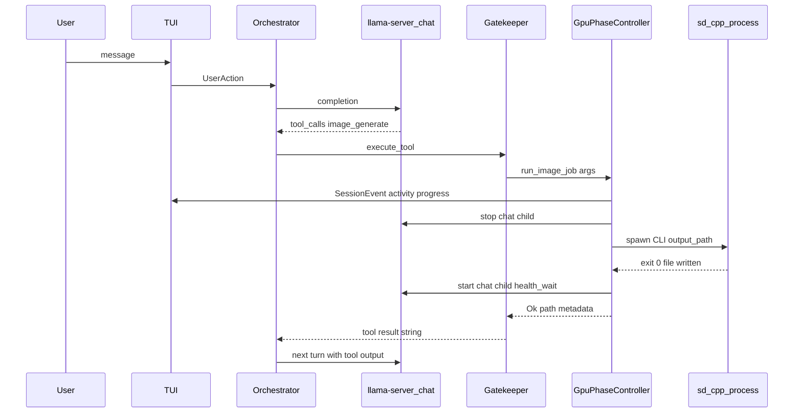

 Local image generation in Eris (meta-plan, UML-first)

## What we want to achieve

- **User-visible goal:** From a normal chat turn, the model can request image generation (e.g. tool `image:generate`), or the user can enter a dedicated **GPU presentation mode** for iterative prompting; Eris coordinates **exclusive VRAM use** between chat `llama-server` and a **separate image runner** (MVP: [stable-diffusion.cpp](https://github.com/leejet/stable-diffusion.cpp) or the fork you standardize on—verify upstream name/binaries; treat as **external binary + model files**).
- **System goal:** A **single orchestration authority** owns: stopping chat LLM on GPU, running image gen with validated args, writing artifacts under a **vault-known path**, restarting chat LLM, and feeding the transcript/tool result so the next LLM turn “sees” the image location (text path today; true multimodal later is out of scope for MVP).
- **Non-goals for MVP:** Running SD and full chat model **simultaneously** on one 4080; Discord parity for long blocking (defer patterns); auto-tuning every SD knob from the LLM (too many degrees of freedom).

**Your choice (confirmed):** **Phase 1 = fixed sd.cpp-style backend** (you build/install binary and models). **Phase 3 = pluggable `ImageBackend`** so ComfyUI, Ollama diffusion, etc. can swap without rewriting the GPU state machine.

---

## Conceptual separation (avoid a classic mistake)

Today Eris already has [`AgentState`](src/orchestrator/state.rs) (`Chat` | `Reflect` | `Idle` | `Recover`) — that is **LLM protocol / loop semantics**, rendered in the TUI (e.g. [`src/ui/terminal/render.rs`](src/ui/terminal/render.rs)).

**Do not overload `AgentState` with “image mode.”** Add a **second axis**, e.g. `GpuRuntimePhase` or `ComputeMode`:

| Axis | Meaning |
|------|--------|
| `AgentState` | What the **LLM loop** is doing (tool rounds, recovery, idle copy). |
| `GpuRuntimePhase` | **Who owns the GPU** for generation: `TextChat` (llama chat up), `ImageGen` (chat llama down, SD runner up), `Transitioning`, `Degraded`. |

The TUI can **combine** both for labels (e.g. status line: `AgentState::Chat` + `GpuRuntimePhase::Transitioning`).

---

## High-level component view (UML component diagram)

**Anchor in current code:** [`PeripheralLifecycle`](src/executive/peripherals.rs) already tracks `llama_chat` / `llama_embed` and shutdown order (embed then chat on teardown). The **GpuPhaseController** (new conceptual module) either extends that type or wraps it with **explicit pause/resume chat** while leaving embed alone, as you prefer.

**Tools:** [`Gatekeeper::execute_tool`](src/tools/gatekeeper.rs) is the natural **ingress** for `image:generate`; the tool implementation must call into **GpuPhaseController**, not shell out blindly from a dumb tool (so cancellation and mutex are centralized).

**Presentation events:** extend [`SessionEvent`](src/presentation/mod.rs) (or add parallel channel) with **phase / progress** lines so the TUI does not rely on `println!` (per `.cursorrules`).

---

## State machine (UML statechart) — GPU phase only

**Concurrency rule:** only **one** transition at a time; queue or reject overlapping `image:generate` / mode toggles.

---

## Sequence — MVP tool path (happy path)

**Blind spot to design for:** after tool returns, the **agent loop** still needs a healthy LLM; if restart fails, the tool result path must be **saved** and the session must surface **Degraded** with a deterministic retry action.

---

## Mapping “many SD args” to product surfaces (for you as HITL + for the LLM)

Stable Diffusion has more **meaningful** knobs than typical LLM sampling (resolution, steps, CFG, sampler, seed, negative prompt, hires fix, LoRA stack, etc.). If every knob is exposed to the **LLM JSON tool**, the schema explodes and the model will mis-set rare fields.

**Layered model (recommended):**

1. **Profile / preset (config + TUI):** e.g. `fast_draft`, `quality`, `square_1024` — maps internally to a **closed** set of CLI flags for sd.cpp. Lives in vault config (like [`LlamaCppConfig`](src/config.rs) pattern): paths to binary, base model, VAE override, default width/height, max steps cap.
2. **Tool-visible “semantic” args (small JSON Schema):** `prompt`, optional `negative_prompt`, optional `seed`, optional `profile` enum, optional `aspect` (`1:1` | `16:9`). Everything else **forbidden** at MVP or clamped server-side.
3. **Power user / image tab (Phase 2):** full form in TUI writes to a **scratch struct** in RAM (and optional autosave file under `.fcp/`) — still validated and clamped before spawn. The LLM never sees raw 40 fields unless you explicitly add an “expert” tool later.

**Grammar note:** With llama.cpp backend, tool args are GBNF-constrained; a **small** schema is a feature ([`docs/LLAMA_CPP_SETUP.md`](docs/LLAMA_CPP_SETUP.md)).

---

## Phase breakdown (whole feature, with your MVP preference)

### Phase 1 — MVP (fixed sd.cpp, TUI progress, exclusive GPU)

- **HITL / ops (you):** Clone/build sd.cpp with **CUDA** for Ada (4080); download a **base model** (often SDXL or SD1.5 family in safetensors—exact format depends on the sd.cpp revision you pin). Document in a personal runbook: binary path, model path, one working CLI invocation that writes PNG to a known path.
- **Eris:** `GpuPhaseController`: mutex, stop managed **chat** llama only, spawn sd with **validated** args + timeout, restart chat llama, health check. **Embed** stays up per your plan.
- **Tool:** `image:generate` with **minimal** schema + preset mapping; tool returns JSON or structured string: `{ "path": "...", "seed": ... }`.
- **UI:** extend `SessionEvent` / `activity_line` pattern ([`AgentStateUpdate.activity_line`](src/presentation/mod.rs)) for phased status (“Stopping chat model…”, “Generating…”, “Restarting chat model…”).
- **Artifacts:** e.g. `<vault>/.fcp/generated/<ulid>.png` (or date-based); **quota/cleanup** can wait.

### Phase 2 — “Image workspace” (optional tab / mode without killing data)

- **Separate `GpuRuntimePhase` from `AgentState`.** TUI switches **layout** on phase/events; transcript remains **canonical** in orchestrator/session memory (avoid “replay last N” as primary fix).
- **Enter/exit** deterministic keys → same controller as tool exit.
- **Scratch persistence** for drafts under `.fcp/` for crash safety.

### Phase 3 — Pluggable `ImageBackend`

- **Trait** (Rust later): `ImageBackend::generate(job) -> Result<ArtifactMeta>`; first impl wraps sd.cpp CLI; future: HTTP to ComfyUI, etc.
- **Config:** select backend + per-backend tables.

### Phase 4 — Cross-surface and polish

- CLI/Discord: **async** pattern (ack fast, notify when file ready) if you ever expose long gen there.
- Optional: vision model path so the **same** image is passed as bytes (out of scope until product wants true multimodal).

---

## Risks and non-obvious constraints

- **Tokio / blocking:** heavy process wait should stay off the cooperative runtime where appropriate (project rule: CPU-heavy / blocking in `spawn_blocking` patterns—process supervision fits that story).
- **Timeouts:** SD runs unbounded; cap wall time and kill child.
- **Cancellation:** user cancel must unwind to `TextChat` or `Degraded` cleanly.
- **Security:** never pass unsanitized strings to `sh -c`; argv-only, path canonicalization under vault.
- **Ollama backend:** if `LlmBackend::Ollama`, GPU swap story differs (Ollama holds models); MVP can **gate** `image:generate` to `LlamaCpp` only or define parallel “unload” semantics—document explicitly.

---

## What you should learn about SD (vs LLMs) — compressed study list

- **Artifacts:** checkpoints (UNet/CLIP/VAE bundles), LoRA, embeddings — each adds VRAM and CLI complexity; MVP = **one base checkpoint** only.
- **Sampling:** steps vs CFG tradeoff; deterministic **seed** for reproducibility.
- **Resolution:** not arbitrary; multiples of 8/64 matter; cap max pixels to avoid OOM.
- **VRAM:** SDXL vs SD1.5 footprint on 16 GiB with chat already absent — still pick a model that fits **with embed + desktop overhead**.
- **Validation:** sd.cpp flags differ by version — **pin a revision** and treat CLI as a **frozen contract** in Eris config.

---

## UML summary table

| Diagram | Purpose |
|---------|--------|
| Component | Shows Eris core vs peripherals vs presentation |
| `GpuRuntimePhase` statechart | Exclusive GPU ownership and failure state |
| Sequence (tool) | End-to-end swap + tool result + next LLM turn |

---

## Implementation note (post-plan only)

When you leave plan mode, the first code touchpoints will likely be: new config section (parallel to `[llama_cpp]`), extension of [`PeripheralLifecycle`](src/executive/peripherals.rs) or adjacent module for **selective** chat stop/start, new tool module + gatekeeper registration in [`chat_session.rs`](src/executive/chat_session.rs), and presentation events for progress.