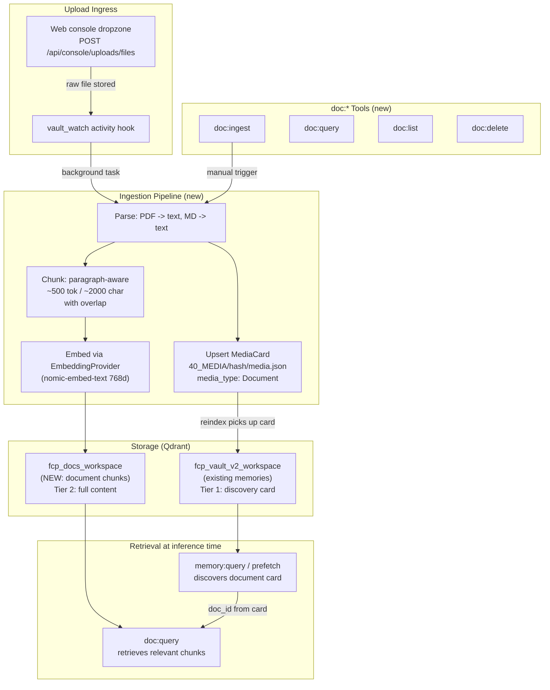

# Large Document RAG Pipeline

## Status Quo

Today, uploaded files (PDF/Markdown) land in `99_USER_UPLOADED/files/{uuid}.{ext}` as raw bytes with **no parsing, no chunking, no Qdrant indexing, and no model notification**. The console dropzone handler in [src/ui/web/console_handlers.rs](src/ui/web/console_handlers.rs) stores the file and returns a JSON receipt -- that is all. The vault's semantic memory (`SemanticBrain`) indexes whole files from `00_Invariants` through `40_MEDIA` as one-point-per-file, and `99_USER_UPLOADED` is explicitly excluded from ingest roots.

The existing [01_BIG_CONTENT_LENS.md](docs/TODO/01_BIG_CONTENT_LENS.md) plan describes **ephemeral** buffer tools for large pasted text (no vault, no persistence). This RAG pipeline is **complementary**: it targets persistent uploaded documents that need vector-backed semantic retrieval, not ephemeral paste buffers.

---

## Architecture Overview



---

## Core Design Decisions

### 1. Separate Qdrant collection for documents

Documents live in `fcp_docs_{workspace}`, completely isolated from memories in `fcp_vault_v2_{workspace}`. Same 768-dim cosine vectors, same `EmbeddingProvider`, but different payload schema and lifecycle. This means:

- `memory:query` never returns document chunks; `doc:query` never returns memories
- Collections can be wiped/rebuilt independently
- No risk of document noise degrading memory recall (or vice versa)

Config field (computed at runtime, like `qdrant_collection_v2`):

```rust
// in AppConfig
pub qdrant_docs_collection: String,
// set at ignition:
config.qdrant_docs_collection = format!("fcp_docs_{}", config.workspace);
```

### 2. Two-tier discovery via `40_MEDIA` catalog cards

The existing `MediaCard` system ([src/media/card.rs](src/media/card.rs)) already has a `MediaType::Document` variant and `infer_media_type_from_path` already recognizes `99_USER_UPLOADED/files/` as `Document`. Today, `media:catalog` creates `40_MEDIA/{content_hash}/media.json` cards that get embedded into the **memory** Qdrant collection via `SemanticBrain::ingest_vault_v2` (since `40_MEDIA` is in `VAULT_INGEST_SUBDIRS_V2`).

We leverage this as a **discovery tier**:

- **Tier 1 (Memory collection -- `40_MEDIA` card)**: When `doc:ingest` processes a file, it also upserts a `MediaCard` with `media_type: Document`. The card carries lightweight metadata: title, tags, description (a short summary or the first paragraph), plus document-specific `type_fields`:

```rust
// type_fields written by doc:ingest
{
    "doc_id": "a1b2c3...",
    "total_chunks": 58,
    "format": "pdf",
    "char_count": 142000,
    "ingested_at": "2026-06-24T08:15:00Z"
}
```

The existing `build_embed_text()` embeds title + tags + description into the memory collection. The reindex watcher picks this up automatically. Now `memory:query` and turn-start prefetch can organically surface *"there is a 58-chunk PDF called 'Q2 Infrastructure Report' tagged #infrastructure #quarterly"* -- without polluting the memory collection with hundreds of chunk vectors.

- **Tier 2 (Document collection -- chunks)**: The LLM sees the `doc_id` in the card and drills into content with `doc:query { doc_id: "a1b2c3..." }` to retrieve the actual passages.

This two-tier model means:
- Documents are **discoverable** through normal memory recall (prefetch, `memory:query`)
- The heavy chunk vectors stay **isolated** in `fcp_docs_{workspace}`
- `doc:delete` cleans up both tiers: removes chunks from the document collection AND deletes the `40_MEDIA` card + its memory collection point
- The LLM naturally learns the pattern: see card in memory -> drill with `doc:query`

### 3. New struct: `DocumentStore`

Parallel to `SemanticBrain` but focused on chunked document retrieval. Lives in a new file [src/memory/document_store.rs](src/memory/document_store.rs).

```rust
pub struct DocumentStore {
    client: Arc<Qdrant>,
    embed: Arc<dyn EmbeddingProvider>,
    config: Arc<AppConfig>,
}

pub struct DocumentChunk {
    pub text: String,
    pub doc_id: String,
    pub source_path: String,
    pub source_name: String,
    pub chunk_index: u32,
    pub total_chunks: u32,
    pub content_hash: String,
    pub ingested_at_ms: u64,
    pub score: f32,       // populated on search results
}
```

Key methods:

- `new(config, embed)` -- connects to Qdrant, creates `fcp_docs_{workspace}` collection if missing, creates payload indexes on `doc_id` (keyword) and `source_path` (keyword)
- `ingest_document(vault_root, relative_path, source_label)` -- parse, chunk, embed, upsert to document collection; **also upserts a `MediaCard`** in `40_MEDIA/{content_hash}/media.json` with `media_type: Document` and `type_fields` carrying `doc_id`, `total_chunks`, `format`, `char_count`; returns `IngestReceipt { doc_id, content_hash, source_path, total_chunks, preview }`
- `query(text, top_k, doc_id_filter, min_score)` -- embed query, search, return ranked `DocumentChunk` list with source attribution
- `list_documents()` -- scroll collection grouped by `doc_id`, return list of `{ doc_id, source_path, source_name, total_chunks, ingested_at_ms }`
- `delete_document(vault_root, doc_id)` -- delete all chunk points from document collection AND remove the corresponding `40_MEDIA/{content_hash}/media.json` card (both tiers cleaned up)
- `re_ingest(vault_root, relative_path)` -- delete old chunks for path, then ingest fresh (handles edits); updates the existing `MediaCard` via `upsert_catalog`

### 4. Qdrant payload schema for document chunks

| Payload key | Type | Purpose |
|---|---|---|
| `text` | string | The chunk text (embedded and stored) |
| `doc_id` | keyword (indexed) | UUID v4 per document; groups all chunks |
| `source_path` | keyword (indexed) | Vault-relative path e.g. `99_USER_UPLOADED/files/abc.pdf` |
| `source_name` | string | Original human-readable filename |
| `chunk_index` | integer | 0-based position within document |
| `total_chunks` | integer | Total chunks for this document |
| `content_hash` | keyword | SHA-256 of raw file bytes (dedup detection) |
| `ingested_at_ms` | integer (indexed) | Millisecond UNIX timestamp |

**Point ID strategy**: UUID v5 from `"{source_path}:chunk:{chunk_index}"` -- deterministic, so re-ingesting the same file at the same path overwrites existing points cleanly.

### 5. Document parsing

Add the `pdf-extract` crate for PDF text extraction. For Markdown/plaintext, read as UTF-8 (already supported by `tokio::fs::read_to_string`).

```rust
fn extract_text(raw_bytes: &[u8], extension: &str) -> Result<String> {
    match extension {
        "pdf" => {
            // pdf-extract runs synchronously -- wrap in spawn_blocking
            let bytes = raw_bytes.to_vec();
            let text = tokio::task::spawn_blocking(move || {
                pdf_extract::extract_text_from_mem(&bytes)
            }).await??;
            Ok(text)
        }
        "md" | "markdown" | "txt" => {
            Ok(String::from_utf8_lossy(raw_bytes).into_owned())
        }
        _ => Err(FcpError::ToolFault { .. })
    }
}
```

Note: `pdf_extract` is CPU-heavy, so it is wrapped in `spawn_blocking` per the workspace rules on asynchronous isolation.

### 6. Chunking strategy

Extend [src/ingest/shared.rs](src/ingest/shared.rs) with a new paragraph-aware, overlapping chunker:

```rust
pub struct ChunkConfig {
    pub target_chars: usize,    // ~2000 (approx 500 tokens)
    pub overlap_chars: usize,   // ~200 (approx 50 tokens)
    pub min_chunk_chars: usize, // 100 (don't emit tiny tail chunks)
}

pub fn chunk_document(text: &str, cfg: &ChunkConfig) -> Vec<String> { ... }
```

Algorithm:

1. Split text into paragraphs on `\n\n` boundaries
2. Greedily accumulate paragraphs until `target_chars` is reached
3. Emit chunk; rewind by `overlap_chars` from the end of the emitted chunk to start the next one
4. If a single paragraph exceeds `target_chars`, fall back to character-boundary splitting with overlap
5. Tail chunk smaller than `min_chunk_chars` is merged into the previous chunk

This is strictly better than the existing `split_into_chunks` (which has no overlap and splits mid-word). The existing function remains untouched for backward compatibility.

### 7. `doc:*` tools

Four new tools in `src/tools/doc/`:

**`doc:ingest`** -- Ingest a file into the document store

```rust
struct DocIngestArgs {
    relative_path: String,      // path under vault root
    source_label: Option<String>, // optional human-friendly name override
}
```

Returns: `{ doc_id, content_hash, source_path, source_name, total_chunks, preview_head, catalog_path }`

The tool reads the file, extracts text, chunks it, embeds all chunks (batched), and upserts to the document Qdrant collection. It also creates a `MediaCard` in `40_MEDIA/{content_hash}/media.json` (Tier 1 discovery card) which the existing `SemanticBrain` reindex watcher picks up and indexes into the memory collection. If the file was previously ingested (same `source_path`), old points are deleted first (re-ingest) and the card is updated.

**`doc:query`** -- Semantic search over ingested documents

```rust
struct DocQueryArgs {
    query: String,
    top_k: Option<u32>,         // default 5, max from config
    doc_id: Option<String>,     // scope to single document
    min_score: Option<f32>,     // default from config
}
```

Returns: ranked list of `{ score, text, source_name, source_path, chunk_index, total_chunks, doc_id }` formatted as markdown with source citations.

**`doc:list`** -- List ingested documents

No args. Scrolls Qdrant (deduplicated by `doc_id`), returns table of `{ doc_id, source_name, total_chunks, ingested_at }`.

**`doc:delete`** -- Remove a document from the store

```rust
struct DocDeleteArgs {
    doc_id: String,
}
```

Deletes all chunk points from the document collection where payload `doc_id` matches, AND removes the corresponding `40_MEDIA` catalog card + its point in the memory collection. Both tiers are cleaned up atomically. Returns confirmation with chunk count deleted.

### 8. Auto-ingest on upload (optional, gated by config)

When `document_rag.auto_ingest = true`:

- The console upload handler ([src/ui/web/console_handlers.rs](src/ui/web/console_handlers.rs)) fires a background `tokio::spawn` after storing the file, calling `DocumentStore::ingest_document()`
- On success, inject a `SessionEvent` notifying the model: `"[SYSTEM] Document ingested: {filename} ({chunks} chunks). Use doc:query to search it."`
- On failure, log via `tracing::warn!` and do not interrupt the user

When auto-ingest is off, the LLM (or user) must explicitly call `doc:ingest`.

### 9. Upload handler notification to model

Even when auto-ingest is off, the upload handler should notify the active chat session that a file was uploaded, so the model can offer to ingest it. Extend the existing `vault_watch` activity logging into an actual `SessionEvent::SystemInject`:

```
[SYSTEM] User uploaded file: report.pdf (2.3 MB) at 99_USER_UPLOADED/files/{uuid}.pdf
```

This uses the existing presentation channel pattern (same as alarm injects).

### 10. Config section

New `[document_rag]` block in `AppConfig`:

```toml
[document_rag]
enabled = true
auto_ingest = false           # auto-ingest uploads on arrival
chunk_target_chars = 2000     # ~500 tokens per chunk
chunk_overlap_chars = 200     # ~50 tokens overlap
max_file_bytes = 52428800     # 50 MB ceiling per file
max_chunks_per_doc = 500      # safety cap
query_top_k_default = 5
query_top_k_max = 20
query_min_score = 0.35
query_max_total_chars = 12000 # budget for returned text
```

### 11. Integration points in existing code

| File | Change |
|---|---|
| [src/memory/mod.rs](src/memory/mod.rs) | Add `pub mod document_store;` |
| [src/memory/document_store.rs](src/memory/document_store.rs) | **New file**: `DocumentStore` struct + all methods |
| [src/ingest/shared.rs](src/ingest/shared.rs) | Add `ChunkConfig` + `chunk_document()` |
| [src/ingest/mod.rs](src/ingest/mod.rs) | Re-export new chunking |
| [src/media/card.rs](src/media/card.rs) | `doc:ingest` calls `upsert_catalog()` with `MediaType::Document` + enriched `type_fields`; `doc:delete` removes card file + Qdrant point |
| [src/tools/doc/](src/tools/doc/) | **New dir**: `mod.rs`, `ingest.rs`, `query.rs`, `list.rs`, `delete.rs` |
| [src/tools/mod.rs](src/tools/mod.rs) | Add `pub mod doc;` |
| [src/tools/specs.rs](src/tools/specs.rs) | Add 4 TOML descriptor blocks for `doc:*` tools |
| [src/tools/gatekeeper.rs](src/tools/gatekeeper.rs) | Allow `doc:*` in `Chat` and `Reflect` states |
| [src/tools/routing_phrases.rs](src/tools/routing_phrases.rs) | Add `fallback_triggers` for `doc:*` |
| [src/tools/registration.rs](src/tools/registration.rs) | Add `should_register_document_rag()` predicate |
| [src/executive/chat_session.rs](src/executive/chat_session.rs) | Construct `DocumentStore`, register `doc:*` tools (conditional on `document_rag.enabled` + semantic brain online) |
| [src/config.rs](src/config.rs) | Add `DocumentRagConfig` struct + defaults + merge into `AppConfig` |
| [src/ui/web/console_handlers.rs](src/ui/web/console_handlers.rs) | Post-upload hook: auto-ingest spawn and/or session notification |
| [Cargo.toml](Cargo.toml) | Add `pdf-extract` dependency |

### 12. Relationship to existing features

- **`SemanticBrain` (memories)**: Untouched. Documents and memories use the same `EmbeddingProvider` and Qdrant instance, but separate collections. `DocumentStore` can share the `Arc<Qdrant>` client from the same connection. The only bridge is the `40_MEDIA` catalog card: a lightweight `MediaCard` with `MediaType::Document` that the existing `SemanticBrain` ingest/reindex pipeline picks up and indexes into the memory collection as a discovery pointer.
- **`40_MEDIA` / `media:catalog`**: The existing `MediaCard` + `upsert_catalog()` is reused as-is. `doc:ingest` writes a card with `type_fields` enriched with RAG metadata (`doc_id`, `total_chunks`, etc.). `media:meta` can still be used to manually edit the card's title/tags/description, improving the discovery embedding. `doc:delete` cleans up the card.
- **`01_BIG_CONTENT_LENS` (ephemeral buffers)**: Complementary. The ephemeral lens handles large pasted text / tool output with no persistence. The document pipeline handles persistent uploaded files. They could share `chunk_document()` from `ingest/shared.rs`.
- **`web:fetch` / `web:find`**: Unrelated; web content stays in its filesystem-based mission store. A future unification could route web artifacts through the document collection too, but that is out of scope.
- **Turn-start prefetch**: Because the `40_MEDIA` catalog card is indexed in the memory collection, turn-start prefetch can **already** surface document metadata organically (e.g. "there is a document about X"). The LLM then drills into content with `doc:query`. A future Phase 4 could add a parallel `run_document_prefetch()` that also searches the document chunk collection to auto-inject the most relevant passages alongside the card, but that is not needed for v1 -- the two-tier card+query flow is sufficient.

---

## Implementation Phases

### Phase 1: Foundation (chunk + store + parse + catalog card)
- `DocumentRagConfig` in config.rs with defaults
- `chunk_document()` in `ingest/shared.rs` with unit tests
- `DocumentStore` struct in `memory/document_store.rs` (connect, create collection, ingest, query, list, delete)
- `ingest_document` writes chunks to `fcp_docs_{workspace}` AND upserts a `MediaCard` (type `Document`) to `40_MEDIA/{hash}/media.json` with `type_fields` carrying `doc_id`, `total_chunks`, `format`, `char_count`
- `delete_document` removes chunks from document collection AND removes the `40_MEDIA` card + its memory-collection point
- PDF text extraction via `pdf-extract` (wrapped in `spawn_blocking`)
- Unit tests for chunking, payload schema, point ID determinism, catalog card roundtrip

### Phase 2: Tools + registration
- `doc:ingest`, `doc:query`, `doc:list`, `doc:delete` tool implementations
- TOML descriptors in `specs.rs`
- Gatekeeper allowlists, routing phrases, registration predicate
- Register in `chat_session.rs` (conditional on config + Qdrant online)
- Integration test: ingest a markdown file, query it, verify results

### Phase 3: Upload hook + notification
- Console upload handler fires `SessionEvent::SystemInject` on new file
- Optional auto-ingest background spawn (gated by `auto_ingest` config)
- Extend `vault_watch` paths to trigger ingest when `document_rag.enabled`

### Phase 4 (future): Document-aware prefetch
- `run_document_prefetch()` parallel to memory prefetch
- Injects `[RELEVANT_DOCUMENT_CONTEXT]` into system prompt
- Separate config knobs: `document_prefetch_enabled`, `document_prefetch_top_k`

---

## Gem vault manual test (3 Wikipedia PDFs)

**Fixtures** (save from Wikipedia → Print/export → Download as PDF):

| File | Source article |
|------|----------------|
| `cephalopod-intelligence.pdf` | https://en.wikipedia.org/wiki/Cephalopod_intelligence |
| `corvidae.pdf` | https://en.wikipedia.org/wiki/Corvid |
| `emergence.pdf` | https://en.wikipedia.org/wiki/Emergence |

**Prereqs:** `vaults/gem/.fcp/config.toml` has `[document_rag] enabled = true` and `auto_ingest = true`. Fresh `eris chat --web` session; Qdrant + embed server up.

**Log grep cheatsheet:**

```bash
rg 'fcp\.web\.console\.(file_uploaded|auto_ingest_failed)|Document ingested|doc:(ingest|query|list|delete)' \
  vaults/gem/.fcp/telemetry/logs/fcp_core.log.*
```

---

### Scenario 1 — Triple upload + auto-ingest (happy path)

**Action:** Upload all three PDFs via the web console dropzone (one at a time or batch, if supported).

**Expect in log:** Three `fcp.web.console.file_uploaded` lines; three `[SYSTEM] Document ingested: … (N chunks, doc_id …)` injects (no `auto_ingest_failed`).

**Prompt (copy-paste):**

```
I uploaded three Wikipedia PDFs: cephalopod intelligence, corvids, and emergence. Run doc:list and tell me how many chunks each document has and its doc_id.
```

**Pass:** `doc:list` returns three rows; chunk counts roughly 10–40 per doc depending on PDF text extraction.

---

### Scenario 2 — Scoped query: cephalopod intelligence

**Prompt:**

```
Use doc:query to search my cephalopod intelligence document for distributed nervous system and neurons in the arms. Cite the passage and doc_id.
```

**Pass:** Hits mention octopus/cephalopod arms, ~two-thirds of neurons in arms, or similar; `source_name` references the upload.

**Log:** `doc:query` execution; query text contains `distributed` or `neurons`.

---

### Scenario 3 — Scoped query: corvids

**Prompt:**

```
Search the corvidae upload for mirror self-recognition and tool use. Use doc:query with doc_id if you have it from doc:list.
```

**Pass:** Chunks mention Eurasian magpies, mirror tests, crows/rooks making tools, or brain-to-body mass ratio vs apes.

---

### Scenario 4 — Cross-corpus query (emergence + disambiguation)

**Prompt:**

```
What do my uploaded documents say about weak emergence versus strong emergence? Also: which upload discusses convergent evolution of intelligence in animals that are not mammals?
```

**Pass:** `doc:query` on emergence PDF for weak/strong emergence (traffic jam, Bedau, irreducibility); second part pulls cephalopod or corvid chunks on convergent/independent evolution of intelligence.

**Log:** Multiple `doc:query` calls with different query strings.

---

### Scenario 5 — Memory discovery → drill-down → delete one doc

**Prompt sequence:**

1. ```
   Do you have any ingested documents about birds or crows in memory? If you see a 40_MEDIA document card, note its doc_id.
   ```

2. ```
   Use doc:query on that corvid document for "episodic memory" or "innovation" — whatever the article emphasizes.
   ```

3. ```
   Delete only the emergence.pdf document from the RAG store (doc:delete). Then doc:list again and confirm exactly two documents remain.
   ```

**Pass:** `memory:query` or prefetch may surface catalog card; `doc:query` returns corvid content; `doc:delete` removes emergence doc; `doc:list` shows two left.

**Log:** `doc:delete` with chunk count; no errors on tier-1 card removal.

---

### Scenario 6 (optional) — Unchanged re-upload

**Action:** Re-upload `emergence.pdf` (same bytes) after scenario 5 deleted it (full re-ingest) OR re-upload before delete to test skip.

**Prompt:**

```
I may have uploaded emergence.pdf twice. If doc:ingest runs again on the same path with identical bytes, was it skipped as unchanged?
```

**Pass:** After first ingest, second ingest at same vault path returns `skipped_unchanged` if hash matches (check tool result or logs).
