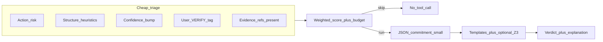

# Logic / claim audit tool: meta-plan (experimental, revisit-friendly)

## Status

### an agent suggest this and it is a compelling idea

Treat the whole feature as **experimental** until you have eval evidence: tool name, default-on/off, and policy hooks can stay provisional. In fcp, surface that in **descriptor** copy (`short_description`, `when_not_to_use`), tool `description()`, and optionally a **config flag** so the binary does not register the tool unless enabled.

## Goal

Give the agent a **voluntary / policy-triggered** tool that returns **OK | LOGIC_ERROR | UNSTATED_ASSUMPTION | HALLUCINATION | UNVERIFIED** (exact set flexible) on a **small, explicit** payload—not a second pass over the whole transcript. Probabilistic layer proposes; deterministic layer audits **only what the gate selects**.

## Tool naming (ideas → fcp-style ids)

Existing tools use **lowercase** namespaced ids, e.g. `mail:read`, `moltbook:verify` ([`Tool::name`](/home/hagbard/dev/eris/src/tools/traits.rs) is a static string). Pick **one** canonical id for code and registry; keep the poetic label in the human description.

| Your idea | Suggested canonical `name()` | Notes |
|-----------|------------------------------|--------|
| Logic:Interroga | `logic:interrogate` | “Interroga” reads like Latin fragment; `interrogate` matches common vocabulary and routing. |
| Truth:Probe | `truth:probe` | “Truth” is philosophically heavy—descriptor should soften to *consistency with supplied evidence / premises*. |
| Claim:Stress | `claim:stress` | Matches “pressure on assertions”; good for stress-test framing. |
| Assumption:Expose | `assumption:expose` | Long but clear; pairs well with UNSTATED_ASSUMPTION verdicts. |
| Reason:Verify | `reason:verify` | Plain; overlaps semantically with “verify” elsewhere—still valid if descriptors disambiguate. |

**Recommendation (non-binding):** `logic:interrogate` or `claim:stress` for memorability + less collision with generic “verify”. If you want the experimental bit **in the id** (so logs are obvious): e.g. `logic:interrogate_exp`—optional; many teams prefer stable id + `experimental` in description only.

**Uncertainty:** defer final rename until after Phase 1 usage; changing `name()` later forces descriptor and gatekeeper string updates ([`docs/ADDING_A_TOOL.md`](/home/hagbard/dev/eris/docs/ADDING_A_TOOL.md)).

## How to know *what* to check (without dumping the chat)

Treat “worth checking” as a **budgeted decision** from **orthogonal signals**. No single signal is trustworthy alone; combine **cheap rules** first, then **one** structured tool call.

### Signal A — Action risk (deterministic, no LLM)

- **Irreversible or high-impact tool intents** (in this codebase: paths toward [`mail:write`](/home/hagbard/dev/eris/src/tools/mail/write.rs), calendar mutations, etc.) are always **candidates** for a pre-flight check *if* the model is about to assert facts or chains of justification.
- Implementation shape later: either **orchestrator policy** (“before tool X, require audit tool in last N turns”) or **descriptor / system prompt** nudge for Forge—start with **tool + prompt**; add hard policy only if you want enforcement.

### Signal B — Structural complexity (cheap heuristics)

- Detect **candidates** from the *assistant draft* before send: `if` / `therefore` / `implies` / `because` / quantifiers, numeric inequalities, code-like identifiers, multi-step bullets.
- These are **flags**, not proofs—they only raise priority.

### Signal C — “Dangerous certainty” (weak but useful)

- Self-reported confidence or “I am sure” language is **gameable**; use it only as **one bump** in score, never sole trigger.

### Signal D — Human / explicit tags

- User messages containing `VERIFY`, `LOGIC_CHECK`, or similar—**force** candidate (Forge or you).

### Signal E — Evidence handles, not raw dump

- The check always consumes **`claim` + optional `premises[]` + `evidence_refs[]`** (message ids, vault paths, tool output hashes). If the model cannot fill refs for a factual claim, verdict defaults to **UNVERIFIED** / assumption-heavy rather than ingesting 10k tokens.

### Budget

- **Per turn cap**: e.g. at most one full check, or max K premises, max formula depth—keeps latency predictable.

## How could you *test* usefulness for LLMs (beyond math / physics / logic homework)?

Formal domains are the **easy** ground truth. Elsewhere you measure **useful intervention**, not metaphysical truth.

1. **Synthetic bad-reasoning suite (NL, not only equations)**  
   Short vignettes: gossip chains, policy justifications, “user is angry because they said X” (invalid inference), contradictions with hidden premise. Expected tool verdicts are hand-labeled. Track precision/recall on **verdict class**, not on “world truth.”

2. **Proxy outcome metrics (A/B or before/after)**  
   - **Revision rate:** After tool output, does the assistant **change** the next draft (plan edit, softened claim, added caveat)?  
   - **High-risk pipeline:** For runs where `mail:write` (etc.) was eligible, compare **with** optional pre-call audit vs without: human or rubric scores on “unsupported claim sent” (small sample is enough for directional signal).

3. **Human rubric on a fixed task set**  
   e.g. 20 tasks mixing code explanation, emotional inference, scheduling—raters score **groundedness** and **logical fairness** of final answer. Tool on vs off; keep models constant.

4. **Honest scope for subjective / normative claims**  
   The tool should often return **UNVERIFIED** or **UNSTATED_ASSUMPTION** (value-laden premises)—success is **not** pretending to prove morals, but **flagging missing premises** or refusal to overclaim. Eval success = fewer overconfident factual leaps, not “settled ethics.”

5. **Regression tests in Rust**  
   Phase 1: JSON fixtures → expected JSON verdicts (no LLM in CI). Keeps the “engine” honest as you iterate.

Add a small **eval playbook** (markdown or `#[test]` corpus) as Phase **0b** / todo `eval-harness` so “useful?” is a designed question, not an afterthought.

## Architecture (three layers)

1. **Commitment schema (JSON)** — stable fields: `conclusion`, `premises`, `inference_kind`, `evidence_refs`, optional `smt_fragment` or a tiny DSL you control. This is the **pipe** Forge fills; validation via existing JSON Schema in [`Gatekeeper`](/home/hagbard/dev/eris/src/tools/gatekeeper.rs).

2. **Deterministic critic (Rust)**  
   - **Phase 1**: **Fallacy / shape templates** on a normalized mini-AST (e.g. “affirming the consequent”)—fast, no solver.  
   - **Phase 2**: **Consume Z3** via the [`z3` crate](https://crates.io/crates/z3) (prove-rs bindings to the Z3 binary library) for entailment / countermodels on **very small** theories—you implement **mapping** from your bounded input to Z3 AST and back, not an SMT engine. Per project rules, run solver work in **`tokio::task::spawn_blocking`**.  
   - **Note**: Native dependency (FFI inside the crate); your repo bans `unsafe` in **your** code, not in dependencies—still a deliberate supply-chain/build choice.

3. **Grounding (optional slice)** — `HALLUCINATION` only when **`evidence_refs` resolve** to stored text (transcript slice, vault file, prior tool JSON) and a **cheap check** fails (substring / hash / optional small NLI model later). No refs → do not claim “hallucination”; use **UNSTATED_ASSUMPTION** or **UNVERIFIED**.

## Z3 strategy: consume the crate, do not build a solver

**Intent:** The “reasoning engine” for entailment and counterexamples is **Microsoft Z3**, reused through the Rust ecosystem—not hand-rolled logic tables for general SMT.

- **Dependency:** the [`z3` crate](https://crates.io/crates/z3) ([`prove-rs/z3.rs`](https://github.com/prove-rs/z3.rs), API reference on [`docs.rs/z3`](https://docs.rs/z3)). Your code owns **only**: (1) a **tiny** JSON (or internal) representation of propositions, (2) a **builder** that instantiates `Bool`/`Int`/… AST nodes and calls `Solver::assert`, `check_sat`, `get_model`, and (3) mapping results back to **OK / LOGIC_ERROR** + human-readable counterexample text.
- **What you do not write:** CDCL/DPLL, theory combination, or a general “logic language” runtime—that is Z3’s job.
- **Learning / spike (before wiring the Tool):** small `#[test]` or scratch binary in-repo: toy “premises ⇒ conclusion” check, then “premises ∧ ¬conclusion” for countermodel; read upstream **examples** and **tests** in `z3.rs`. Optionally gate the dependency behind a **Cargo feature** (`z3-audit`) so default builds stay light until you are comfortable with native linking / CI.
- **Integration constraint:** keep solver calls inside **`tokio::task::spawn_blocking`** (per fcp rules); cap AST size and solver timeout to avoid stalls.
- **Alternative (open decision):** subprocess to a `z3` binary + SMT-LIB strings if you want weaker coupling to native libs—still “consume Z3,” not reinvent it.

## fcp integration (when you implement)

Follow the existing checklist in [`docs/ADDING_A_TOOL.md`](/home/hagbard/dev/eris/docs/ADDING_A_TOOL.md):

- New module under e.g. `src/tools/logic_audit/` (folder name decoupled from final `name()` string) implementing [`Tool`](/home/hagbard/dev/eris/src/tools/traits.rs): `name`, `description`, `parameters_schema`, `execute`.
- Register in [`src/executive/chat_session.rs`](/home/hagbard/dev/eris/src/executive/chat_session.rs); add descriptor TOML in [`src/tools/specs.rs`](/home/hagbard/dev/eris/src/tools/specs.rs); extend `state_allows_tool` in [`src/tools/gatekeeper.rs`](/home/hagbard/dev/eris/src/tools/gatekeeper.rs) (likely **Chat + Idle**, probably **not** side-effecting Reflect-only unless you want read-only audit there).
- Consider `allow_repeat_in_turn` if the same args can yield different results when evidence updates—usually `false`.
- **Experimental:** config-gated registration **or** always register but descriptors say experimental and default routing is conservative.

## Phased roadmap (revisit order)

| Phase | Deliverable | Value |
|-------|-------------|--------|
| **0** | Documented JSON schema + verdict enum + triage rules + naming shortlist | Aligns Forge behavior without code |
| **0b** | Eval playbook + synthetic fixture list (incl. non-math cases) | Lets you answer “is this useful?” |
| **1** | Tool stub: validate JSON, template checks only, return structured JSON string | Loop-breaker with near-zero deps |
| **2** | Evidence resolver against transcript/vault (your storage model) | Honest `HALLUCINATION` / support |
| **3** | **Consume `z3` crate:** spike tests, then entailment + countermodels for hand-picked or generated tiny theories | Real counterexamples without a custom solver |
| **4** | Optional orchestrator **policy** tying high-risk tools to recent audit | Enforcement, not just nudge |

## What to defer (on purpose)

- Full NL → FOL translation (PhD-shaped); keep the formal core **small** and **user/agent-declared**.
- Verifying “every line”—explicitly out of scope; **triage + refs + budget** are the design answer.

## Open decisions (when you return)

- Final tool `name()` (pick from table or hybrid).
- Whether Z3 is **in-process** (`z3` crate) or **subprocess** (SMT-LIB to `z3` binary)—both are “consume Z3,” not rewrite it.
- Whether grounding v1 is **exact quote** only or allows embedding similarity (heavier, fuzzier).
- **Experimental:** config key name and default (off vs on for dev vaults only).

This is enough blueprint to park the idea, then implement **Phase 0–1** in small steps without committing to the whole vision upfront.