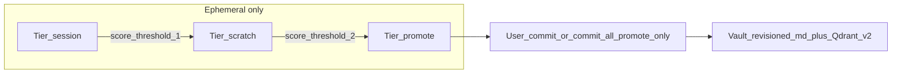
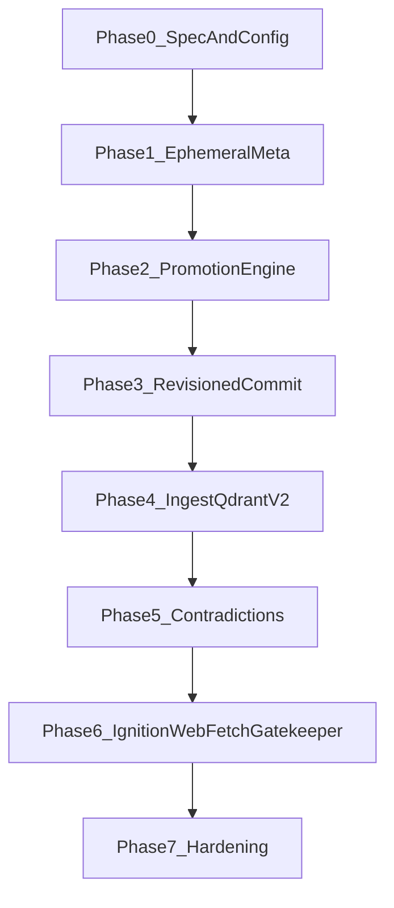

# Zettelkasten Memory Refactor Plan

## Branch strategy (hard cut)

- Work lives on a **feature branch**. **No downward compatibility** with v1 vault layout (`10_Episodic`, `20_Semantic`, etc.) if the branch lands successfully.
- **No migrator, no dual-read, no parity suite against old vaults.** Operators start from a **new empty workspace** that ignition seeds with v2 roots only.
- If the branch fails, abandon it; v1 repos stay untouched on `main`. This removes migration overhead and keeps implementation focused.

## Goals and Non-Goals

- Build a computable memory architecture with:
  - **Three ephemeral tiers:** `session` → `scratch` → `promote` (highest **ephemeral** tier only; not the vault).
  - **Human-controlled persistence:** user commits at session end via `memory:commit` / `memory:commit_all` (no auto-commit in this phase).
  - **`memory:commit_all` only commits rows in `promote` tier** (see Commit policy below). Session/scratch are never bulk-committed by accident.
  - Append-only committed revisions, stable `node_id`, active-head retrieval for default recall.
  - Contradiction as typed links + `needs_review`, not silent resolution.
  - Vault taxonomy: `00_Invariants`, `10_Topology`, `20_Discourse`, `30_Synthesis`.
- **New Qdrant collection** for this branch (do not reuse the old `fcp_vault_{workspace}` payload/points); see Vector store.

Non-goals:

- Migrating or ingesting legacy v1 folder layouts.
- Full gardener/yield merge passes (later).

## Vector store (hard cut)

- Use a **new collection name** (e.g. `fcp_vault_v2_{workspace}` or configurable `qdrant_collection_v2`) so **no v1 vectors** pollute recall.
- On first run with a v2-sealed vault, collection is created empty; old collection is ignored (or never referenced by this binary on the branch).
- **Ingest:** index **only the current head revision** per `node_id` by default (`is_current == true`), with payload fields sufficient to filter in Qdrant or in Rust after fetch: at minimum `node_id`, `rev`, `is_current`, `epistemic_status`, `vault_key`, `text`, `tags` (extend [`src/memory/semantic.rs`](../../src/memory/semantic.rs) payload contract).
- **History:** default `memory:query` returns **latest-only** semantic hits. Add a **separate tool or explicit args**, e.g. `memory:query_history` or `memory:query` with `include_history: true` / `node_id: …`, to retrieve **prior revisions** (prefer reading revision files from the vault to avoid indexing duplicate vectors for every old rev).

## Commit policy

- **`memory:commit_all`:** commits **only** ephemeral rows with `tier == promote`. Session and scratch are never included in bulk commit.
- **`memory:commit` (single `staged_id`):** default policy **align with bulk**: only allow commit when `tier == promote`, unless you later add an explicit `force` flag for power users (not in initial scope unless needed).
- After commit, invalidate ephemeral row as today; vault + Qdrant upsert follow revision rules.

## Config (session-shaped TTLs, three tiers)

- Replace single `ephemeral_ttl_secs` with **three values**:
  - `ephemeral_ttl_session_secs` — shortest, fits active task/context.
  - `ephemeral_ttl_scratch_secs` — medium, working notes.
  - `ephemeral_ttl_promote_secs` — longest, “ready for user review before session end.”
- Tune defaults so a normal **chat session** can hold promote-tier rows long enough to commit without premature expiry (concrete numbers in Phase 0 spec / `.fcp/config.toml` defaults).
- **Tier promotion** may **refresh or extend** `expires_at` according to the **target tier’s** TTL (e.g. on `session→scratch→promote`, recompute expiry from `now + ttl_for_tier`).

## Ephemeral tier promotion and scoring (sequence)

**Tiers (ephemeral, each with its own TTL from config):**

| Tier      | Intent | TTL |
| --------- | ------ | --- |
| `session` | Task/context, freshest noise | `ephemeral_ttl_session_secs` |
| `scratch` | Working notes, repeated but not yet “ready” | `ephemeral_ttl_scratch_secs` |
| `promote` | Staged for user review; **only tier eligible for `commit_all`** | `ephemeral_ttl_promote_secs` |

**Dedupe key (normative — avoids Phase 2 fork)**

- **Authoritative identity:** `node_id` (UUID) is the stable id for a concept across turns and commits.
- **Merging rows in ephemeral:** use **`canonical_key`** for matching incoming turn-end candidates to an existing row:
  - `canonical_key` = normalized form of the **title** from `memory:stage` or of the **extracted subject line** (NFKC, lowercase, collapse whitespace, slug; **no embedding as primary key**).
  - On first insert, assign **`node_id`**; subsequent merges for the same `canonical_key` update that row’s score/metadata.
- **Embeddings:** use only for **optional** “suggested merge” (gardener / future), **not** for deterministic tier promotion or dedupe in v1.

**What is deterministic vs assisted**

- **Deterministic:** `promotion_score`, `mention_count`, `first_seen_at`, `last_seen_at`, `tier`, tier transitions, decay, `source_turn_refs`, dedupe by `canonical_key` / `node_id`.
- **Model-assisted:** claim extraction, kind/tags, link candidates; may suggest `canonical_key` or title; **never** changes tier without passing numeric thresholds.

**Scoring inputs (tune in Phase 0)**

- +N per distinct turn the same `canonical_key` / `node_id` appears.
- +boost for explicit `memory:stage` or strong user-intent phrases.
- +optional boost for temporal spread across windows.
- −decay per daemon tick; tier downgrade policy: **decide in Phase 0** (monotonic tier up only + TTL eviction vs allow downgrade on decay).
- Contradiction / `needs_review`: cap tier or block entry to `promote`.

**Pipeline order**

1. **`memory:stage`:** upsert row; assign `node_id` if new; set `canonical_key` from title; bump score; set tier/TTL for current tier.
2. **End-of-turn hook:** merge candidates by `canonical_key` / `node_id`; update counts and score; tier transitions.
3. **Snapshot daemon** (`spawn_snapshot_daemon` in [`src/memory/ephemeral.rs`](../../src/memory/ephemeral.rs)): decay; expire; snapshot bin.
4. **User end of session:** `memory:commit` / `memory:commit_all` (**promote-only** for `commit_all`); write vault + upsert **v2** collection.

**`memory:staged_list`:** expose **`tier`**, **`promotion_score`**, **`expires_at`**, **`needs_review`** (plus existing `staged_id`, title, tags, optional preview) so user and agent see what is commit-eligible.

## Vault layout v2 and agent write policy

| Root | Role | Agent `vault:write` / `memory:commit` target |
| ---- | ---- | ------------------------------------------ |
| `00_Invariants/` | Immutable self, identity, user-curated facts | **Readable; not writable by agent.** User-maintained. |
| `10_Topology/` | Environment, config, low-volatility ops | Writable when **tags/kind** route here. |
| `20_Discourse/` | Raw interaction / append-only stream | Writable when tags/kind route here (e.g. episodic / conversation). |
| `30_Synthesis/` | Calcified graph, revisioned zettels | `30_Synthesis/<node_id>/rXXXX.md`, `is_current`, etc. |

- **Routing:** replace v1 keyword→folder (`memory_routing`) with **tag/kind → root** mapping in config (four roots above). **`00_Invariants` must never be chosen as commit target** (enforce in commit path + **gatekeeper denies `vault:write` under `00_Invariants/`**).
- **Align ignition + vault watch:** retire `00_Core/Identity.md` in favor of **`00_Invariants/Identity.md`** (or agreed filename). Update [`VaultWatchConfig`](../../src/config.rs) defaults and ignition templates.

## `web:fetch` (deprecated on branch)

- Gate deprecation with a **config flag**; **remove `web:fetch` from gatekeeper** allowlists so the model cannot call it in normal states.
- **Keep code in tree** as dead/unreachable from the router for now (or only behind the flag for local experiments). Pagination/chunking may be **reused later** for long `vault:read` — follow-up, not memory v2 MVP.

## Architectural decisions (recap)

- Deterministic promotion core; model proposes, policy disposes.
- Ephemeral mutable; committed append-only revisions + active head; default recall = head only; **history = separate tool/flag**.
- Contradictions: link + flag; gardener resolution later.
- **Stable Qdrant point ids** for vault-backed chunks: keep **UUID v5 from vault-relative path** ([`upsert_vault_document`](../../src/memory/semantic.rs)); avoid random point ids for committed vault files.

## Tooling surface (must stay in sync)

- **[`src/tools/gatekeeper.rs`](../../src/tools/gatekeeper.rs):** per-state allowlists — drop `web:fetch` when deprecated; add new tools (`memory:query_history`, `memory:promotion_list`, etc.).
- **Tool compendium + JIT recovery:** register new tools and routing phrases ([`src/tools/specs.rs`](../../src/tools/specs.rs), [`src/tools/routing_phrases.rs`](../../src/tools/routing_phrases.rs), orchestrator compendium paths) so slim prompts and schema recovery know names and when to use them.
- **[`src/orchestrator/context.rs`](../../src/orchestrator/context.rs):** memory lifecycle copy — three tiers, promote-only `commit_all`, `staged_list` fields, history vs default query.

## Current code touchpoints

- [`src/memory/ephemeral.rs`](../../src/memory/ephemeral.rs) — cache, TTLs per tier, daemon.
- [`src/tools/memory/`](../../src/tools/memory/) — stage, staged_list, commit, commit_all, query (+ history tool or query args).
- [`src/memory/semantic.rs`](../../src/memory/semantic.rs) — collection v2, ingest roots, recursion, payload, head-only ingest.
- [`src/orchestrator/context.rs`](../../src/orchestrator/context.rs) — prompts.
- [`src/config.rs`](../../src/config.rs) — TTL triple, collection v2, vault watch paths, `web_fetch_deprecated` (or similar), tag→root routing.

## Target data model (v2)

- `MemoryNode` / `MemoryRevision` / `MemoryEdge` / ephemeral metadata: `tier`, `promotion_score`, `mention_count`, `needs_review`, `canonical_key`, `node_id`, etc.
- Epistemic status on committed notes: `candidate`, `stable`, `contested`, `deprecated`, `retracted` (optional `corroborated` later).

## Retrieval and ingest policy

- Recursive ingest **only** under the four v2 roots; invalid frontmatter → skip + log.
- **Default index:** one point per **current head** per `node_id`.
- **Default `memory:query`:** semantic search on that index + epistemic filters.
- **History:** `memory:query_history` (or equivalent) loads older revisions from vault files (optional secondary index later).

## Phased roadmap

### Phase 0 — Spec + config

- Numeric thresholds, three TTL defaults, tier downgrade policy, v2 collection name.
- Tag/kind → root matrix; `00_Invariants` write deny list.

### Phase 1 — Ephemeral metadata

- `CacheValue` (+ bincode version): `node_id`, `canonical_key`, `tier`, scores, `needs_review`, per-tier TTL behavior.

### Phase 2 — Promotion engine

- Turn-end hook + stage + daemon; dedupe per **Dedupe key** section.

### Phase 3 — Revisioned commit

- `commit_all` **promote-only**; routing to `10/20/30` only; **never** `00_Invariants` from agent.
- One active head per `node_id`.

### Phase 4 — Ingest + Qdrant v2

- New collection; recursive ingest; payload fields; **latest head only** for default index; **`memory:query_history`** (or equivalent).

### Phase 5 — Contradictions + optional review tools

- Edges + `needs_review`; `memory:promotion_list` / explain as needed.

### Phase 6 — Ignition, vault watch, web:fetch, docs, compendium

- Scaffold v2 tree + `00_Invariants/Identity.md`; update watch paths.
- `web:fetch` deprecated flag + gatekeeper removal.
- README, tool specs, compendium, JIT recovery strings.

### Phase 7 — Hardening

- Tests: promote-only `commit_all`, TTL per tier, ingest head-only, history tool, gatekeeper + `00_Invariants` write deny.

## Testing strategy

**New tests**

- `commit_all` skips `session` and `scratch`; only commits `promote`.
- Three TTLs and tier-based expiry refresh.
- Qdrant v2 collection; ingest skips non-head revisions for default path.
- History retrieval returns older revs; default query does not.
- Gatekeeper: no `web:fetch` when deprecated; `vault:write` denied under `00_Invariants/` for agent (as implemented).

**Updated tests**

- `ephemeral.rs`, `stage.rs`, `staged_list.rs`, `commit.rs`, `commit_all.rs`, `semantic.rs`, `query.rs`, `config.rs`, gatekeeper tests if present.

## Critical issues and risk register

- Model overreach on promotion → thresholds + promote-only bulk commit.
- Head uniqueness and v2 collection isolation.
- Greenfield vault + v2 collection; document loudly; optional startup guard if legacy layout without v2 marker.

## Go / no-go (branch merge)

- Promote-only `commit_all` tested; `staged_list` exposes tier/score/expiry/needs_review.
- v2 collection + head-only ingest + history path; identity under `00_Invariants` aligned.
- `web:fetch` gated/removed from gatekeeper; compendium/JIT updated.

## Implementation order

1. Phase 0 spec + config (TTL triple, collection v2, routing matrix).
2. Ephemeral schema + promotion + dedupe keys.
3. Revisioned commit + promote-only rules + `00_Invariants` read-only enforcement.
4. Semantic ingest + payloads + history tool.
5. Contradictions + optional list tools.
6. Ignition + vault watch + `web:fetch` deprecation + docs + compendium/JIT.
7. Hardening + merge decision.
