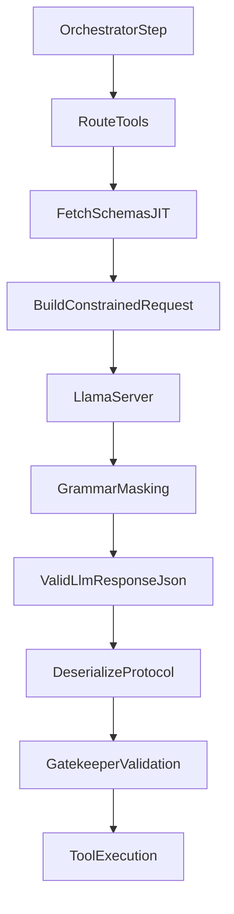

# Deterministic Constrained Decoding (llama-server)

## Goal

Migrate the chat generation path from prompt-enforced JSON to engine-enforced constrained decoding using `llama-server`, with phase-1 constraints applied to the full assistant protocol object (`LlmResponse`). Keep TOML descriptors for routing intent, and source strict schemas from Rust types/tool schemas.

## Chosen Architecture

- Backend path: `llama-server` OpenAI-compatible HTTP bridge.
- Constraint scope: full `LlmResponse` schema enforced during generation.
- Keep `Gatekeeper` JSON Schema validation as execution-time safety rail (authorization + args validation).
- Enforce exact `response_format` wrapper with strict mode:
  - `response_format.type = "json_schema"`
  - `response_format.json_schema.name = "eris_protocol_response"`
  - `response_format.json_schema.strict = true`
  - `response_format.json_schema.schema = <patched LlmResponse schema>`

## Implementation Sequence

### 1) Extend the engine boundary for constrained generation

- Update [`/Users/jandahlke/dev/hagbards_stuff/eris/src/engine/traits.rs`](/Users/jandahlke/dev/hagbards_stuff/eris/src/engine/traits.rs) to support a constrained call (e.g. new `generate_constrained(...)` method or equivalent request enum).
- Define an explicit constraint payload type (schema JSON + mode metadata) so orchestrator can request deterministic decoding without backend-specific coupling.
- Keep current `generate(...)` for unconstrained paths (condensation/legacy fallback).

### 2) Add a llama-server engine implementation

- Add new engine module (e.g. [`/Users/jandahlke/dev/hagbards_stuff/eris/src/engine/llama_server.rs`](/Users/jandahlke/dev/hagbards_stuff/eris/src/engine/llama_server.rs)).
- Implement constrained request to `/v1/chat/completions` with exact OpenAI-style `json_schema` wrapper payload and timeout/error mapping into `FcpError`.
- Preserve token accounting and tracing parity with [`/Users/jandahlke/dev/hagbards_stuff/eris/src/engine/ollama.rs`](/Users/jandahlke/dev/hagbards_stuff/eris/src/engine/ollama.rs).
- Add a minimal capability probe/health check on startup (or first-use): send a tiny strict schema request and fail fast with a clear config/runtime error if the backend does not honor constrained decoding.

### 3) Route orchestrator through constrained protocol generation

- In [`/Users/jandahlke/dev/hagbards_stuff/eris/src/orchestrator/core/step.rs`](/Users/jandahlke/dev/hagbards_stuff/eris/src/orchestrator/core/step.rs), switch the main protocol-generation call to constrained mode using the `LlmResponse` schema.
- Keep parse checks (`parse_llm_response_protocol`) initially as defense-in-depth; explicitly retain fallback for truncation/EOF cases (`max_tokens` or context edge) even under constrained decoding.
- Keep condensation/tool execution flow unchanged outside generation call choice.

### 4) Make schema contracts first-class and JIT-injected

- Add canonical `LlmResponse` JSON Schema source (derive + explicit patch builder) in orchestrator domain (likely near [`/Users/jandahlke/dev/hagbards_stuff/eris/src/orchestrator/state.rs`](/Users/jandahlke/dev/hagbards_stuff/eris/src/orchestrator/state.rs)).
- Build per-turn dynamic schema from active/authorized tools only:
  - constrain `tool_calls[].name` to current allowed tool names
  - bind `tool_calls[].args` to the matching tool schema (`oneOf`/discriminator-style branch per tool)
  - avoid static all-tools schema that permits out-of-turn tools
- Reuse tool schemas from [`/Users/jandahlke/dev/hagbards_stuff/eris/src/tools/gatekeeper.rs`](/Users/jandahlke/dev/hagbards_stuff/eris/src/tools/gatekeeper.rs) / `Tool::parameters_schema()` and inject concise targeted schema hints in [`/Users/jandahlke/dev/hagbards_stuff/eris/src/orchestrator/core/turn_entry.rs`](/Users/jandahlke/dev/hagbards_stuff/eris/src/orchestrator/core/turn_entry.rs).
- Keep TOML descriptors as routing intelligence only; do not duplicate schema authority there.
- Tighten high-risk argument fields in schemas (for example numeric bounds like timer/alarm minima) so syntactically valid but semantically bad values are reduced before gatekeeper enforcement.

### 5) Backend selection + ignition/peripheral lifecycle updates

- Add backend selection/config fields in [`/Users/jandahlke/dev/hagbards_stuff/eris/src/config.rs`](/Users/jandahlke/dev/hagbards_stuff/eris/src/config.rs) (e.g. `llm_backend`, llama-server URL/model/options).
- Update chat boot wiring in [`/Users/jandahlke/dev/hagbards_stuff/eris/src/executive/chat_session.rs`](/Users/jandahlke/dev/hagbards_stuff/eris/src/executive/chat_session.rs) and any parallel path in [`/Users/jandahlke/dev/hagbards_stuff/eris/src/executive/router.rs`](/Users/jandahlke/dev/hagbards_stuff/eris/src/executive/router.rs) to instantiate selected engine.
- Extend ignition in [`/Users/jandahlke/dev/hagbards_stuff/eris/src/executive/ignition.rs`](/Users/jandahlke/dev/hagbards_stuff/eris/src/executive/ignition.rs) to choose backend and persist config defaults.
- Update [`/Users/jandahlke/dev/hagbards_stuff/eris/src/executive/peripherals.rs`](/Users/jandahlke/dev/hagbards_stuff/eris/src/executive/peripherals.rs) for llama-server readiness/launch checks (without breaking Ollama-based embeddings/tool-router if retained).
- If running Ollama embeddings and llama-server chat concurrently, add explicit startup guidance/telemetry for memory pressure and backend readiness ordering (keep this operationally safe, but avoid hardcoding GPU-specific assumptions in core logic).

### 6) Reliability rollout + observability

- Add feature flag/guardrail to toggle constrained protocol mode per backend.
- Add metrics/tracing for: constrained requests, schema compile/reject events, fallback activation, and parse-failure rate trend.
- Define deprecation criteria for legacy 3-stage JSON repair loop based on observed parse success.

### 7) Test strategy before cleanup

- Add unit tests for new trait and backend request construction.
- Add integration-style tests around orchestrator main step to assert constrained responses parse cleanly and tool paths remain intact.
- Update existing engine/orchestrator mocks in [`/Users/jandahlke/dev/hagbards_stuff/eris/src/orchestrator/core/tests.rs`](/Users/jandahlke/dev/hagbards_stuff/eris/src/orchestrator/core/tests.rs).
- Add regression tests for malformed/extra-tail content behavior under constrained mode.
- Add tests for dynamic per-turn schema patching:
  - a disallowed tool name is rejected by schema at decode-time
  - allowed tool names accept only their matching args shape
  - truncated constrained outputs still route through existing recover/fallback behavior.

## Flow (Target Runtime)

## Initial Non-Goals (to keep phase 1 tight)

- No direct FFI (`llama-cpp-rs`) yet.
- No removal of `Gatekeeper` schema checks.
- No immediate deletion of recovery logic until constrained reliability is measured in-repo.

---

---

name: Deterministic Tool Routing Plan
overview: Introduce deterministic, schema-enforced constrained decoding via llama-server for the full `LlmResponse` contract, while preserving current tool routing intelligence and gatekeeper validation. Roll out behind config flags with a compatibility fallback so JSON contract reliability improves before removing legacy recovery behavior.
todos:

- id: extend-llm-engine-trait
  content: Add constrained-generation capability to `LlmEngine` and a backend-agnostic constraint payload type.
  status: pending
- id: implement-llama-server-engine
  content: Create llama-server engine module with exact OpenAI `json_schema` wrapper (`name` + `strict: true` + `schema`) and map constrained request/response handling into existing error and token-metric conventions.
  status: pending
- id: wire-constrained-step-path
  content: Use constrained generation for main orchestrator protocol output in `step.rs` while keeping fallback/parsing safety checks.
  status: pending
- id: unify-schema-sources
  content: Define canonical `LlmResponse` schema and build a per-turn dynamic schema patch from active tools (`Tool::parameters_schema()`), without duplicating TOML contracts.
  status: pending
- id: backend-selection-and-ignition
  content: Add config + ignition/backend wiring (including peripheral readiness flow) for selecting llama-server engine.
  status: pending
- id: rollout-telemetry-and-tests
  content: Add constrained-mode observability, reliability gates, and regression coverage before reducing legacy JSON repair behavior.
  status: pending
  isProject: false

---
