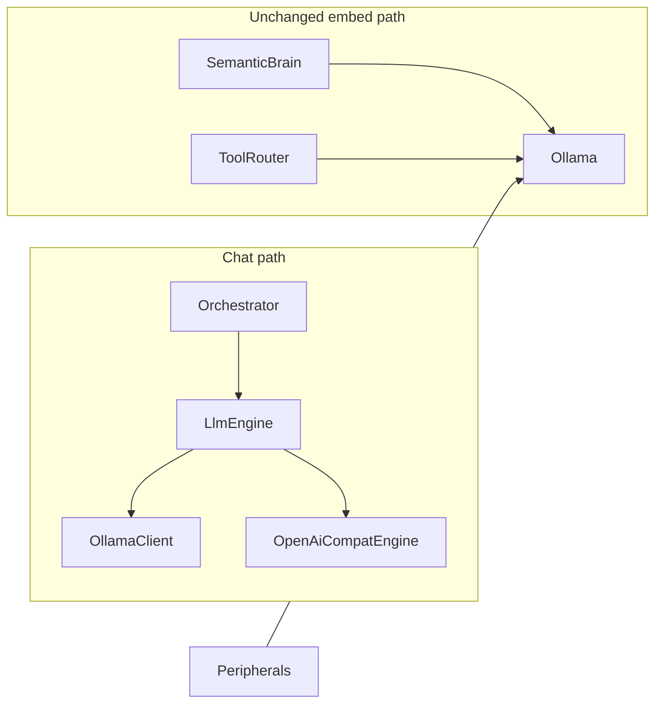

# Gemini (OpenAI-compatible) chat backend

## Constraints (from you)

- **Embeddings:** unchanged — local Ollama + `embed_model_name` (e.g. `nomic-embed-text`) for [`SemanticBrain`](src/memory/semantic.rs) and [`ToolRouter`](src/orchestrator/tool_router.rs).
- **Secrets:** operator maintains a **vault env file** under `.fcp/` (same mental model as keeping [`vaults/gemma4/.fcp/eris-sa.json`](vaults/gemma4/.fcp/eris-sa.json) in the vault). No interactive key prompts.
- **Scope:** **Gemini first**, one implementation; structure it as a **single OpenAI Chat Completions–shaped client** (same JSON shape Ollama’s `/v1/chat/completions` uses) so a future second provider is mostly config + base URL + auth header, not a second protocol.
- **Ignition:** after name prompts, offer **Local Ollama** vs **Cloud API (Gemini)**; cloud path sets defaults and does **not** ask for API keys (user edits `.fcp/.env` themselves). **No extra TUI for Gemini model:** use one **hardcoded cheap Flash-tier** model id in code (see §5); avoid defaulting to Pro / “1.5”-class or other spendy SKUs so API keys do not burn tokens on surprise picks.

## Current anchor points

- Trait: [`LlmEngine`](src/engine/traits.rs) — already the right seam.
- Chat wiring: [`executive/router.rs`](src/executive/router.rs) builds `Ollama` + `OllamaClient` and passes `Arc<Ollama>` into semantic/tool-router; **keep** that for embeds even when chat uses Gemini.
- Config load: [`AppConfig::load`](src/config.rs) uses Figment (defaults → `.fcp/config.toml` → `FCP_*` env). Today [`dotenvy::dotenv()`](src/config.rs) only loads **CWD `.env`**, not `.fcp/.env`.

## Design (small MVP)

### 1. Config

Add a small enum (serde string), default **`ollama`**:

- `llm_backend = "ollama" | "gemini_openai"` (names can be shortened in TOML; keep one clear default).

Optional override for portability / Google doc changes:

- `gemini_openai_base_url` — default in code to Google’s documented OpenAI-compat base (e.g. `https://generativelanguage.googleapis.com/v1beta/openai/` — verify against current [Gemini OpenAI compatibility](https://ai.google.dev/gemini-api/docs/openai) when implementing).

Reuse existing **`model_name`** for the Gemini model id. **Ignition (Gemini path)** sets it to a **single constant** (e.g. `gemini-2.0-flash` — confirm exact id against Google’s OpenAI-compat docs at implement time). Power users may still override via `.fcp/config.toml` / `FCP_MODEL_NAME`; default path stays budget-friendly.

API key: read from environment **`FCP_GEMINI_API_KEY`** (fits existing `FCP_` Figment prefix and avoids new secret fields in TOML). No JSON key file required for this MVP unless you later want parity with `service_account_key` paths.

Ollama-specific knobs (`enable_reasoning_fsm`, Ollama `think`, etc.) **no-op** for the HTTP backend (document or ignore in logs).

### 2. Load `.fcp/.env` before Figment

In [`AppConfig::load`](src/config.rs), after resolving that config is read from **CWD vault** (already true), call something like:

- `let _ = dotenvy::from_path(vault_layout::fcp_dir(Path::new(".")).join(".env"));`

Run this **before** (or immediately after) `dotenvy::dotenv()` so vault-local vars win or supplement CWD `.env`. Missing file = ignore (no error).

Add a tiny helper on [`vault_layout`](src/vault_layout.rs) e.g. `fcp_dotenv_path(workspace_root)` for clarity.

### 3. New engine module: OpenAI-compat HTTP `LlmEngine`

New file under [`src/engine/`](src/engine/) (name e.g. `openai_compat.rs`):

- `struct OpenAiCompatChatEngine { reqwest::Client, base_url, api_key, model, timeouts, optional token_metrics_tx }`
- `impl LlmEngine`: map `stack: &[Message]` → OpenAI `messages` (system/user/assistant), POST `{base}/chat/completions` with:
  - `Authorization: Bearer <key>` (Gemini OpenAI compat expects API key as bearer)
  - `response_format: { "type": "json_object" }` when the API supports it (required for FCP JSON discipline; align with [`OllamaClient`](src/engine/ollama.rs) `FormatType::Json`).
- Parse assistant `content` from first choice; map `usage.prompt_tokens` / `completion_tokens` into [`EngineResponse`](src/engine/traits.rs); publish [`LlmTokenSnapshot`](src/engine/token_metrics.rs) when the channel is present (zeros if usage missing).
- Streaming: if `stream_tx` is `Some`, use SSE streaming and append deltas (mirror timeout/error style from Ollama); if too brittle for MVP, **non-stream only** for Gemini path first and document — prefer matching Ollama behavior if effort is low.

Use existing **`reqwest`** + **`serde_json`**; **no new dependencies** if possible.

**Tests:** `wiremock` stub for `POST .../chat/completions` returning a minimal OpenAI-shaped JSON (same style as [`engine/ollama.rs`](src/engine/ollama.rs) tests).

### 4. Router factory

In [`executive/router.rs`](src/executive/router.rs) chat branch:

- Always: parse `ollama_host`, build `Arc<Ollama>`, `ensure_peripherals_for_chat`, semantic brain + tool router (unchanged).
- **Engine selection:** `match config.llm_backend` → `OllamaClient::with_token_metrics(...)` vs `OpenAiCompatChatEngine::new(...)`.
- If `gemini_openai` and `FCP_GEMINI_API_KEY` is missing/empty → clear [`FcpError::Config`](src/executive/error.rs) at startup (fail fast).

[`Orchestrator`](src/orchestrator/core/orchestrator.rs) (re-exported from `orchestrator::core`) stays generic; only the concrete `E` type at the call site changes (compiler may need a small type-erasure wrapper **only if** the two engine types make the orchestrator type unwieldy — try direct match first; if needed, a thin `enum Engine { Ollama(OllamaClient), OpenAi(OpenAiCompatChatEngine) }` with `impl LlmEngine` avoids `Box<dyn>`).

### 5. Ignition

In [`executive/ignition.rs`](src/executive/ignition.rs):

- After agent + user name, **`Select`**: `Local Ollama` vs `Cloud API (Gemini)` (this backend choice stays; **no** second prompt for Gemini model).
- **Ollama:** keep existing `list_local_models` / model selection.
- **Gemini:** set `llm_backend = "gemini_openai"` and set **`model_name`** from a **single hardcoded constant** in code (Flash / cheap tier only — **not** Pro, not a default that maps to expensive “1.5” chat models). Do **not** prompt for API key; operator creates `.fcp/.env` with `FCP_GEMINI_API_KEY=...`.

**Seal vs runtime (same as Ollama today):**

- [`ignition.rs`](src/executive/ignition.rs) already writes `model={config.model_name}` into [`.fcp/seal`](src/vault_layout.rs) alongside `agent=` / `sealed_at=`. For Gemini ignition that `model_name` is the same hardcoded Flash id unless the operator later edits TOML.
- **Changing the model later:** edit **`model_name`** in `.fcp/config.toml` (and optionally `FCP_MODEL_NAME`). Runtime reads Figment-resolved `AppConfig::model_name`. The seal file is a **snapshot from first setup** and does not auto-update when TOML changes.

Update written `seal` / comments in ignition output only if you already embed hints elsewhere; keep minimal.

### 6. Telemetry / health (optional MVP polish)

- [`src/ui/render.rs`](src/ui/render.rs) label `ollama tok:` → generic `llm tok:` when backend is not Ollama, or leave as-is for smallest diff (your call during implementation).
- [`system:health`](src/tools/system/health.rs) can mention `llm_backend` + masked presence of API key env; skip if time-boxed.

### 7. Docs

Per your preference for a **small MVP**: add a **short** subsection to an existing doc you already maintain (e.g. [`docs/STATE.MD`](docs/STATE.MD) or [`README.md`](README.md)) only if you want it discoverable — otherwise a commented block in a sample `config.toml` in tests is enough.

## Risks / acceptance checks

- **JSON mode:** Confirm Gemini’s OpenAI-compat layer honors `json_object` for your chosen model; if not, fall back to strict system prompting + validation (or document limitation).
- **`num_ctx`:** Map loosely to provider `max_tokens` / context only if needed; MVP can omit model-specific context wiring and rely on server defaults.
- **No `unwrap`/`expect`** in production paths; route errors through `FcpError`.

---

name: Gemini OpenAI-compat LLM
overview: "Add a minimal second chat backend: Gemini via Google’s OpenAI-compatible HTTP API, while keeping Ollama for embeddings and peripheral management. Vault secrets live in `.fcp/.env` (loaded before Figment); ignition gains an Ollama vs Gemini path without prompting for keys."
todos:

- id: config-enum-env
  content: Add llm_backend (+ optional gemini_openai_base_url), load .fcp/.env in AppConfig::load, validate FCP_GEMINI_API_KEY for gemini path
  status: pending
- id: openai-compat-engine
  content: Implement OpenAiCompatChatEngine (reqwest, JSON response_format, LlmEngine + token_metrics + wiremock tests)
  status: pending
- id: router-ignition
  content: Branch router.rs engine construction; ignition Select Ollama vs Gemini only; Gemini path hardcodes cheap Flash model_name; seal writes model=
  status: pending
- id: polish-docs
  content: "Optional: TUI/health strings + one-line doc for .fcp/.env and FCP_GEMINI_API_KEY"
  status: pending
  isProject: false

---
