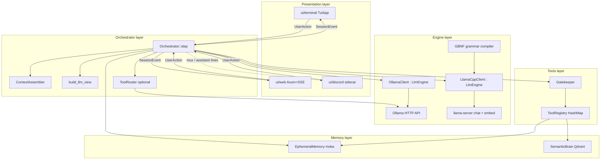
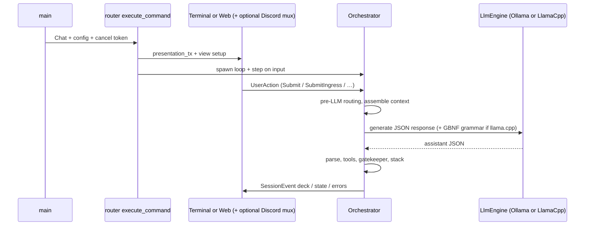

# Overview and mental model

## What this program is

**Eris** is a local, vault-centric assistant: a Rust binary that connects **presentation surfaces**—full-screen **ratatui** (`eris chat`), **localhost web + SSE** (`eris chat --web`), and optionally **Discord**—to one shared orchestrator backed by either **Ollama** or **llama.cpp** (direct GGUF inference with GBNF grammar enforcement). Tools sit behind a **gatekeeper** (JSON Schema + per-state allowlists); pre-LLM “which tools matter” uses **embedding similarity** (ToolRouter) via a backend-agnostic `EmbeddingProvider` trait. Long-term recall lives in **Qdrant**; short-lived staging uses an **moka** cache (ephemeral memory).

The **active vault** is always the process **current working directory** at config load—not `vault_root + workspace` from TOML. That is a deliberate mental model: `cd` into your vault, run chat, `.fcp/` and markdown live beside your notes.

## Architectural layers (simplified)

## Main runtime flow (chat)

## Glossary

| Term | Meaning |
|------|---------|
| **Vault root / active vault** | `AppConfig::config_source_dir` (= cwd at load); `active_vault()` |
| **Workspace** | Logical id for Qdrant collection `fcp_vault_v2_{workspace}`, ephemeral snapshot filename `.fcp/ephemeral_{workspace}.bin`, etc. |
| **Layer 1 / Layer 2** | Legacy docs sometimes call the LLM “Layer 1” and orchestrator+tools “Layer 2”; code modules are `engine` and `orchestrator` |
| **chat_stack** | Canonical `Vec<Message>`; LLM may see a *view* via `build_llm_view` |
| **Tool mode vs conversational** | Pre-LLM routing: some user turns skip tools (short input, system alarm prefix); else tools enabled with full or slim schemas |
| **Gatekeeper** | Validates args against JSON Schema and enforces `AgentState` allowlists |
| **LlmBackend** | `Ollama` (default) or `LlamaCpp`; set in `AppConfig` via `llm_backend` |
| **GBNF grammar** | BNF-style grammar passed to llama-server to constrain output to valid FCP protocol JSON; compiled at session start from registered tool schemas |
| **EmbeddingProvider** | Trait (`engine/embedding.rs`) abstracting vector generation; `OllamaEmbedding` and `LlamaCppEmbedding` implement it |
| **40_MEDIA** | Vault subtree of `media.json` catalog cards for user-uploaded blobs; Qdrant indexes card text only when `[vision] enabled` |

## Source map (`src/`)

| Directory | Role |
|-----------|------|
| `executive/` | CLI, command routing, ignition, peripherals, identity helpers |
| `config.rs` | `AppConfig` + Figment load |
| `vault_layout.rs` | Paths under `.fcp/` |
| `workspace.rs` | `init_workspace` for multi-workspace vault roots (legacy/bootstrap) |
| `engine/` | `LlmEngine` trait, `OllamaClient`, `LlamaCppClient`, `EmbeddingProvider` trait, token metrics, reasoning FSM |
| `engine/grammar/` | GBNF grammar compiler: static envelope (`envelope.rs`), tool name enum (`tool_names.rs`), JSON Schema → GBNF per-tool args (`schema_to_gbnf.rs`) |
| `orchestrator/` | `core/` loop, `state`, `context/` (assembler, LLM view, condensation, compendium), `llm_support/` (JSON envelope + post-tool copy), `tool_router`, `heartbeat/`, `alarms/`, `loop/` policies |
| `memory/` | Ephemeral + semantic |
| `media/` | `40_MEDIA` catalog cards (`media.json`), embed text for Qdrant |
| `tools/` | Trait, gatekeeper, tool implementations, descriptors |
| `ingest/` | Chunking helpers for semantic pipeline |
| `telemetry/` | tracing init, preflight, routing log codes |
| `presentation/` | View-neutral `UserAction`, `SessionEvent`, `InputSource`, alarm → action relay, presentation multiplexer |
| `ui/terminal/` | ratatui `TuiApp`, render, crossterm setup |
| `ui/web/` | Axum router, SSE, browser chat |
| `ui/discord/` | Optional Serenity gateway sidecar |
| `util/` | HTTP API client, fs watch |

## Out of scope for this doc set

- **`target/`** build artifacts
- **Specific vault contents** (e.g. `vaults/eve/`): layout and conventions are described generically
