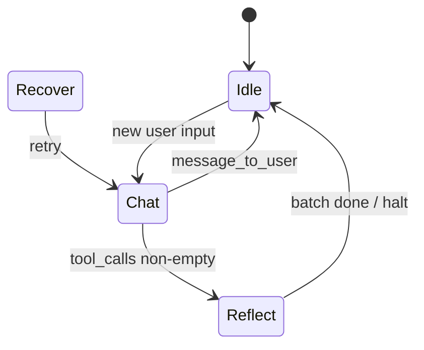

# Orchestrator layer

## Core type (`orchestrator/core.rs`)

`Orchestrator<E: LlmEngine>` owns:

- **state:** `AgentState` (Chat, Reflect, Idle, Recover)
- **engine:** generic LLM client
- **gatekeeper:** tool registry + validation
- **ephemeral:** `Arc<EphemeralMemory>`
- **context_assembler:** builds system prompts from identity snapshot + tool JSON
- **tool_router:** optional semantic gating
- **chat_stack:** full conversation for persistence logic; **not** always identical to what the LLM sees
- **context_view:** `ContextViewSettings` for `build_llm_view`
- **interrupt_rx:** `watch::Receiver` from heartbeat — triggers idle injection path
- **tui_tx:** optional UI updates
- **promotion_suppressed_during_step:** `Arc<std::sync::atomic::AtomicBool>` shared with `spawn_snapshot_daemon`. At the **start** of `step()`, a local `PromotionSuppressedDuringStep` guard sets it to `true` (`Ordering::SeqCst`); `Drop` clears it when `step` returns or unwinds, so promotion/decay never runs concurrently with an in-flight step.

### `step()` — one “turn”

Rough pipeline:

1. Arm promotion suppression (RAII above); increment `turn_seq`; reset recovery/tool counters; clear activity line / last deck dedupe state.
2. **Empty user message** → synthetic “SY FNORD” idle JSON (`handle_empty_user_turn`).
3. **Deterministic agenda complete** — if user text matches “done” heuristics and prior `AGENDA_CONFIRM` line → run `agenda:complete` without LLM (`maybe_run_deterministic_agenda_complete`).
4. **Pre-LLM routing** (`run_pre_llm_routing`):
   - User line starts with `SYSTEM_ALARM_PREFIX` → **conversational** (no tools).
   - `ToolRouter::short_input_guard_conversational_only` → conversational.
   - No router → **tools on**, full roster (no semantic filter list).
   - Router `match_tools(user_input)` on **user text** (embed + cosine vs precomputed tool vectors):
     - Empty matches → still **tools on**, roster-only (fallback).
     - Non-empty → tools on + matched names for JIT guidance / possible targeted schema subset path.
5. **Inner loop** (tool rounds, recovery): assemble system prompt (conversational vs full tools vs selected tools), optional JIT descriptor block, `build_llm_view`, `engine.generate`.
6. **Interrupt:** `tokio::select!` on `interrupt_rx.changed()` → clear stack, inject idle/agenda prompt, return `FcpError::Interrupted`.
7. **Parse** assistant JSON → `LlmResponse`; push to stack; condensation if over token threshold (`context_window`); interpret `LoopDirective`; execute tools through gatekeeper; apply `orchestrator::loop::*` policies.

### Assistant text on the TUI (`emit_optional_user_message`)

When the model returns **both** `tool_calls` and a non-empty `message_to_user`:

- **Main transcript (deck):** only `message_to_user` is emitted as `TuiEvent::IncomingMessage` (prefixed with agent name). If the same body was already sent this `step()` (`last_deck_message_body`), the duplicate is skipped (avoids double bubbles when status-driven replays repeat the line).
- **Status (`activity_line`):** a short line `Tools: <comma-separated tool names>` (trimmed to a fixed character budget), not the old combined “message · tools…” pattern. Full JSON and tool payloads remain in `tracing` (e.g. `UI_TOOL_ROUND_STATUS`, `UI_EMIT_INCOMING_MESSAGE`).

When there are **no** tool calls, behavior is unchanged: non-empty `message_to_user` goes to the deck as before.

## State machine (`orchestrator/state.rs`)

- **`LlmResponse`:** `thought`, optional `status` (`Task` | `Reflect` | `Idle` + `Process` alias), `message_to_user`, `tool_calls`.
- **`status()` inference:** explicit status or infer from tool_calls / message_to_user / default Task.
- **`normalize_tool_calls`:** e.g. `action` → `name`, agenda `id` → `task_id` in args.
- **`LoopDirective`:** what the coordinator does next (execute tools, halt, recover, shift reflection).

## Context assembly (`orchestrator/context.rs`)

- **`assemble`:** identity + **all** allowed tools for current `AgentState` as OpenAI-style JSON functions between `FCP_TOOL_DEFS_BEGIN/END` markers.
- **`assemble_with_selected_tools`:** filters to a subset (used when targeting after routing).
- **`assemble_conversational`:** JSON schema rules but **no** tool definitions (tool_calls expected empty).

System prompt text mandates **single JSON object** output, no markdown fences; model uses `FormatType::Json` in Ollama.

## LLM-only view (`orchestrator/context_view.rs`)

`build_llm_view` clones `chat_stack` and may:

- Strip or slim tool `parameters` in the tool-def block (when `optimize_context` + not recovery pass).
- Trim tool result snippets per `ToolContextViewHint` and config overrides.
- Compact assistant JSON when configured.

`Orchestrator::force_full_tool_schemas_in_llm_view` forces full schemas for one pass after certain gatekeeper schema faults.

## ToolRouter (`orchestrator/tool_router.rs`)

- At startup, embeds each tool’s enriched string (description + optional `routing_hints` from descriptors + built-in lexical hints per tool name).
- **`match_tools`:** embed query text, cosine similarity vs threshold, return sorted hits.
- **Guards:** short inputs and “looks like URL/news” heuristics to avoid false tool mode.

Note: **Pre-LLM** routing uses **user input** string, not the model’s `thought` field (despite the parameter name in `match_tools`).

## Heartbeat (`orchestrator/heartbeat.rs`)

Polls every second: if `now - last_input_time > idle_timeout_secs`, sends on `watch` channel. Orchestrator uses this to enter idle injection (and clears stack in that branch).

## Alarms (`orchestrator/alarm_scheduler.rs`, `tools/clock`)

- `alarms.json` stores `AlarmRecord` rows with `fire_at_unix`; scheduler sleeps until next due, fires `TuiEvent::SystemAlarm`, persists remaining rows.
- Agenda-linked alarms include `agenda_task_id` → UI sends `UserAction::AgendaAlarmPending` with confirmation block.

## Missed agenda (`orchestrator/missed_agenda.rs`)

Startup hint if overdue tasks exist (spawned once).

## Post-tool guidance (`orchestrator/post_tool_guidance.rs`)

Injected strings for recovery / user-facing follow-ups after tool success or failure.

## Loop policy modules (`orchestrator/loop/`)

- **`transition.rs`:** `StateTransition` / `TransitionControl` — coordinator applies these.
- **`directive_policy.rs` / `recovery_policy.rs`:** classify failures and next action.
- **`tool_batch.rs`:** `ToolBatchDecision` — Continue, Halt, RetryWithTargetedSchema, Recover, Fatal.

(Exact transitions are implemented in `core.rs` + policies; this diagram is illustrative.)
