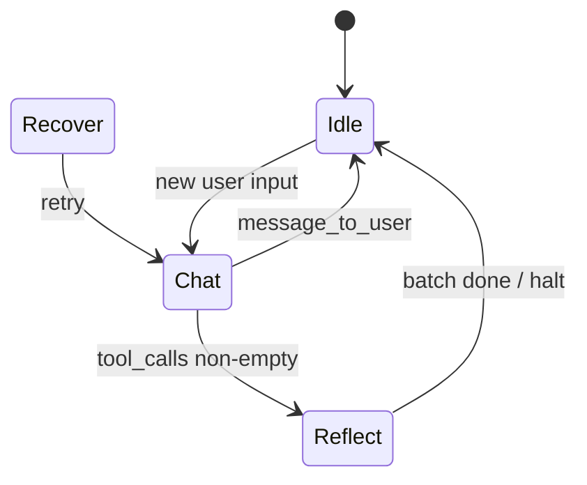

# Orchestrator layer

## Core type (`orchestrator/core/`)

`orchestrator/core/mod.rs` only declares submodules and re-exports; the type and constructor live in `core/orchestrator.rs`, with `step`, tool dispatch, transitions, etc. in sibling files under `core/`.

`Orchestrator<E: LlmEngine>` owns:

- **state:** `AgentState` (Chat, Reflect, Idle, Recover)
- **engine:** generic LLM client
- **gatekeeper:** tool registry + validation
- **ephemeral:** `Arc<EphemeralMemory>`
- **context_assembler:** builds system prompts from identity snapshot + tool JSON
- **tool_router:** optional semantic gating
- **chat_stack:** full conversation for persistence logic; **not** always identical to what the LLM sees
- **context_view:** `ContextViewSettings` for `build_llm_view`
- **interrupt_rx:** `watch::Receiver` from heartbeat — triggers idle injection path (only populated when `idle_heartbeat_enabled` spawns the monitor)
- **presentation_tx:** optional `mpsc::Sender<SessionEvent>` for terminal/web/Discord surfaces
- **promotion_suppressed_during_step:** `Arc<std::sync::atomic::AtomicBool>` shared with `spawn_snapshot_daemon`. At the **start** of `step()`, a local `PromotionSuppressedDuringStep` guard sets it to `true` (`Ordering::SeqCst`); `Drop` clears it when `step` returns or unwinds, so promotion/decay never runs concurrently with an in-flight step.

### `step()` — one “turn”

Rough pipeline:

1. Arm promotion suppression (RAII above); increment `turn_seq`; reset recovery/tool counters; clear activity line / last deck dedupe state (presentation-facing “deck” is driven by `SessionEvent::IncomingMessage` and related events).
2. **Empty user message** → synthetic “SY FNORD” idle JSON (`handle_empty_user_turn`).
3. **Deterministic agenda complete** — if user text matches “done” heuristics and prior `AGENDA_CONFIRM` line → run `agenda:complete` without LLM (`maybe_run_deterministic_agenda_complete`).
4. **Pre-LLM routing** (`run_pre_llm_routing`):
   - User line starts with `SYSTEM_ALARM_PREFIX` → **conversational** (no tools).
   - `ToolRouter::short_input_guard_conversational_only` → conversational.
   - No router → **tools on**, full roster (no semantic filter list).
   - Router `match_tools(user_input)` on **user text** (embed + cosine vs precomputed tool vectors):
     - Empty matches → still **tools on**, roster-only (fallback).
     - Non-empty → tools on + matched names for JIT guidance / possible targeted schema subset path.
5. **Inner loop** (tool rounds, recovery): assemble system prompt (conversational vs full tools vs selected tools), optional JIT descriptor block, `build_llm_view`, `engine.generate`.
6. **Interrupt:** `tokio::select!` on `interrupt_rx.changed()` → clear stack, inject idle/agenda prompt, return `FcpError::Interrupted`.
7. **Parse** assistant JSON → `LlmResponse`; push to stack; condensation if over token threshold (`orchestrator::context`, implemented in `context/window.rs`); interpret `LoopDirective`; execute tools through gatekeeper; apply `orchestrator::loop::*` policies.

### Assistant text on presentation surfaces (`emit_optional_user_message`)

When the model returns **both** `tool_calls` and a non-empty `message_to_user`:

- **Main transcript (deck):** only `message_to_user` is emitted as `SessionEvent::IncomingMessage` (prefixed with agent name). If the same body was already sent this `step()` (`last_deck_message_body`), the duplicate is skipped (avoids double bubbles when status-driven replays repeat the line).
- **Status (`activity_line`):** a short line `Tools: <comma-separated tool names>` (trimmed to a fixed character budget), not the old combined “message · tools…” pattern. Full JSON and tool payloads remain in `tracing` (e.g. `UI_TOOL_ROUND_STATUS`, `UI_EMIT_INCOMING_MESSAGE`).

When there are **no** tool calls, behavior is unchanged: non-empty `message_to_user` goes to the deck as before.

## State machine (`orchestrator/state.rs`)

- **`LlmResponse`:** `thought`, optional `status` (`Task` | `Reflect` | `Idle` + `Process` alias), `message_to_user`, `tool_calls`.
- **`status()` inference:** explicit status or infer from tool_calls / message_to_user / default Task.
- **`normalize_tool_calls`:** e.g. `action` → `name`, agenda `id` → `task_id` in args.
- **`LoopDirective`:** what the coordinator does next (execute tools, halt, recover, shift reflection).

## Context pipeline (`orchestrator/context/`)

Submodules (all re-exported at `crate::orchestrator::context::…`):

- **`assembler.rs` — `ContextAssembler`:** builds system prompts from identity + tool JSON.
  - **`assemble`:** identity + **all** allowed tools for current `AgentState` as OpenAI-style JSON functions between `FCP_TOOL_DEFS_BEGIN/END` markers (`view` module).
  - **`assemble_with_selected_tools`:** filters to a subset (used when targeting after routing).
  - **`assemble_slim_tool_map`:** phrase map from **`compendium`** + tool defs without `parameters`.
  - **`assemble_conversational`:** JSON schema rules but **no** tool definitions (tool_calls expected empty).
- **`view.rs`:** `build_llm_view`, `ContextViewSettings`, delimiters. Clones `chat_stack` and may strip/slim tool `parameters`, trim tool result snippets per `ToolContextViewHint`, compact assistant JSON when configured.
- **`window.rs`:** sliding-window condensation, rolling summary JSON, `plan_sliding_condensation`, etc.
- **`compendium.rs`:** `build_phrase_compendium` / typical phrasing lines for slim tool prompts.

System prompt text mandates **single JSON object** output, no markdown fences; model uses `FormatType::Json` in Ollama.

`Orchestrator::force_full_tool_schemas_in_llm_view` forces full schemas for one pass after certain gatekeeper schema faults.

## ToolRouter (`orchestrator/tool_router.rs`)

- At startup, embeds each tool’s enriched string from `enrich_for_routing`: description + optional **`routing_hints`** from the embedded descriptor registry; if the registry has no hints for that tool, **`tools::routing_phrases::fallback_triggers`** supplies a long “typical phrasing” string (see `tools/routing_phrases.rs`). Lexical URL/page guards remain in `tool_router.rs` (short-input and web-intent heuristics), separate from those embedding strings.
- **`match_tools`:** embed query text, cosine similarity vs threshold, return sorted hits.
- **Guards:** short inputs and “looks like URL/news” heuristics to avoid false tool mode.

Note: **Pre-LLM** routing uses **user input** string, not the model’s `thought` field (despite the parameter name in `match_tools`).

## Heartbeat (`orchestrator/heartbeat/`)

`heartbeat/monitor.rs` (`spawn_heartbeat_monitor`): polls every second; if `now - last_input_time > idle_timeout_secs`, sends on `watch` channel. Orchestrator uses this to enter idle injection (and clears stack in that branch).

**Config gate:** the chat bootstrap calls `spawn_heartbeat_monitor` **only when** `AppConfig::idle_heartbeat_enabled` is `true`. Default in code is **false** (operators rely on explicit cancel / alarms without periodic idle injection).

## Alarms (`orchestrator/alarms/`, `tools/clock`)

- **`alarms/scheduler.rs`:** `spawn_alarm_scheduler` — `alarms.json` stores `AlarmRecord` rows with `fire_at_unix`; sleeps until next due, fires `SessionEvent::SystemAlarm` on `presentation_tx`, persists remaining rows.
- Agenda-linked alarms include `agenda_task_id` → UI sends `UserAction::AgendaAlarmPending` with confirmation block.
- **`alarms/missed_startup.rs`:** `startup_overdue_agenda_hint` — startup banner if agenda-linked alarms were due while the app was offline.

## LLM support text (`orchestrator/llm_support/`)

- **`llm_support/json_envelope.rs`:** split leading JSON object from trailing prose, trailing-content protocol check, `llm_json_parse_recovery_message` for `RecoverFromFuckup`.
- **`llm_support/post_tool_guidance.rs`:** `POST_TOOL_*` strings and `recover_override_message_for_tool_failure` injected after tool batches / failures.

## Loop policy modules (`orchestrator/loop/`)

- **`transition.rs`:** `StateTransition` / `TransitionControl` — coordinator applies these.
- **`directive_policy.rs` / `recovery_policy.rs`:** classify failures and next action.
- **`tool_batch.rs`:** `ToolBatchDecision` — Continue, Halt, RetryWithTargetedSchema, Recover, Fatal.

(Exact transitions are implemented in `orchestrator/core/` + `orchestrator/loop/` policies; this diagram is illustrative.)
