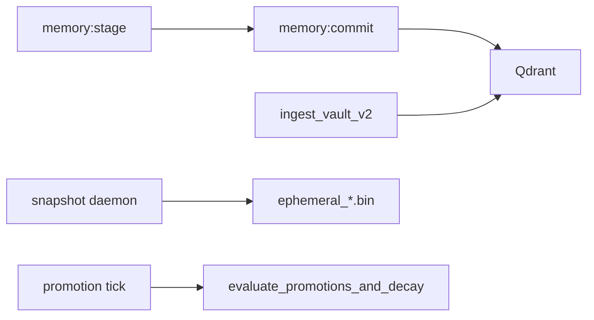

# Memory subsystem

## Ephemeral (`memory/ephemeral.rs`)

- **Backend:** `moka::future::Cache<String, CacheValue>` (max 10k entries).
- **`CacheValue`:** beyond `staged_id`, `title`, `data`, `tags`, `expires_at` (unix), entries carry **staging metadata**: `node_id`, `canonical_key`, **`tier`** (`EphemeralTier`: session / scratch / promote, etc.), **`promotion_score`**, `mention_count`, `needs_review`, `first_seen_at`, `last_seen_at`, **`kind`** (`VaultKind` for commit routing). Defaults in serde keep older snapshots loadable.
- **Insert/list/get** by id or title; TTL expiry; **web artifact** tagging interacts with semantic cleanup.
- **Promotion / decay:** `evaluate_promotions_and_decay` applies config thresholds (`promotion_threshold_*`, `promotion_decay_per_tick`), bumps scores from staging and (when enabled) turn-end mention logic elsewhere in the orchestrator, and moves tiers. Emits structured logs when tiers change.
- **Disk:** `snapshot_to_disk` / `load_from_disk` serializes non-expired entries with **bincode** to `.fcp/ephemeral_{workspace}.bin`. Heavy serialization uses `tokio::task::spawn_blocking` per workspace rules.
- **`spawn_snapshot_daemon`:** runs a `tokio::select!` loop with **two** intervals:
  - **Snapshot tick** (`snapshot_interval_secs`): collect expired entries → optional Qdrant delete for `web_artifact` rows → invalidate cache → `snapshot_to_disk`.
  - **Promotion tick** (`promotion_eval_interval_secs`): call `evaluate_promotions_and_decay` **unless** `promotion_suppressed_during_step` is `true` (orchestrator is inside `Orchestrator::step`). When suppressed, emits `trace` (`promotion_tick_skipped_step_active`) and leaves tiers/scores untouched for that tick.
- **Cancel path:** final `snapshot_to_disk` on `CancellationToken`.

## Semantic (`memory/semantic.rs`)

- **Client:** `qdrant_client::Qdrant` gRPC from `AppConfig::qdrant_url`.
- **Collection:** `AppConfig::qdrant_collection_v2` (computed `fcp_vault_v2_{workspace}`); vectors 768-dim cosine (matches typical nomic-embed dimensions).
- **`create_collection`** if missing.
- **`generate_embedding`:** via Ollama embeddings API (same as ToolRouter).
- **Upsert:** point with payload `text`, `tags`, `vault_key`, **`recency_ts`** (Unix time in **milliseconds**: vault ingest uses source file `mtime`; commits and web chunks use wall-clock at upsert).
- **`upsert_vault_document`:** stable point id from UUID v5 of path — avoids duplicate points on re-ingest.
- **Search:** `search_memory_query` — **`semantic`** (default): vector similarity, optional tag filter, `vault_path_prefix`, oversampling when filtering post-Qdrant. **`recency`**: Qdrant scroll ordered by `recency_ts` descending (no embedding call); same tag/prefix fallback behavior as semantic mode.
- **Web artifacts:** dedicated delete/cleanup helpers for staged web fetch chunks.

## Ingest (`ingest/`)

- **`shared`:** `split_into_chunks`, `truncate_char_boundary`, trim helpers, budget caps for snippets — used by semantic ingest and tools (e.g. web).

## Boot-time vault ingest

`SemanticBrain::ingest_vault_v2` (router chat path) walks configured v2 roots: `00_Invariants`, `10_Topology`, `20_Discourse`, `30_Synthesis`. Flat roots ingest top-level `*.md` with frontmatter-aware parsing; **`30_Synthesis`** is traversed per **node** (`node_id` directories) and only the **current head** revision per node is indexed (see `ingest_synthesis_recursive`). Returns early with `0` if `qdrant_collection_v2` is empty or Ollama embedding ping fails at boot. Failures are logged; optional brain may still allow chat.

## Mental model

| Tier | Technology | Purpose |
|------|------------|---------|
| Ephemeral | moka + optional bincode file | Staging, web artifact cache lines, rolling summary (see `orchestrator::context` / `context/window.rs`), tiered promotion toward commit |
| Semantic | Qdrant + Ollama embeddings | Long-term vector search, vault chunk recall (v2 layout + synthesis heads) |

**Agent note:** orchestrator ↔ daemon coordination uses `Arc<AtomicBool>` **loads/stores only** (no `Arc<Mutex<>>`), in line with workspace concurrency rules.
