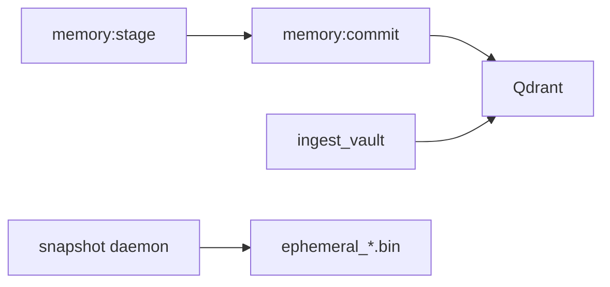

# Memory subsystem

## Ephemeral (`memory/ephemeral.rs`)

- **Backend:** `moka::future::Cache<String, CacheValue>` (max 10k entries).
- **`CacheValue`:** `staged_id`, `title`, `data`, `tags`, `expires_at` (unix).
- **Insert/list/get** by id or title; TTL expiry; **web artifact** tagging interacts with semantic cleanup.
- **Disk:** `snapshot_to_disk` / `load_from_disk` serializes non-expired entries with **bincode** to `.fcp/ephemeral_{workspace}.bin`. Heavy serialization uses `tokio::task::spawn_blocking` per workspace rules.
- **`spawn_snapshot_daemon`:** periodic tick: purge expired entries (and Qdrant web artifact points if semantic brain present), then snapshot to disk; final snapshot on cancel.

## Semantic (`memory/semantic.rs`)

- **Client:** `qdrant_client::Qdrant` gRPC from `AppConfig::qdrant_url`.
- **Collection:** `fcp_vault_{workspace}`; vectors 768-dim cosine (matches typical nomic-embed dimensions).
- **`create_collection`** if missing.
- **`generate_embedding`:** via Ollama embeddings API (same as ToolRouter).
- **Upsert:** point with payload `text`, `tags`, `vault_key`.
- **`upsert_vault_document`:** stable point id from UUID v5 of path — avoids duplicate points on re-ingest.
- **Search:** `search_memory_query` with optional tag filter, `vault_path_prefix`, oversampling when filtering post-Qdrant.
- **Web artifacts:** dedicated delete/cleanup helpers for staged web fetch chunks.

## Ingest (`ingest/`)

- **`shared`:** `split_into_chunks`, `truncate_char_boundary`, trim helpers, budget caps for snippets — used by semantic ingest and tools (e.g. web).

## Boot-time vault ingest

`SemanticBrain::ingest_vault` walks top-level `*.md` in `10_Episodic`, `20_Semantic`, `30_Persons`, `40_User`, and `99_USER_UPLOADED` (from router) and pushes them into Qdrant; failures are logged but may not abort chat if brain is optional.

## Mental model

| Tier | Technology | Purpose |
|------|------------|---------|
| Ephemeral | moka + optional bincode file | Staging, web artifact cache lines, rolling summary (see `context_window`) |
| Semantic | Qdrant + Ollama embeddings | Long-term vector search, vault chunk recall |

