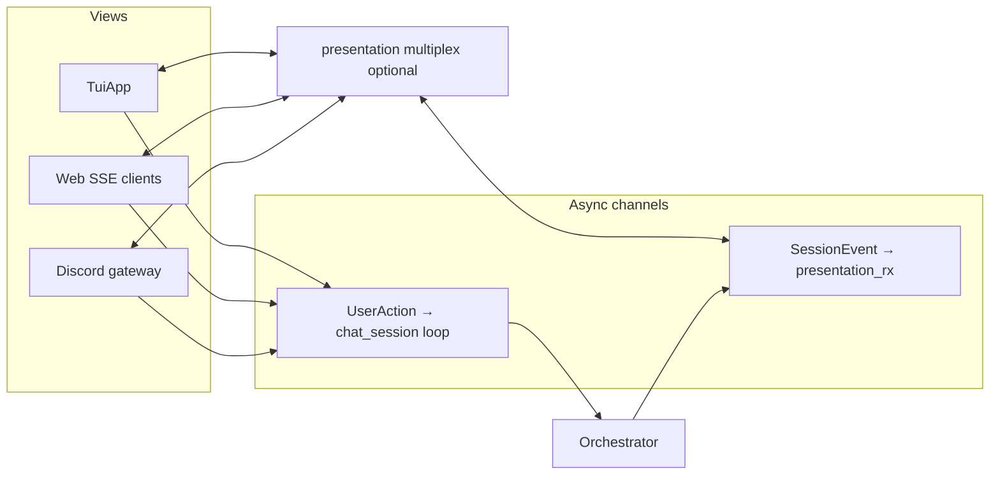

# Presentation, telemetry, and operations

## Shared contracts (`presentation/`)

View-neutral types used by **terminal**, **web**, and **Discord**:

- **`UserAction`** — inbound from any surface: `Submit`, `SubmitIngress` (carries `InputSource` + optional `for_model`), `CancelCurrentTurn`, `SystemInject`, `AgendaAlarmPending`.
- **`SessionEvent`** — outbound to views: `StateUpdate`, `UserTranscriptLine`, `IncomingMessage`, `ModelThought`, `SystemError`, `SystemAlarm`.
- **`InputSource`** — `Cli` | `Web` | `Discord` for transcript badges and telemetry.
- **`alarm_relay`** — maps `SystemAlarm` payloads into the correct `UserAction` for the orchestrator loop.
- **`multiplex.rs`** — when Discord runs with web or TUI, **one** task drains `presentation_rx` from core and fans out: relays alarms to `user_action_tx` exactly once, forwards events to web broadcast and/or terminal `mpsc`, and `try_send`s `IncomingMessage` bodies to Discord outbound (bounded queue; overflow drops with `tracing::warn`).

The orchestrator holds **`presentation_tx: Option<mpsc::Sender<SessionEvent>>`** and never imports ratatui or Axum.

## Terminal UI (`ui/terminal/`)

- **`setup.rs` / `mod.rs`:** crossterm raw mode, alternate screen, restore on drop/panic path from router.
- **`app.rs` — `TuiApp`:** consumes `mpsc::Receiver<SessionEvent>`, sends `UserAction` on the channel given at construction (same ends as web/Discord for the session).
- **`render.rs`:** ratatui layout; status line reflects `AgentStateUpdate` (tool round caps, recovery budget, timing, `activity_line`).

**Alarm path:** `spawn_alarm_scheduler` may emit `SessionEvent::SystemAlarm` on `presentation_tx`. With Discord + TUI, the multiplexer relays the alarm to `user_action_tx` and can **omit** duplicate `SystemAlarm` delivery to the TUI (`terminal_omit_system_alarm`) so the operator does not see the same alarm twice.

**Input queue:** `chat_session` loop holds up to **three** queued `UserIngress` items; when over capacity it drops the oldest and emits a `SessionEvent::SystemError` line.

**Tool rounds vs deck:** Same rules as orchestrator docs: during tool rounds, `activity_line` lists tool names; `message_to_user` may still go to `IncomingMessage`; duplicate suppression via `last_deck_message_body` in `orchestrator/core/deck.rs`.

## Web UI (`ui/web/`)

- **`eris chat --web`:** after `start_chat_session`, `run_web_chat` or `run_web_chat_with_broadcast` binds **`web_bind_addr`:` `web_port`**, serves Axum routes + **SSE** stream of serialized `SessionEvent`, static HTML/JS under `templates/` and `assets/`.
- **Shutdown:** shares `CancellationToken` with the rest of chat. The bundled JS calls **`POST /api/shutdown`** from the explicit exit control (clean stop, same intent as Ctrl+C in the TUI); simply closing a tab without that hook leaves the server running until the operator stops the `eris` process.
- **`web_open_browser`:** optional `open` / `xdg-open` / `cmd start` on listen URL.

## Discord (`ui/discord/`)

- **Sidecar task:** Serenity gateway; reads config (`discord.*`), resolves channel by id or by exact name at READY, consumes outbound + typing channels from router wiring.
- **Ingress:** maps channel messages to `UserAction::SubmitIngress` with `InputSource::Discord` so the transcript shows provenance.
- **Typing:** optional `DiscordTypingCtl` channel from core for “typing” indicators on Discord-originated turns only.

If `discord.enabled` is true but **`bot_token`** is unset/empty, **`discord_sidecar_should_run`** is false: chat proceeds; **`validate_discord_sidecar`** still enforces required ids/channel when enabled.

## Telemetry (`telemetry/`)

- **`logger.rs`:** `tracing` subscriber with file appender under vault `.fcp/telemetry/logs/`. **No `println!` in logic** (per rules); user-facing stderr is reserved for startup/shutdown errors in `main` / teardown paths.
- **`routing_codes.rs`:** Structured log field constants for pre-LLM routing outcomes.
- **`preflight.rs`:** For non-`Chat` commands, checks Ollama/Qdrant reachability (or llama-server when `llm_backend = LlamaCpp`); **Chat** skips this global preflight and relies on `ensure_peripherals_for_chat` inside `start_chat_session`.

## Idle heartbeat (`orchestrator/heartbeat/`)

`spawn_heartbeat_monitor` is started from **`chat_session`** only when **`idle_heartbeat_enabled`** is `true`. When **false** (default), there is no periodic idle injection from time alone; `UserAction::CancelCurrentTurn` still pings the orchestrator’s `interrupt` `watch` sender so **`FcpError::Interrupted`** handling remains available where wired.

## Operator-visible startup

1. Config load errors → stderr + exit.
2. Telemetry init failure → stderr + exit.
3. Chat: startup status lines flow as `SessionEvent::SystemError` (historical name—also used for benign status copy).

## Shutdown

- `CancellationToken` cancels the orchestrator consumer task, alarm scheduler, and web server (when active).
- Terminal path: `restore_terminal()` after `TuiApp::run`.
- `PeripheralLifecycle::shutdown_started_peripherals` stops only daemons this process started (Ollama/Qdrant child processes, llama-server chat + embed when `LlamaCpp` backend, etc.).

## HTTP API client (`util/api/`)

- **`ApiHttpClient`:** templated GET with `reqwest`, profile merge from `AppConfig::apis`, `{placeholder}` substitution in URLs and query strings.
- Used by weather, wiki, and DB REST tools.

## Filesystem watch (`util/fs_watch/`)

Debounced `notify` watcher: reloads identity snapshot into `watch::channel` for `ContextAssembler`. Filter logic in `filter.rs`, spawn in `spawn.rs`.
