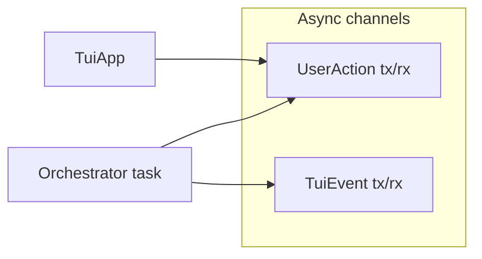

# UI, telemetry, and operations

## TUI (`ui/`)

- **`app.rs` — `TuiApp`:** Owns `mpsc::Receiver<TuiEvent>` from orchestrator, `mpsc::Sender<UserAction>` to orchestrator loop, scroll state, panes (Main, Telemetry, SystemErrors, CommandDeck).
- **`render.rs`:** ratatui layout and widgets.
- **`events.rs`:** `TuiEvent` (state update, incoming message, system error, alarm) and `UserAction` (submit, cancel, system inject, agenda alarm). `AgentStateUpdate.activity_line` is **status-only** (e.g. `Tools: foo, bar` during tool rounds); user-facing assistant prose from `message_to_user` is carried on the main transcript via `IncomingMessage`, not mixed into that field.
- **`terminal.rs`:** crossterm setup/restore.

**Alarm path:** `orchestrator::alarms::spawn_alarm_scheduler` → `TuiEvent::SystemAlarm` → `try_send` `UserAction::SystemInject` or `AgendaAlarmPending` to avoid blocking.

**Input queue:** Router loop holds up to 3 queued submits; drops oldest with a system error when full.

**Tool rounds vs deck:** When the model returns `tool_calls`, the orchestrator sets `activity_line` to a truncated list of tool names and may still emit `message_to_user` to the deck. Duplicate deck lines matching `last_deck_message_body` in the same `step()` are suppressed (see `emit_optional_user_message` in `orchestrator/core/deck.rs`).

## Telemetry (`telemetry/`)

- **`logger.rs`:** `tracing` subscriber with file appender under vault `.fcp/telemetry/logs/`. **No `println!` in logic** (per rules); user-facing stderr only for startup/shutdown errors in `main` / teardown.
- **`routing_codes.rs`:** Structured log field constants for pre-LLM routing outcomes.
- **`preflight.rs`:** For non-`Chat` commands, checks Ollama/Qdrant reachability; **Chat** skips this and relies on `ensure_peripherals_for_chat`.

## Operator-visible startup

1. Config load errors → stderr + exit.
2. Telemetry init failure → stderr + exit.
3. Chat: TUI shows startup lines (peripherals, etc.) via `SystemError` events (naming is historical—also used for status strings).

## Shutdown

- `CancellationToken` cancels orchestrator task and alarm scheduler.
- TUI exit restores terminal.
- `PeripheralLifecycle::shutdown_started_peripherals` stops only daemons started by this process.

## HTTP API client (`util/api/`)

- **`ApiHttpClient`:** Templated GET with `reqwest`, profile merge from `AppConfig::apis`, `{placeholder}` substitution in URLs and query strings.
- Used by weather and wiki tools.

## Filesystem watch (`util/fs_watch/`)

Debounced `notify` watcher: reloads identity snapshot into `watch::channel` for `ContextAssembler` (`orchestrator/context/assembler.rs`). Filter logic in `filter.rs`, spawn in `spawn.rs`.
