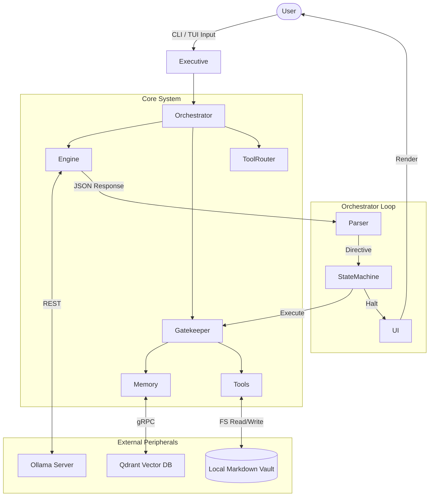

# Eris Architecture Overview

## Introduction
Eris is a local-first, autonomous AI agent built in Rust. It utilizes `ollama-rs` for Local LLM execution and embeddings, `qdrant-client` for persistent semantic vector memory, and `ratatui` for a terminal-based UI (TUI). Eris operates over a local Markdown "vault" (compatible with Obsidian) and features a bounded, cognitive Orchestrator loop designed to execute multi-step tasks, recover from schema faults, and prevent infinite loops.

## High-Level Architecture

The system is composed of the following primary modules:

- **Executive & CLI**: Handles initialization, configuration (`AppConfig`), telemetry setup, and peripheral daemon lifecycle (Ollama, Qdrant).
- **Orchestrator**: The central cognitive loop. Manages the state machine (`Idle`, `Chat`, `Reflect`, `Recover`), handles context condensation, evaluates LLM JSON responses, and sequences tool execution.
- **Engine**: Abstraction over the LLM provider (`ollama-rs`). Implements the `LlmEngine` trait and handles generation and token tracking. It includes a `ReasoningRouter` for extracting `<think>` reasoning tags from models like DeepSeek.
- **Memory**: Divided into two subsystems:
  - **EphemeralMemory**: Short-term, volatile caching backed by `moka`. Periodically snapshotted to disk. Holds web artifacts and intermediate states.
  - **SemanticBrain**: Long-term vector database backed by Qdrant. Automatically ingests markdown vault files on boot and handles semantic search.
- **Tools & Gatekeeper**: The tool registry (`Gatekeeper`) manages tool invocation. Eris uses a two-tier semantic `ToolRouter` to inject full JSON schemas only for the most relevant tools, saving context space.
- **UI**: A terminal-based interface using `ratatui` with distinct panes (Main, Telemetry, System Errors, Command Deck). Follows a unidirectional data flow (TUI events over `mpsc` channels).

## Architecture Diagram

## Data Flow
1. **Input Phase**: User submits input via the TUI Command Deck.
2. **Routing Phase**: The `ToolRouter` embeds the input and calculates cosine similarity against all registered tools to select the `Top-K` tools (Tier 1).
3. **Context Assembly**: The `ContextAssembler` injects Ephemeral/Semantic memory and the Tier 1 JSON tool schemas into the system prompt.
4. **Generation**: The Engine queries Ollama.
5. **Parsing**: The response is parsed into a `LoopDirective` (e.g., `ExecuteTools`, `HaltAndAwaitInput`).
6. **Execution**: If tools are requested, the `Gatekeeper` executes them, appending the result back into the `chat_stack`.
7. **Continuation/Recovery**: The loop continues until the Agent explicitly transitions to `Idle` (via a Halt directive), or reaches the `max_tool_rounds` limit. If the LLM produces an invalid schema, the `Orchestrator` triggers a `Recover` transition for targeted retries.