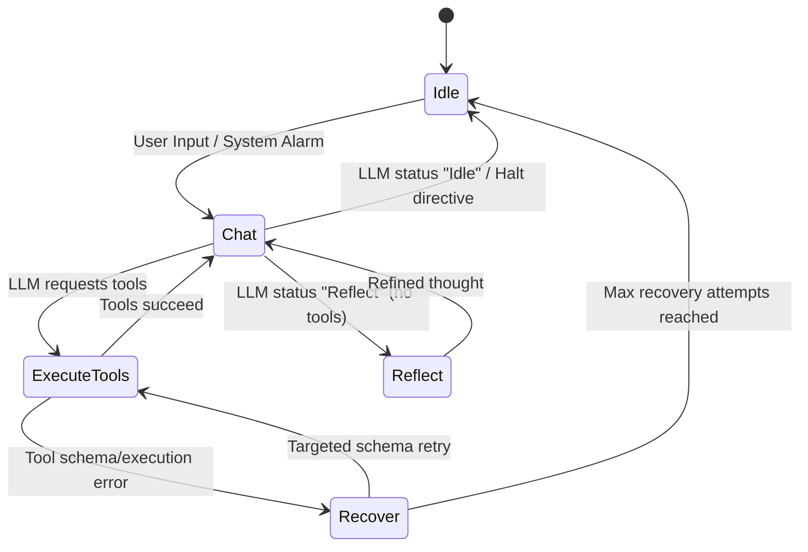

# Orchestrator & Loop Dynamics

The `Orchestrator` is the cognitive heart of Eris, responsible for maintaining the state machine and guarding against infinite loops or hallucinatory spiraling. It enforces a strict "One Prompt = One Action" workflow unless interrupted or iterating through tool feedback.

## State Machine

The Agent operates within the following states (`AgentState`):
- **Idle**: Waiting for user input or heartbeat triggers.
- **Chat**: Processing a prompt, fetching tools, and querying the LLM.
- **Reflect**: Processing tool results or evaluating intermediate thoughts without requiring tools.
- **Recover**: Attempting to correct a schema fault or system error encountered in the previous turn.

## The Step Funnel

The `step()` function is the primary entrypoint for the event loop.

1. **Pre-LLM Routing**:
   - Short inputs or conversational markers bypass semantic routing entirely to save time.
   - Otherwise, the `ToolRouter` generates an embedding of the user's input and computes cosine similarity against predefined tool description embeddings.
   - Outputs a roster of Tier 1 tools (full JSON schema injected into prompt) and Tier 2 tools (name & description only).

2. **Context Assembly**:
   - `ContextAssembler` builds the prompt, incorporating Vault paths, ephemeral memory state, and targeted `ToolDescriptor` JIT (Just-In-Time) guidance for the matched tools.

3. **LLM Generation & Condensation**:
   - Queries `ollama-rs`.
   - If the token usage exceeds `condensation_threshold`, `execute_condensation()` is fired, which forces the LLM to summarize the entire chat stack and replaces the stack with the summary.

4. **Directive Parsing (`LoopDirective`)**:
   - Extracts JSON via a greedy `{...}` slice.
   - Maps the parsed JSON to a `LoopDirective` (`HaltAndAwaitInput`, `ExecuteTools`, `ShiftToReflection`, `RecoverFromFuckup`).

5. **Tool Batch Execution**:
   - Iterates through requested tools.
   - Uses `ToolIntentTicket` to track duplicate suppression (prevents the LLM from spamming the same identical tool call in a loop).
   - If execution fails due to a schema error, it flags `TargetedSchemaRetry` to feed the exact failure reason back to the LLM.

## Fail-Safes
- **Global Interrupts**: A `CancellationToken` linked to `Ctrl+C` and system idle timeouts can instantly abort the `generate` await.
- **Max Tool Rounds**: Caps the number of sequential tool executions per user turn (`max_tool_rounds`).
- **Max Recovery Attempts**: Caps how many times the agent can try to fix its own malformed JSON (`max_recovery_attempts`).