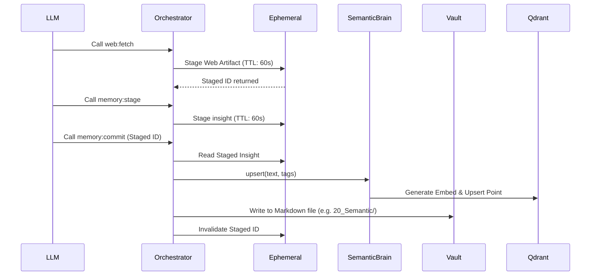

# Memory Subsystems

Eris divides memory into two distinct modules: Ephemeral (short-term cache) and Semantic (long-term vector database).

## Ephemeral Memory (`src/memory/ephemeral.rs`)

Ephemeral memory acts as a short-term scratchpad and staging area. It is heavily utilized for transient data that should not permanently pollute the knowledge base, such as scraped web artifacts, intermediate thoughts, and timers.

### Characteristics:
- **Backend**: In-memory concurrent cache (`moka`), bounded to 10,000 entries.
- **TTL (Time-to-Live)**: Every entry has an absolute expiration timestamp (`expires_at`).
- **Durability**: Periodically snapshotted to a local binary file via `snapshot_to_disk` (using `bincode` inside a `spawn_blocking` task to prevent async thread blocking).
- **Integration**: Tools like `memory:stage` and `web:fetch` write here. `memory:commit` takes a staged ID and promotes it to the Semantic Brain.

## Semantic Brain (`src/memory/semantic.rs`)

The Semantic Brain handles long-term persistence and associative recall, representing the agent's core knowledge base.

### Characteristics:
- **Backend**: Qdrant Vector Database via gRPC (`qdrant-client`).
- **Embeddings**: Uses `ollama-rs` (typically with models like `nomic-embed-text`) to generate 768-dimensional float vectors using Cosine distance.
- **Boot Ingestion**: Upon startup, Eris scans specific directories (`10_Episodic`, `20_Semantic`, `30_Persons`, `40_User`) in the Markdown Vault. It generates embeddings for non-empty files and upserts them to Qdrant. Note: Point IDs are generated deterministically using UUIDv5 from the vault's relative path, ensuring that re-ingestion overwrites rather than duplicates points.
- **Query Strategy**: 
  - When `memory:query` is called, it searches Qdrant using the generated embedding.
  - It supports tag-based filtering. If a tag filter yields 0 hits, it automatically falls back to an unfiltered search using the *same* vector to save an Ollama HTTP call.

## Memory Flow Diagram

